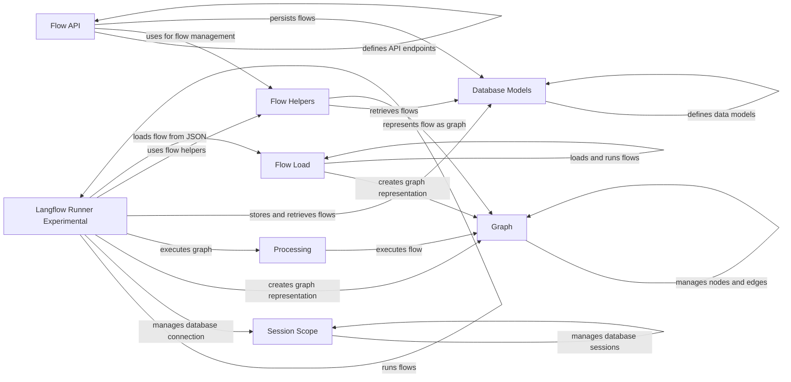

## Component Details

### Flow API
The Flow API component defines the API endpoints for managing flows, including creating, reading, updating, and deleting flows. It acts as the entry point for external requests related to flow management, interacting with the database to persist flows and utilizing helper functions for flow management tasks such as loading, validating, and deleting flows.
- **Related Classes/Methods**: `repos.langflow.src.backend.base.langflow.api.v1.flows`

### Flow Helpers
The Flow Helpers component provides utility functions for loading, running, and managing flows. It interacts with the database to retrieve flows and uses the graph module to represent the flow as a graph. It centralizes common flow-related operations, ensuring consistency and reusability across different parts of the application.
- **Related Classes/Methods**: `repos.langflow.src.backend.base.langflow.helpers.flow`

### Flow Load
The Flow Load component handles the loading and running of flows from JSON format. It uses asynchronous helpers and interacts with the graph module to create a graph representation of the flow. It is responsible for deserializing flow definitions and preparing them for execution.
- **Related Classes/Methods**: `repos.langflow.src.backend.base.langflow.load.load`

### Graph
The Graph component represents a flow as a graph data structure, managing nodes and edges. It provides methods for creating a graph from a payload and interacting with the nodes and edges of the graph. It serves as the in-memory representation of a flow, enabling efficient manipulation and execution.
- **Related Classes/Methods**: `langflow.graph.graph.base.Graph`

### Processing
The Processing component handles the processing of the flow graph, including running the graph and applying tweaks to the flow. It interacts with the Graph module to execute the flow. It orchestrates the execution of the flow, managing the interaction between nodes and edges.
- **Related Classes/Methods**: `langflow.processing.process`

### Database Models
The Database Models component defines the data models for flows, including the FlowBase and FlowCreate models. It interacts with the database to persist flows. It provides a structured representation of flow data for storage and retrieval.
- **Related Classes/Methods**: `langflow.services.database.models.flow.model`

### Session Scope
The Session Scope component manages the database session scope. It provides a context manager for creating and closing database sessions. It ensures proper database connection management and transaction handling.
- **Related Classes/Methods**: `langflow.services.deps.session_scope`

### Langflow Runner Experimental
The Langflow Runner Experimental component is responsible for running flows, managing the database connection, and creating a graph representation of the flow. It interacts with the database to store and retrieve flows and uses the processing module to execute the graph. It orchestrates the entire flow execution process, from loading to running and persisting results.
- **Related Classes/Methods**: `repos.langflow.src.backend.base.langflow.services.flow.flow_runner.LangflowRunnerExperimental`
