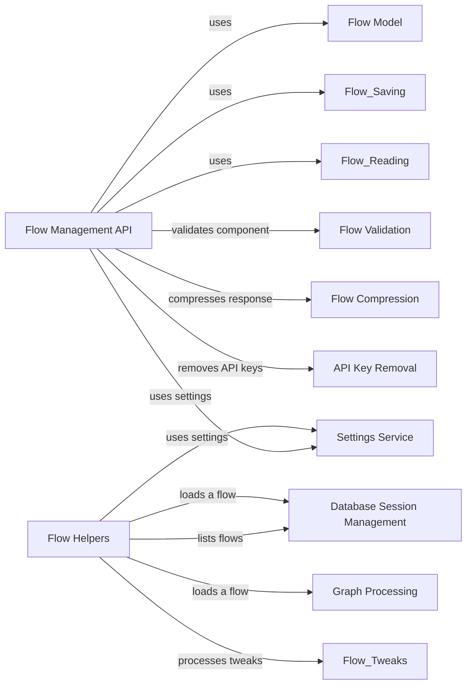

## Component Details

The Flow Management component orchestrates the creation, retrieval, updating, and deletion of flows within the Langflow application. It provides API endpoints for flow management, interacts with the database for persistence, and manages file system operations for flow storage. This component acts as the central point for managing and interacting with flows, coordinating the execution of graphs and managing the state of flows.

### Flow Management API
Defines the API endpoints for managing flows, including creating, reading, updating, and deleting flows. It handles requests, interacts with the database and file system, and performs necessary validations and transformations. It also handles uploading files and managing public flows.
**Related Classes/Methods**:

- <a href="https://github.com/langflow-ai/langflow/blob/master/src/backend/base/langflow/api/v1/flows.py#L140-L168" target="_blank" rel="noopener noreferrer">`src.backend.base.langflow.api.v1.flows:create_flow` (140:168)</a>
- <a href="https://github.com/langflow-ai/langflow/blob/master/src/backend/base/langflow/api/v1/flows.py#L172-L260" target="_blank" rel="noopener noreferrer">`src.backend.base.langflow.api.v1.flows:read_flows` (172:260)</a>
- <a href="https://github.com/langflow-ai/langflow/blob/master/src/backend/base/langflow/api/v1/flows.py#L282-L291" target="_blank" rel="noopener noreferrer">`src.backend.base.langflow.api.v1.flows:read_flow` (282:291)</a>
- <a href="https://github.com/langflow-ai/langflow/blob/master/src/backend/base/langflow/api/v1/flows.py#L310-L375" target="_blank" rel="noopener noreferrer">`src.backend.base.langflow.api.v1.flows:update_flow` (310:375)</a>
- <a href="https://github.com/langflow-ai/langflow/blob/master/src/backend/base/langflow/api/v1/flows.py#L379-L396" target="_blank" rel="noopener noreferrer">`src.backend.base.langflow.api.v1.flows:delete_flow` (379:396)</a>
- <a href="https://github.com/langflow-ai/langflow/blob/master/src/backend/base/langflow/api/v1/flows.py#L56-L136" target="_blank" rel="noopener noreferrer">`src.backend.base.langflow.api.v1.flows:_new_flow` (56:136)</a>
- <a href="https://github.com/langflow-ai/langflow/blob/master/src/backend/base/langflow/api/v1/flows.py#L295-L306" target="_blank" rel="noopener noreferrer">`src.backend.base.langflow.api.v1.flows:read_public_flow` (295:306)</a>
- <a href="https://github.com/langflow-ai/langflow/blob/master/src/backend/base/langflow/api/v1/flows.py#L420-L461" target="_blank" rel="noopener noreferrer">`src.backend.base.langflow.api.v1.flows:upload_file` (420:461)</a>

### Flow Helpers
Provides helper functions for listing and loading flows. It interacts with the database to retrieve flow information and performs necessary processing and transformations. It centralizes the logic for interacting with the database to retrieve flow information.
**Related Classes/Methods**:

- <a href="https://github.com/langflow-ai/langflow/blob/master/src/backend/base/langflow/helpers/flow.py#L31-L44" target="_blank" rel="noopener noreferrer">`src.backend.base.langflow.helpers.flow:list_flows` (31:44)</a>
- <a href="https://github.com/langflow-ai/langflow/blob/master/src/backend/base/langflow/helpers/flow.py#L47-L69" target="_blank" rel="noopener noreferrer">`src.backend.base.langflow.helpers.flow:load_flow` (47:69)</a>
- <a href="https://github.com/langflow-ai/langflow/blob/master/src/backend/base/langflow/helpers/flow.py#L72-L77" target="_blank" rel="noopener noreferrer">`src.backend.base.langflow.helpers.flow:find_flow` (72:77)</a>

### Settings Service
Provides access to application settings and configurations. It is used by various other components to retrieve necessary parameters and settings, such as file system paths and database connection details.
**Related Classes/Methods**:

- <a href="https://github.com/langflow-ai/langflow/blob/master/src/backend/base/langflow/services/deps.py#L117-L130" target="_blank" rel="noopener noreferrer">`langflow.services.deps.get_settings_service` (117:130)</a>

### Database Session Management
Manages database sessions, providing a context for database operations. It ensures proper session handling and resource management, guaranteeing that database connections are properly opened and closed.
**Related Classes/Methods**:

- <a href="https://github.com/langflow-ai/langflow/blob/master/src/backend/base/langflow/services/deps.py#L157-L179" target="_blank" rel="noopener noreferrer">`langflow.services.deps.session_scope` (157:179)</a>

### Flow Model
Defines the data model for flows and provides utilities for creating flow instances. It interacts with the database to persist flow data, defining the structure of the flow data stored in the database.
**Related Classes/Methods**:

- <a href="https://github.com/langflow-ai/langflow/blob/master/src/backend/base/langflow/services/database/models/flow/model.py#L220-L223" target="_blank" rel="noopener noreferrer">`langflow.services.database.models.flow.model.FlowCreate` (220:223)</a>

### Graph Processing
Responsible for creating a graph representation of the flow from the payload. It transforms the flow data into a graph structure that can be executed by the Langflow engine.
**Related Classes/Methods**:

- <a href="https://github.com/langflow-ai/langflow/blob/master/src/backend/base/langflow/graph/graph/base.py#L1064-L1098" target="_blank" rel="noopener noreferrer">`langflow.graph.graph.base.Graph.from_payload` (1064:1098)</a>

### Flow Validation
Validates if a component is valid before it is added to the flow. It ensures that only valid components are used in the flow, preventing errors during execution.
**Related Classes/Methods**:

- <a href="https://github.com/langflow-ai/langflow/blob/master/src/backend/base/langflow/api/utils.py#L91-L101" target="_blank" rel="noopener noreferrer">`langflow.api.utils.validate_is_component` (91:101)</a>

### Flow Compression
Compresses the flow response to reduce the size of the data transmitted over the network. It improves the performance of the API by reducing the amount of data that needs to be transferred.
**Related Classes/Methods**:

- <a href="https://github.com/langflow-ai/langflow/blob/master/src/backend/base/langflow/utils/compression.py#L9-L19" target="_blank" rel="noopener noreferrer">`langflow.utils.compression.compress_response` (9:19)</a>

### API Key Removal
Removes API keys from the flow before it is stored or transmitted. It protects sensitive information by preventing API keys from being exposed.
**Related Classes/Methods**:

- <a href="https://github.com/langflow-ai/langflow/blob/master/src/backend/base/langflow/api/utils.py#L49-L58" target="_blank" rel="noopener noreferrer">`langflow.api.utils.remove_api_keys` (49:58)</a>