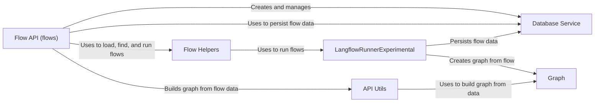

## Component Details

The Flow Management component orchestrates the creation, storage, retrieval, and execution of Langflow application flows. It encompasses the API endpoints for flow management, the underlying graph representation, database persistence, and utility functions for flow manipulation and execution. The central flow involves receiving flow definitions via the API, converting them into graph structures, persisting them in the database, and providing mechanisms for retrieving and executing these flows.

### Graph
The Graph class represents the flow as a graph data structure. It manages nodes (components) and edges (connections) within the flow. It provides methods for adding, removing, updating, and processing nodes and edges. It is the central data structure for representing and executing flows.
- **Related Classes/Methods**: `langflow.graph.graph.base.Graph`

### Flow API (flows)
The Flow API defines the endpoints for performing CRUD operations on flows. It handles requests to create, read, update, and delete flows, interacting with the database service to persist flow data.
- **Related Classes/Methods**: `langflow.api.v1.flows`

### Database Service
The Database Service provides an abstraction layer for interacting with the database. It handles the persistence of flows, including creating, reading, updating, and deleting flow records.
- **Related Classes/Methods**: `langflow.services.database.service.DatabaseService`, `langflow.services.database.models.flow.model`

### Flow Helpers
The Flow Helpers module provides utility functions for working with flows. It includes functions for loading flows, finding flows, running flows, and building the function and schema for a flow.
- **Related Classes/Methods**: `langflow.helpers.flow`

### API Utils
The API Utils module provides utility functions for the API layer. It includes functions for building a graph from flow data, either from the database or directly from a data payload. It also handles caching of graphs.
- **Related Classes/Methods**: `langflow.api.utils`

### LangflowRunnerExperimental
The LangflowRunnerExperimental class is responsible for running a flow. It takes a flow definition, creates a graph from it, and then executes the graph. It also handles adding the flow to the database.
- **Related Classes/Methods**: `langflow.services.flow.flow_runner.LangflowRunnerExperimental`
