```mermaid
graph LR
    langflow_graph_graph_base_Graph["langflow.graph.graph.base.Graph"]
    langflow_graph_vertex_base_Vertex["langflow.graph.vertex.base.Vertex"]
    langflow_processing_process_Process["langflow.processing.process.Process"]
    langflow_graph_graph_state_manager_GraphStateManager["langflow.graph.graph.state_manager.GraphStateManager"]
    langflow_api_v1_flows["langflow.api.v1.flows"]
    langflow_services_database_models_flow_model_Flow["langflow.services.database.models.flow.model.Flow"]
    langflow_services_database_service_DatabaseService["langflow.services.database.service.DatabaseService"]
    langflow_custom_custom_component_component_Component["langflow.custom.custom_component.component.Component"]
    langflow_services_state_service_StateService["langflow.services.state.service.StateService"]
    langflow_helpers_flow["langflow.helpers.flow"]
    langflow_api_v1_flows -- "Manages" --> langflow_services_database_models_flow_model_Flow
    langflow_api_v1_flows -- "Uses" --> langflow_helpers_flow
    langflow_api_v1_flows -- "Interacts with" --> langflow_services_database_service_DatabaseService
    langflow_services_database_models_flow_model_Flow -- "Represents" --> langflow_graph_graph_base_Graph
    langflow_services_database_models_flow_model_Flow -- "Persisted by" --> langflow_services_database_service_DatabaseService
    langflow_services_database_service_DatabaseService -- "Supports persistence for" --> langflow_services_state_service_StateService
    langflow_graph_graph_base_Graph -- "Composed of" --> langflow_graph_vertex_base_Vertex
    langflow_graph_graph_base_Graph -- "Interacts with" --> langflow_graph_graph_state_manager_GraphStateManager
    langflow_graph_graph_base_Graph -- "Executed by" --> langflow_processing_process_Process
    langflow_graph_vertex_base_Vertex -- "Encapsulates" --> langflow_custom_custom_component_component_Component
    langflow_graph_vertex_base_Vertex -- "Interacts with" --> langflow_graph_graph_state_manager_GraphStateManager
    langflow_processing_process_Process -- "Executes" --> langflow_graph_graph_base_Graph
    langflow_processing_process_Process -- "Utilizes" --> langflow_graph_vertex_base_Vertex
    langflow_processing_process_Process -- "Uses" --> langflow_graph_graph_state_manager_GraphStateManager
    langflow_graph_graph_state_manager_GraphStateManager -- "Manages state for" --> langflow_graph_graph_base_Graph
    langflow_graph_graph_state_manager_GraphStateManager -- "Manages state for" --> langflow_graph_vertex_base_Vertex
    langflow_graph_graph_state_manager_GraphStateManager -- "Depends on" --> langflow_services_state_service_StateService
    langflow_services_state_service_StateService -- "May use" --> langflow_services_database_service_DatabaseService
    langflow_helpers_flow -- "Used by" --> langflow_processing_process_Process
```

## Component Details

Abstract Components Overview and Relationships for Langflow

### langflow.graph.graph.base.Graph
The foundational data structure representing an AI workflow. It defines the interconnected nodes (vertices) and edges that form the blueprint of a flow.

**Related Classes/Methods**:

- <a href="https://github.com/langflow-ai/langflow/blob/master/src/backend/base/langflow/graph/graph/base.py#L59-L2146" target="_blank" rel="noopener noreferrer">`langflow.graph.graph.base.Graph` (59:2146)</a>

### langflow.graph.vertex.base.Vertex
Represents a single, executable computational unit or component within a Langflow graph. Each Vertex wraps a specific AI capability (e.g., an LLM, a tool) and manages its configuration, inputs, outputs, and execution logic.

**Related Classes/Methods**:

- <a href="https://github.com/langflow-ai/langflow/blob/master/src/backend/base/langflow/graph/vertex/base.py#L45-L817" target="_blank" rel="noopener noreferrer">`langflow.graph.vertex.base.Vertex` (45:817)</a>
- <a href="https://github.com/langflow-ai/langflow/blob/master/src/backend/base/langflow/graph/vertex/base.py#L46-L109" target="_blank" rel="noopener noreferrer">`langflow.graph.vertex.base.Vertex:__init__` (46:109)</a>
- <a href="https://github.com/langflow-ai/langflow/blob/master/src/backend/base/langflow/graph/vertex/base.py#L118-L122" target="_blank" rel="noopener noreferrer">`langflow.graph.vertex.base.Vertex:set_input_value` (118:122)</a>
- <a href="https://github.com/langflow-ai/langflow/blob/master/src/backend/base/langflow/graph/vertex/base.py#L127-L129" target="_blank" rel="noopener noreferrer">`langflow.graph.vertex.base.Vertex:add_component_instance` (127:129)</a>
- <a href="https://github.com/langflow-ai/langflow/blob/master/src/backend/base/langflow/graph/vertex/base.py#L131-L132" target="_blank" rel="noopener noreferrer">`langflow.graph.vertex.base.Vertex:add_result` (131:132)</a>
- <a href="https://github.com/langflow-ai/langflow/blob/master/src/backend/base/langflow/graph/vertex/base.py#L134-L138" target="_blank" rel="noopener noreferrer">`langflow.graph.vertex.base.Vertex:update_graph_state` (134:138)</a>
- <a href="https://github.com/langflow-ai/langflow/blob/master/src/backend/base/langflow/graph/vertex/base.py#L140-L147" target="_blank" rel="noopener noreferrer">`langflow.graph.vertex.base.Vertex:set_state` (140:147)</a>
- <a href="https://github.com/langflow-ai/langflow/blob/master/src/backend/base/langflow/graph/vertex/base.py#L162-L178" target="_blank" rel="noopener noreferrer">`langflow.graph.vertex.base.Vertex:get_built_result` (162:178)</a>
- <a href="https://github.com/langflow-ai/langflow/blob/master/src/backend/base/langflow/graph/vertex/base.py#L324-L346" target="_blank" rel="noopener noreferrer">`langflow.graph.vertex.base.Vertex:build_params` (324:346)</a>
- <a href="https://github.com/langflow-ai/langflow/blob/master/src/backend/base/langflow/graph/vertex/base.py#L348-L370" target="_blank" rel="noopener noreferrer">`langflow.graph.vertex.base.Vertex:update_raw_params` (348:370)</a>
- <a href="https://github.com/langflow-ai/langflow/blob/master/src/backend/base/langflow/graph/vertex/base.py#L372-L377" target="_blank" rel="noopener noreferrer">`langflow.graph.vertex.base.Vertex:instantiate_component` (372:377)</a>
- <a href="https://github.com/langflow-ai/langflow/blob/master/src/backend/base/langflow/graph/vertex/base.py#L379-L412" target="_blank" rel="noopener noreferrer">`langflow.graph.vertex.base.Vertex:_build` (379:412)</a>
- <a href="https://github.com/langflow-ai/langflow/blob/master/src/backend/base/langflow/graph/vertex/base.py#L414-L451" target="_blank" rel="noopener noreferrer">`langflow.graph.vertex.base.Vertex:extract_messages_from_artifacts` (414:451)</a>
- <a href="https://github.com/langflow-ai/langflow/blob/master/src/backend/base/langflow/graph/vertex/base.py#L453-L469" target="_blank" rel="noopener noreferrer">`langflow.graph.vertex.base.Vertex:finalize_build` (453:469)</a>
- <a href="https://github.com/langflow-ai/langflow/blob/master/src/backend/base/langflow/graph/vertex/base.py#L514-L523" target="_blank" rel="noopener noreferrer">`langflow.graph.vertex.base.Vertex:get_result` (514:523)</a>
- <a href="https://github.com/langflow-ai/langflow/blob/master/src/backend/base/langflow/graph/vertex/base.py#L707-L766" target="_blank" rel="noopener noreferrer">`langflow.graph.vertex.base.Vertex:build` (707:766)</a>
- <a href="https://github.com/langflow-ai/langflow/blob/master/src/backend/base/langflow/graph/vertex/base.py#L768-L781" target="_blank" rel="noopener noreferrer">`langflow.graph.vertex.base.Vertex:get_requester_result` (768:781)</a>

### langflow.processing.process.Process
This component is the primary orchestrator responsible for the actual execution of a given Graph. It traverses the graph, manages the execution order of individual Vertex components, and handles the flow of data between them.

**Related Classes/Methods**:

- <a href="https://github.com/langflow-ai/langflow/blob/master/src/backend/base/langflow/processing/process.py#L0-L0" target="_blank" rel="noopener noreferrer">`langflow.processing.process.Process` (0:0)</a>

### langflow.graph.graph.state_manager.GraphStateManager
Manages the dynamic runtime state of a flow's execution. This includes storing intermediate results, handling conversational history, and maintaining any dynamic data generated as the flow progresses. It ensures state consistency and accessibility during execution.

**Related Classes/Methods**:

- <a href="https://github.com/langflow-ai/langflow/blob/master/src/backend/base/langflow/graph/graph/state_manager.py#L14-L37" target="_blank" rel="noopener noreferrer">`langflow.graph.graph.state_manager.GraphStateManager` (14:37)</a>

### langflow.api.v1.flows
This module provides the API endpoints for managing flow definitions. It handles operations such as creating, reading, updating, and deleting flow configurations, which are essentially serialized Graph objects.

**Related Classes/Methods**:

- <a href="https://github.com/langflow-ai/langflow/blob/master/src/backend/base/langflow/api/v1/flows.py#L0-L0" target="_blank" rel="noopener noreferrer">`langflow.api.v1.flows` (0:0)</a>

### langflow.services.database.models.flow.model.Flow
The SQLAlchemy ORM model that represents a persisted flow definition in the database. It defines the schema for storing the serialized Graph data and its associated metadata.

**Related Classes/Methods**:

- <a href="https://github.com/langflow-ai/langflow/blob/master/src/backend/base/langflow/services/database/models/flow/model.py#L190-L216" target="_blank" rel="noopener noreferrer">`langflow.services.database.models.flow.model.Flow` (190:216)</a>

### langflow.services.database.service.DatabaseService
Manages all interactions with the underlying database. It provides an essential abstraction layer for persisting and retrieving application data, including Flow definitions and potentially runtime state.

**Related Classes/Methods**:

- <a href="https://github.com/langflow-ai/langflow/blob/master/src/backend/base/langflow/services/database/service.py#L37-L481" target="_blank" rel="noopener noreferrer">`langflow.services.database.service.DatabaseService` (37:481)</a>

### langflow.custom.custom_component.component.Component
This is the base class for all custom AI components that can be integrated into a Langflow workflow. It defines the common interface and basic functionality that any functional block within a flow must adhere to.

**Related Classes/Methods**:

- <a href="https://github.com/langflow-ai/langflow/blob/master/src/backend/base/langflow/custom/custom_component/component.py#L93-L1610" target="_blank" rel="noopener noreferrer">`langflow.custom.custom_component.component.Component` (93:1610)</a>

### langflow.services.state.service.StateService
Provides the underlying storage and retrieval mechanism for the runtime state managed by the GraphStateManager. It abstracts the actual persistence layer for state (e.g., in-memory, Redis, database).

**Related Classes/Methods**:

- <a href="https://github.com/langflow-ai/langflow/blob/master/src/backend/base/langflow/services/state/service.py#L10-L29" target="_blank" rel="noopener noreferrer">`langflow.services.state.service.StateService` (10:29)</a>

### langflow.helpers.flow
A utility module containing helper functions and methods that facilitate various operations related to flows, such as serialization/deserialization, validation, and manipulation of flow data.

**Related Classes/Methods**:

- <a href="https://github.com/langflow-ai/langflow/blob/master/src/backend/base/langflow/helpers/flow.py#L0-L0" target="_blank" rel="noopener noreferrer">`langflow.helpers.flow` (0:0)</a>

### [FAQ](https://github.com/CodeBoarding/GeneratedOnBoardings/tree/main?tab=readme-ov-file#faq)