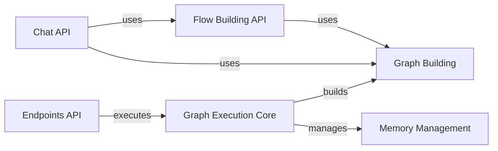

## Component Details

The Graph Execution Engine orchestrates the execution of a Langflow flow represented as a graph. It manages the state of vertices and edges, handles asynchronous execution, and ensures the flow runs correctly to produce the desired output. The engine builds the graph from data or a database, manages chat memory, and interacts with various APIs for building flows, chatting, and voice mode functionalities. It is the central component responsible for running the flow and producing the desired output.

### Graph Execution Core
This component is responsible for the core logic of executing the graph. It includes the `Graph` class, which manages the nodes and edges, and the `run_graph` functions, which orchestrate the execution of the graph. It handles the traversal of the graph, the execution of the nodes, and the management of the state.
**Related Classes/Methods**:

- <a href="https://github.com/langflow-ai/langflow/blob/master/src/backend/base/langflow/graph/graph/base.py#L60-L2147" target="_blank" rel="noopener noreferrer">`src.backend.base.langflow.graph.graph.base.Graph` (60:2147)</a>
- <a href="https://github.com/langflow-ai/langflow/blob/master/src/backend/base/langflow/processing/process.py#L26-L62" target="_blank" rel="noopener noreferrer">`src.backend.base.langflow.processing.process:run_graph_internal` (26:62)</a>
- <a href="https://github.com/langflow-ai/langflow/blob/master/src/backend/base/langflow/processing/process.py#L65-L121" target="_blank" rel="noopener noreferrer">`src.backend.base.langflow.processing.process:run_graph` (65:121)</a>

### Graph Building
This component provides utilities for building the graph from different sources, such as data or a database. It includes functions for building the graph and caching it for later use. It interacts with the database to retrieve the graph data and with the cache to store the graph.
**Related Classes/Methods**:

- <a href="https://github.com/langflow-ai/langflow/blob/master/src/backend/base/langflow/api/utils.py#L160-L181" target="_blank" rel="noopener noreferrer">`src.backend.base.langflow.api.utils:build_graph_from_data` (160:181)</a>
- <a href="https://github.com/langflow-ai/langflow/blob/master/src/backend/base/langflow/api/utils.py#L184-L191" target="_blank" rel="noopener noreferrer">`src.backend.base.langflow.api.utils:build_graph_from_db_no_cache` (184:191)</a>
- <a href="https://github.com/langflow-ai/langflow/blob/master/src/backend/base/langflow/api/utils.py#L194-L197" target="_blank" rel="noopener noreferrer">`src.backend.base.langflow.api.utils:build_graph_from_db` (194:197)</a>
- <a href="https://github.com/langflow-ai/langflow/blob/master/src/backend/base/langflow/api/utils.py#L200-L210" target="_blank" rel="noopener noreferrer">`src.backend.base.langflow.api.utils:build_and_cache_graph_from_data` (200:210)</a>

### Memory Management
This component manages the chat memory, including storing, retrieving, updating, and deleting messages. It provides both synchronous and asynchronous methods for these operations and integrates with the database to persist messages. It is used by other components to store and retrieve chat history.
**Related Classes/Methods**:

- <a href="https://github.com/langflow-ai/langflow/blob/master/src/backend/base/langflow/memory.py#L45-L70" target="_blank" rel="noopener noreferrer">`src.backend.base.langflow.memory:get_messages` (45:70)</a>
- <a href="https://github.com/langflow-ai/langflow/blob/master/src/backend/base/langflow/memory.py#L73-L99" target="_blank" rel="noopener noreferrer">`src.backend.base.langflow.memory:aget_messages` (73:99)</a>
- <a href="https://github.com/langflow-ai/langflow/blob/master/src/backend/base/langflow/memory.py#L102-L107" target="_blank" rel="noopener noreferrer">`src.backend.base.langflow.memory:add_messages` (102:107)</a>
- <a href="https://github.com/langflow-ai/langflow/blob/master/src/backend/base/langflow/memory.py#L110-L127" target="_blank" rel="noopener noreferrer">`src.backend.base.langflow.memory:aadd_messages` (110:127)</a>
- <a href="https://github.com/langflow-ai/langflow/blob/master/src/backend/base/langflow/memory.py#L130-L151" target="_blank" rel="noopener noreferrer">`src.backend.base.langflow.memory:aupdate_messages` (130:151)</a>
- <a href="https://github.com/langflow-ai/langflow/blob/master/src/backend/base/langflow/memory.py#L185-L193" target="_blank" rel="noopener noreferrer">`src.backend.base.langflow.memory:delete_messages` (185:193)</a>
- <a href="https://github.com/langflow-ai/langflow/blob/master/src/backend/base/langflow/memory.py#L196-L208" target="_blank" rel="noopener noreferrer">`src.backend.base.langflow.memory:adelete_messages` (196:208)</a>
- <a href="https://github.com/langflow-ai/langflow/blob/master/src/backend/base/langflow/memory.py#L211-L221" target="_blank" rel="noopener noreferrer">`src.backend.base.langflow.memory:delete_message` (211:221)</a>
- <a href="https://github.com/langflow-ai/langflow/blob/master/src/backend/base/langflow/memory.py#L224-L243" target="_blank" rel="noopener noreferrer">`src.backend.base.langflow.memory:store_message` (224:243)</a>
- <a href="https://github.com/langflow-ai/langflow/blob/master/src/backend/base/langflow/memory.py#L246-L282" target="_blank" rel="noopener noreferrer">`src.backend.base.langflow.memory:astore_message` (246:282)</a>
- <a href="https://github.com/langflow-ai/langflow/blob/master/src/backend/base/langflow/memory.py#L297-L301" target="_blank" rel="noopener noreferrer">`src.backend.base.langflow.memory.LCBuiltinChatMemory:messages` (297:301)</a>
- <a href="https://github.com/langflow-ai/langflow/blob/master/src/backend/base/langflow/memory.py#L303-L307" target="_blank" rel="noopener noreferrer">`src.backend.base.langflow.memory.LCBuiltinChatMemory:aget_messages` (303:307)</a>
- <a href="https://github.com/langflow-ai/langflow/blob/master/src/backend/base/langflow/memory.py#L309-L313" target="_blank" rel="noopener noreferrer">`src.backend.base.langflow.memory.LCBuiltinChatMemory:add_messages` (309:313)</a>
- <a href="https://github.com/langflow-ai/langflow/blob/master/src/backend/base/langflow/memory.py#L315-L319" target="_blank" rel="noopener noreferrer">`src.backend.base.langflow.memory.LCBuiltinChatMemory:aadd_messages` (315:319)</a>
- <a href="https://github.com/langflow-ai/langflow/blob/master/src/backend/base/langflow/memory.py#L321-L322" target="_blank" rel="noopener noreferrer">`src.backend.base.langflow.memory.LCBuiltinChatMemory:clear` (321:322)</a>
- <a href="https://github.com/langflow-ai/langflow/blob/master/src/backend/base/langflow/memory.py#L324-L325" target="_blank" rel="noopener noreferrer">`src.backend.base.langflow.memory.LCBuiltinChatMemory:aclear` (324:325)</a>

### Flow Building API
This component is responsible for building and managing flows. It includes functionalities for starting flow builds, generating flow events, and creating flow responses. It interacts with various services like chat service, telemetry service, and database sessions.
**Related Classes/Methods**:

- <a href="https://github.com/langflow-ai/langflow/blob/master/src/backend/base/langflow/api/build.py#L41-L80" target="_blank" rel="noopener noreferrer">`src.backend.base.langflow.api.build:start_flow_build` (41:80)</a>
- <a href="https://github.com/langflow-ai/langflow/blob/master/src/backend/base/langflow/api/build.py#L83-L146" target="_blank" rel="noopener noreferrer">`src.backend.base.langflow.api.build:get_flow_events_response` (83:146)</a>
- <a href="https://github.com/langflow-ai/langflow/blob/master/src/backend/base/langflow/api/build.py#L149-L178" target="_blank" rel="noopener noreferrer">`src.backend.base.langflow.api.build:create_flow_response` (149:178)</a>
- <a href="https://github.com/langflow-ai/langflow/blob/master/src/backend/base/langflow/api/build.py#L181-L477" target="_blank" rel="noopener noreferrer">`src.backend.base.langflow.api.build:generate_flow_events` (181:477)</a>

### Chat API
This component provides API endpoints for chat functionalities, including retrieving vertices order, building flows, getting build events, canceling builds, building individual vertices, and streaming vertex data. It uses services like chat service and telemetry service.
**Related Classes/Methods**:

- <a href="https://github.com/langflow-ai/langflow/blob/master/src/backend/base/langflow/api/v1/chat.py#L72-L139" target="_blank" rel="noopener noreferrer">`src.backend.base.langflow.api.v1.chat:retrieve_vertices_order` (72:139)</a>
- <a href="https://github.com/langflow-ai/langflow/blob/master/src/backend/base/langflow/api/v1/chat.py#L143-L207" target="_blank" rel="noopener noreferrer">`src.backend.base.langflow.api.v1.chat:build_flow` (143:207)</a>
- <a href="https://github.com/langflow-ai/langflow/blob/master/src/backend/base/langflow/api/v1/chat.py#L211-L222" target="_blank" rel="noopener noreferrer">`src.backend.base.langflow.api.v1.chat:get_build_events` (211:222)</a>
- <a href="https://github.com/langflow-ai/langflow/blob/master/src/backend/base/langflow/api/v1/chat.py#L226-L253" target="_blank" rel="noopener noreferrer">`src.backend.base.langflow.api.v1.chat:cancel_build` (226:253)</a>
- <a href="https://github.com/langflow-ai/langflow/blob/master/src/backend/base/langflow/api/v1/chat.py#L257-L415" target="_blank" rel="noopener noreferrer">`src.backend.base.langflow.api.v1.chat:build_vertex` (257:415)</a>
- <a href="https://github.com/langflow-ai/langflow/blob/master/src/backend/base/langflow/api/v1/chat.py#L418-L497" target="_blank" rel="noopener noreferrer">`src.backend.base.langflow.api.v1.chat:_stream_vertex` (418:497)</a>
- <a href="https://github.com/langflow-ai/langflow/blob/master/src/backend/base/langflow/api/v1/chat.py#L505-L540" target="_blank" rel="noopener noreferrer">`src.backend.base.langflow.api.v1.chat:build_vertex_stream` (505:540)</a>
- <a href="https://github.com/langflow-ai/langflow/blob/master/src/backend/base/langflow/api/v1/chat.py#L543-L558" target="_blank" rel="noopener noreferrer">`src.backend.base.langflow.api.v1.chat:build_flow_and_stream` (543:558)</a>
- <a href="https://github.com/langflow-ai/langflow/blob/master/src/backend/base/langflow/api/v1/chat.py#L562-L638" target="_blank" rel="noopener noreferrer">`src.backend.base.langflow.api.v1.chat:build_public_tmp` (562:638)</a>

### Endpoints API
This component defines API endpoints for running flows, including simple runs, task-based runs, generator-based runs, and experimental runs. It handles input validation, tweak processing, graph creation, and execution.
**Related Classes/Methods**:

- <a href="https://github.com/langflow-ai/langflow/blob/master/src/backend/base/langflow/api/v1/endpoints.py#L109-L162" target="_blank" rel="noopener noreferrer">`src.backend.base.langflow.api.v1.endpoints:simple_run_flow` (109:162)</a>
- <a href="https://github.com/langflow-ai/langflow/blob/master/src/backend/base/langflow/api/v1/endpoints.py#L165-L184" target="_blank" rel="noopener noreferrer">`src.backend.base.langflow.api.v1.endpoints:simple_run_flow_task` (165:184)</a>
- <a href="https://github.com/langflow-ai/langflow/blob/master/src/backend/base/langflow/api/v1/endpoints.py#L222-L267" target="_blank" rel="noopener noreferrer">`src.backend.base.langflow.api.v1.endpoints:run_flow_generator` (222:267)</a>
- <a href="https://github.com/langflow-ai/langflow/blob/master/src/backend/base/langflow/api/v1/endpoints.py#L271-L388" target="_blank" rel="noopener noreferrer">`src.backend.base.langflow.api.v1.endpoints:simplified_run_flow` (271:388)</a>
- <a href="https://github.com/langflow-ai/langflow/blob/master/src/backend/base/langflow/api/v1/endpoints.py#L471-L586" target="_blank" rel="noopener noreferrer">`src.backend.base.langflow.api.v1.endpoints:experimental_run_flow` (471:586)</a>