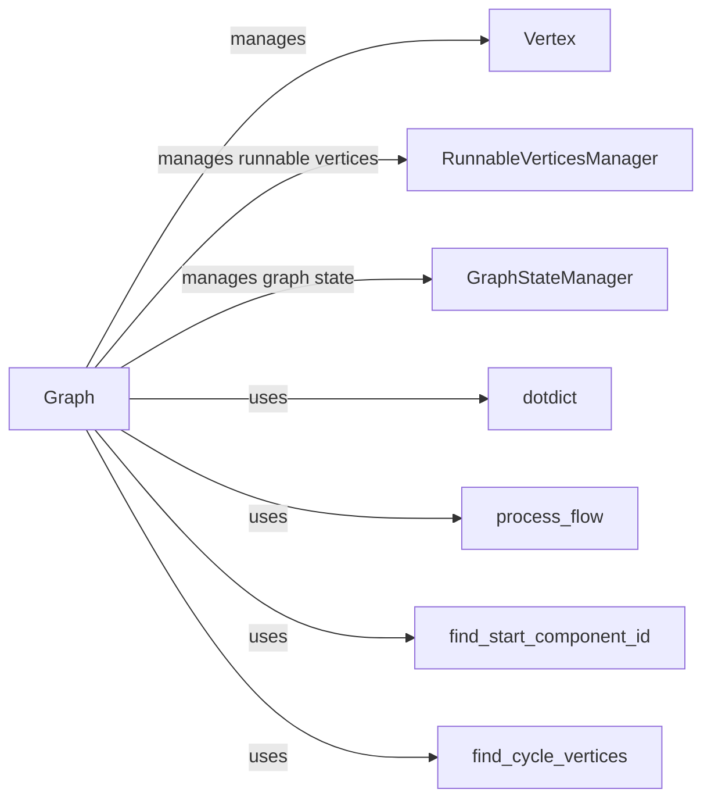

## Component Details

### Graph
The Graph class represents the core graph structure in Langflow. It is responsible for managing vertices (components) and edges (connections) between them. It handles graph building, execution, state management, and provides methods for adding, removing, and updating components. The Graph orchestrates the flow of data between components and manages the overall execution process.
- **Related Classes/Methods**: `repos.langflow.src.backend.base.langflow.graph.graph.base.Graph`

### Vertex
The Vertex class represents a node in the graph, encapsulating a component instance and its associated data. It manages the component's lifecycle, including initialization and execution. It provides methods for interacting with the component and retrieving its output.
- **Related Classes/Methods**: `langflow.graph.vertex.base.Vertex`

### RunnableVerticesManager
The RunnableVerticesManager class manages the state of runnable vertices within the graph. It keeps track of vertices that are ready to be executed, vertices currently being run, and vertices that are part of cycles. It provides methods for updating the run state of vertices and querying their status, ensuring efficient and correct execution of the graph.
- **Related Classes/Methods**: `langflow.graph.graph.runnable_vertices_manager.RunnableVerticesManager`

### GraphStateManager
The GraphStateManager class manages the overall state of the graph, including the activation and deactivation of vertices based on the current state. It provides methods for getting and updating the graph's state, ensuring that the graph execution proceeds in a controlled and predictable manner.
- **Related Classes/Methods**: `langflow.graph.graph.state_manager.GraphStateManager`

### process_flow
The `process_flow` function is a utility function that processes the flow of data through the graph. It handles tasks such as data validation, transformation, and routing, ensuring that data is correctly processed and passed between components.
- **Related Classes/Methods**: `langflow.graph.graph.utils.process_flow`

### dotdict
The `dotdict` class provides a dictionary-like object that allows accessing keys as attributes. It simplifies the process of accessing and manipulating data within the graph, making the code more readable and maintainable.
- **Related Classes/Methods**: `langflow.schema.dotdict.dotdict`

### find_start_component_id
The `find_start_component_id` function identifies the starting component ID in the graph. This ID is used to initiate the execution of the graph, ensuring that the graph execution starts from the correct component.
- **Related Classes/Methods**: `langflow.graph.graph.utils.find_start_component_id`

### find_cycle_vertices
The `find_cycle_vertices` function identifies vertices that are part of cycles in the graph. This information is used to handle cyclic dependencies and prevent infinite loops, ensuring the stability and correctness of the graph execution.
- **Related Classes/Methods**: `langflow.graph.graph.utils.find_cycle_vertices`
