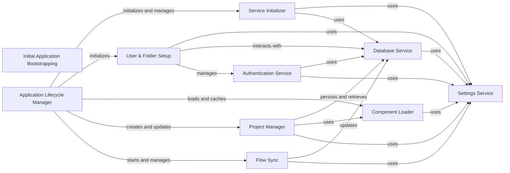

## Component Details

The Initial Application Bootstrapping subsystem is responsible for setting up the Langflow application during its initial startup phase. This includes critical tasks such as ensuring the database is ready, creating a default superuser if one doesn't exist, loading and updating starter projects (pre-built flows), and initializing various core services like settings, database, and authentication. It orchestrates these setup procedures to bring the application to a functional state, preparing it for user interaction and flow execution.

### Initial Application Bootstrapping
Handles the initial setup of the Langflow application, including loading starter projects, creating default users, and ensuring the database is ready.

**Related Classes/Methods**:

- <a href="https://github.com/langflow-ai/langflow/blob/master/src/backend/base/langflow/initial_setup/setup.py#L927-L941" target="_blank" rel="noopener noreferrer">`langflow.initial_setup.setup:initialize_super_user_if_needed` (927:941)</a>
- <a href="https://github.com/langflow-ai/langflow/blob/master/src/backend/base/langflow/main.py#L112-L203" target="_blank" rel="noopener noreferrer">`langflow.main:get_lifespan` (112:203)</a>

### Application Lifecycle Manager
Orchestrates the startup and shutdown of the Langflow application, including service initialization, component loading, and background tasks.

**Related Classes/Methods**:

- <a href="https://github.com/langflow-ai/langflow/blob/master/src/backend/base/langflow/main.py#L112-L203" target="_blank" rel="noopener noreferrer">`langflow.main:get_lifespan` (112:203)</a>
- <a href="https://github.com/langflow-ai/langflow/blob/master/src/backend/base/langflow/main.py#L206-L323" target="_blank" rel="noopener noreferrer">`langflow.main:create_app` (206:323)</a>
- <a href="https://github.com/langflow-ai/langflow/blob/master/src/backend/base/langflow/main.py#L369-L382" target="_blank" rel="noopener noreferrer">`langflow.main:setup_app` (369:382)</a>

### Service Initializer
Manages the creation, retrieval, and lifecycle of all backend services (e.g., Database, Settings, Cache, Telemetry, Variable, Job Queue).

**Related Classes/Methods**:

- <a href="https://github.com/langflow-ai/langflow/blob/master/src/backend/base/langflow/services/utils.py#L230-L250" target="_blank" rel="noopener noreferrer">`langflow.services.utils.initialize_services` (230:250)</a>
- <a href="https://github.com/langflow-ai/langflow/blob/master/src/backend/base/langflow/services/deps.py#L31-L49" target="_blank" rel="noopener noreferrer">`langflow.services.deps.get_service` (31:49)</a>
- <a href="https://github.com/langflow-ai/langflow/blob/master/src/backend/base/langflow/services/manager.py#L21-L128" target="_blank" rel="noopener noreferrer">`langflow.services.manager.ServiceManager` (21:128)</a>
- <a href="https://github.com/langflow-ai/langflow/blob/master/src/backend/base/langflow/services/manager.py#L30-L35" target="_blank" rel="noopener noreferrer">`langflow.services.manager.ServiceManager.register_factories` (30:35)</a>
- <a href="https://github.com/langflow-ai/langflow/blob/master/src/backend/base/langflow/services/manager.py#L45-L51" target="_blank" rel="noopener noreferrer">`langflow.services.manager.ServiceManager.get` (45:51)</a>
- <a href="https://github.com/langflow-ai/langflow/blob/master/src/backend/base/langflow/services/manager.py#L53-L75" target="_blank" rel="noopener noreferrer">`langflow.services.manager.ServiceManager._create_service` (53:75)</a>
- <a href="https://github.com/langflow-ai/langflow/blob/master/src/backend/base/langflow/services/manager.py#L90-L101" target="_blank" rel="noopener noreferrer">`langflow.services.manager.ServiceManager.teardown` (90:101)</a>

### User & Folder Setup
Ensures the existence of a superuser and a default folder for them, especially during initial application setup.

**Related Classes/Methods**:

- <a href="https://github.com/langflow-ai/langflow/blob/master/src/backend/base/langflow/initial_setup/setup.py#L927-L941" target="_blank" rel="noopener noreferrer">`langflow.initial_setup.setup.initialize_super_user_if_needed` (927:941)</a>
- <a href="https://github.com/langflow-ai/langflow/blob/master/src/backend/base/langflow/initial_setup/setup.py#L944-L978" target="_blank" rel="noopener noreferrer">`langflow.initial_setup.setup.get_or_create_default_folder` (944:978)</a>
- <a href="https://github.com/langflow-ai/langflow/blob/master/src/backend/base/langflow/services/auth/utils.py#L281-L301" target="_blank" rel="noopener noreferrer">`langflow.services.auth.utils.create_super_user` (281:301)</a>
- <a href="https://github.com/langflow-ai/langflow/blob/master/src/backend/base/langflow/services/utils.py#L79-L102" target="_blank" rel="noopener noreferrer">`langflow.services.utils.setup_superuser` (79:102)</a>
- <a href="https://github.com/langflow-ai/langflow/blob/master/src/backend/base/langflow/services/utils.py#L28-L76" target="_blank" rel="noopener noreferrer">`langflow.services.utils.get_or_create_super_user` (28:76)</a>

### Project Manager
Manages the loading, updating, and persistence of starter projects (flows) into the database. It also handles updating component versions within these projects.

**Related Classes/Methods**:

- <a href="https://github.com/langflow-ai/langflow/blob/master/src/backend/base/langflow/initial_setup/setup.py#L873-L924" target="_blank" rel="noopener noreferrer">`langflow.initial_setup.setup.create_or_update_starter_projects` (873:924)</a>
- <a href="https://github.com/langflow-ai/langflow/blob/master/src/backend/base/langflow/initial_setup/setup.py#L486-L505" target="_blank" rel="noopener noreferrer">`langflow.initial_setup.setup.load_starter_projects` (486:505)</a>
- <a href="https://github.com/langflow-ai/langflow/blob/master/src/backend/base/langflow/initial_setup/setup.py#L664-L668" target="_blank" rel="noopener noreferrer">`langflow.initial_setup.setup.delete_start_projects` (664:668)</a>
- <a href="https://github.com/langflow-ai/langflow/blob/master/src/backend/base/langflow/initial_setup/setup.py#L508-L571" target="_blank" rel="noopener noreferrer">`langflow.initial_setup.setup.copy_profile_pictures` (508:571)</a>
- <a href="https://github.com/langflow-ai/langflow/blob/master/src/backend/base/langflow/initial_setup/setup.py#L45-L148" target="_blank" rel="noopener noreferrer">`langflow.initial_setup.setup.update_projects_components_with_latest_component_versions` (45:148)</a>
- <a href="https://github.com/langflow-ai/langflow/blob/master/src/backend/base/langflow/initial_setup/setup.py#L244-L467" target="_blank" rel="noopener noreferrer">`langflow.initial_setup.setup.update_edges_with_latest_component_versions` (244:467)</a>
- <a href="https://github.com/langflow-ai/langflow/blob/master/src/backend/base/langflow/initial_setup/setup.py#L602-L606" target="_blank" rel="noopener noreferrer">`langflow.initial_setup.setup.update_project_file` (602:606)</a>
- <a href="https://github.com/langflow-ai/langflow/blob/master/src/backend/base/langflow/initial_setup/setup.py#L659-L661" target="_blank" rel="noopener noreferrer">`langflow.initial_setup.setup.get_all_flows_similar_to_project` (659:661)</a>
- <a href="https://github.com/langflow-ai/langflow/blob/master/src/backend/base/langflow/initial_setup/setup.py#L629-L656" target="_blank" rel="noopener noreferrer">`langflow.initial_setup.setup.create_new_project` (629:656)</a>
- <a href="https://github.com/langflow-ai/langflow/blob/master/src/backend/base/langflow/initial_setup/load.py#L24-L25" target="_blank" rel="noopener noreferrer">`langflow.initial_setup.load.get_starter_projects_dump` (24:25)</a>
- <a href="https://github.com/langflow-ai/langflow/blob/master/src/backend/base/langflow/initial_setup/load.py#L12-L21" target="_blank" rel="noopener noreferrer">`langflow.initial_setup.load.get_starter_projects_graphs` (12:21)</a>

### Database Service
Manages the database connection and provides session management for all database operations.

**Related Classes/Methods**:

- <a href="https://github.com/langflow-ai/langflow/blob/master/src/backend/base/langflow/services/database/service.py#L38-L482" target="_blank" rel="noopener noreferrer">`langflow.services.database.service.DatabaseService` (38:482)</a>
- <a href="https://github.com/langflow-ai/langflow/blob/master/src/backend/base/langflow/services/database/factory.py#L12-L21" target="_blank" rel="noopener noreferrer">`langflow.services.database.factory.DatabaseServiceFactory` (12:21)</a>
- <a href="https://github.com/langflow-ai/langflow/blob/master/src/backend/base/langflow/services/deps.py#L133-L142" target="_blank" rel="noopener noreferrer">`langflow.services.deps.get_db_service` (133:142)</a>
- <a href="https://github.com/langflow-ai/langflow/blob/master/src/backend/base/langflow/services/deps.py#L145-L153" target="_blank" rel="noopener noreferrer">`langflow.services.deps.get_session` (145:153)</a>
- <a href="https://github.com/langflow-ai/langflow/blob/master/src/backend/base/langflow/services/deps.py#L157-L179" target="_blank" rel="noopener noreferrer">`langflow.services.deps.session_scope` (157:179)</a>
- <a href="https://github.com/langflow-ai/langflow/blob/master/src/backend/base/langflow/services/database/utils.py#L16-L61" target="_blank" rel="noopener noreferrer">`langflow.services.database.utils.initialize_database` (16:61)</a>
- <a href="https://github.com/langflow-ai/langflow/blob/master/src/backend/base/langflow/services/database/utils.py#L65-L74" target="_blank" rel="noopener noreferrer">`langflow.services.database.utils.session_getter` (65:74)</a>

### Settings Service
Provides access to application-wide configuration settings, including database URL, authentication settings, component paths, etc.

**Related Classes/Methods**:

- <a href="https://github.com/langflow-ai/langflow/blob/master/src/backend/base/langflow/services/settings/service.py#L8-L32" target="_blank" rel="noopener noreferrer">`langflow.services.settings.service.SettingsService` (8:32)</a>
- <a href="https://github.com/langflow-ai/langflow/blob/master/src/backend/base/langflow/services/settings/factory.py#L7-L22" target="_blank" rel="noopener noreferrer">`langflow.services.settings.factory.SettingsServiceFactory` (7:22)</a>
- <a href="https://github.com/langflow-ai/langflow/blob/master/src/backend/base/langflow/services/deps.py#L117-L130" target="_blank" rel="noopener noreferrer">`langflow.services.deps.get_settings_service` (117:130)</a>
- <a href="https://github.com/langflow-ai/langflow/blob/master/src/backend/base/langflow/services/settings/base.py#L66-L467" target="_blank" rel="noopener noreferrer">`langflow.services.settings.base.Settings` (66:467)</a>
- <a href="https://github.com/langflow-ai/langflow/blob/master/src/backend/base/langflow/services/settings/auth.py#L14-L110" target="_blank" rel="noopener noreferrer">`langflow.services.settings.auth.AuthSettings` (14:110)</a>

### Authentication Service
Handles user authentication, password management, token creation (JWT, API keys), and user authorization checks.

**Related Classes/Methods**:

- <a href="https://github.com/langflow-ai/langflow/blob/master/src/backend/base/langflow/services/auth/utils.py#L281-L301" target="_blank" rel="noopener noreferrer">`langflow.services.auth.utils.create_super_user` (281:301)</a>
- <a href="https://github.com/langflow-ai/langflow/blob/master/src/backend/base/langflow/services/auth/utils.py#L257-L259" target="_blank" rel="noopener noreferrer">`langflow.services.auth.utils.verify_password` (257:259)</a>
- <a href="https://github.com/langflow-ai/langflow/blob/master/src/backend/base/langflow/services/auth/utils.py#L262-L264" target="_blank" rel="noopener noreferrer">`langflow.services.auth.utils.get_password_hash` (262:264)</a>
- <a href="https://github.com/langflow-ai/langflow/blob/master/src/backend/base/langflow/services/auth/utils.py#L267-L278" target="_blank" rel="noopener noreferrer">`langflow.services.auth.utils.create_token` (267:278)</a>
- <a href="https://github.com/langflow-ai/langflow/blob/master/src/backend/base/langflow/services/auth/utils.py#L37-L86" target="_blank" rel="noopener noreferrer">`langflow.services.auth.utils.api_key_security` (37:86)</a>
- <a href="https://github.com/langflow-ai/langflow/blob/master/src/backend/base/langflow/services/auth/utils.py#L89-L135" target="_blank" rel="noopener noreferrer">`langflow.services.auth.utils.ws_api_key_security` (89:135)</a>
- <a href="https://github.com/langflow-ai/langflow/blob/master/src/backend/base/langflow/services/auth/utils.py#L138-L153" target="_blank" rel="noopener noreferrer">`langflow.services.auth.utils.get_current_user` (138:153)</a>
- <a href="https://github.com/langflow-ai/langflow/blob/master/src/backend/base/langflow/services/auth/utils.py#L156-L214" target="_blank" rel="noopener noreferrer">`langflow.services.auth.utils.get_current_user_by_jwt` (156:214)</a>
- <a href="https://github.com/langflow-ai/langflow/blob/master/src/backend/base/langflow/services/auth/utils.py#L217-L240" target="_blank" rel="noopener noreferrer">`langflow.services.auth.utils.get_current_user_for_websocket` (217:240)</a>
- <a href="https://github.com/langflow-ai/langflow/blob/master/src/backend/base/langflow/services/auth/utils.py#L403-L414" target="_blank" rel="noopener noreferrer">`langflow.services.auth.utils.authenticate_user` (403:414)</a>

### Flow Sync
A background task that periodically checks for changes in flow files on the filesystem and updates the database accordingly.

**Related Classes/Methods**:

- <a href="https://github.com/langflow-ai/langflow/blob/master/src/backend/base/langflow/initial_setup/setup.py#L981-L1012" target="_blank" rel="noopener noreferrer">`langflow.initial_setup.setup.sync_flows_from_fs` (981:1012)</a>
- <a href="https://github.com/langflow-ai/langflow/blob/master/src/backend/base/langflow/initial_setup/setup.py#L697-L726" target="_blank" rel="noopener noreferrer">`langflow.initial_setup.setup.load_flows_from_directory` (697:726)</a>
- <a href="https://github.com/langflow-ai/langflow/blob/master/src/backend/base/langflow/initial_setup/setup.py#L807-L855" target="_blank" rel="noopener noreferrer">`langflow.initial_setup.setup.upsert_flow_from_file` (807:855)</a>

### Component Loader
Discovers, loads, and caches information about all available Langflow components, including custom components. It provides metadata and full component definitions.

**Related Classes/Methods**:

- <a href="https://github.com/langflow-ai/langflow/blob/master/src/backend/base/langflow/interface/components.py#L26-L45" target="_blank" rel="noopener noreferrer">`langflow.interface.components.get_and_cache_all_types_dict` (26:45)</a>
- <a href="https://github.com/langflow-ai/langflow/blob/master/src/backend/base/langflow/interface/components.py#L48-L50" target="_blank" rel="noopener noreferrer">`langflow.interface.components.aget_all_types_dict` (48:50)</a>
- <a href="https://github.com/langflow-ai/langflow/blob/master/src/backend/base/langflow/interface/components.py#L53-L81" target="_blank" rel="noopener noreferrer">`langflow.interface.components.aget_component_metadata` (53:81)</a>
- <a href="https://github.com/langflow-ai/langflow/blob/master/src/backend/base/langflow/interface/components.py#L84-L120" target="_blank" rel="noopener noreferrer">`langflow.interface.components.discover_component_types` (84:120)</a>
- <a href="https://github.com/langflow-ai/langflow/blob/master/src/backend/base/langflow/interface/components.py#L123-L137" target="_blank" rel="noopener noreferrer">`langflow.interface.components.discover_component_names` (123:137)</a>
- <a href="https://github.com/langflow-ai/langflow/blob/master/src/backend/base/langflow/interface/components.py#L140-L170" target="_blank" rel="noopener noreferrer">`langflow.interface.components.get_component_minimal_metadata` (140:170)</a>
- <a href="https://github.com/langflow-ai/langflow/blob/master/src/backend/base/langflow/interface/components.py#L173-L209" target="_blank" rel="noopener noreferrer">`langflow.interface.components.ensure_component_loaded` (173:209)</a>
- <a href="https://github.com/langflow-ai/langflow/blob/master/src/backend/base/langflow/interface/components.py#L212-L248" target="_blank" rel="noopener noreferrer">`langflow.interface.components.load_single_component` (212:248)</a>
- <a href="https://github.com/langflow-ai/langflow/blob/master/src/backend/base/langflow/interface/components.py#L252-L277" target="_blank" rel="noopener noreferrer">`langflow.interface.components.get_type_dict` (252:277)</a>
- <a href="https://github.com/langflow-ai/langflow/blob/master/src/backend/base/langflow/interface/components.py#L286-L297" target="_blank" rel="noopener noreferrer">`langflow.interface.components.aget_all_components` (286:297)</a>
- <a href="https://github.com/langflow-ai/langflow/blob/master/src/backend/base/langflow/interface/components.py#L300-L314" target="_blank" rel="noopener noreferrer">`langflow.interface.components.get_all_components` (300:314)</a>

### [FAQ](https://github.com/CodeBoarding/GeneratedOnBoardings/tree/main?tab=readme-ov-file#faq)