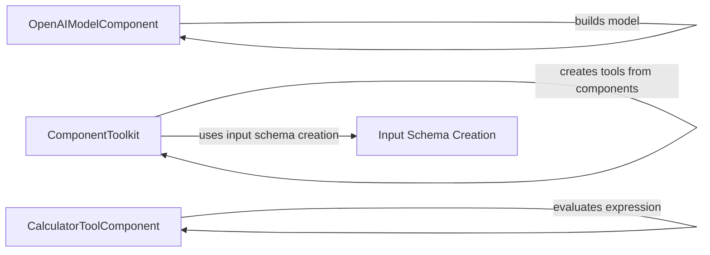

## Component Details

The Language Model and Tool Integration component provides a unified interface for interacting with various language models and tools within Langflow. It encompasses model selection, configuration, and execution, as well as tool management, including building toolkits and executing tools. The main flow involves the ComponentToolkit dynamically generating tools from Langflow components, using input schema creation functions to define the input parameters for each tool. These tools can then be used by other components, such as the CalculatorToolComponent, to perform specific tasks. The OpenAIModelComponent is responsible for building and configuring OpenAI language models.

### OpenAIModelComponent
This component is responsible for building and configuring OpenAI language models within Langflow. It takes user-defined parameters and uses them to initialize and customize the OpenAI model. It interacts with the OpenAI API to create and manage the language model instance.
**Related Classes/Methods**:

- <a href="https://github.com/langflow-ai/langflow/blob/master/src/backend/base/langflow/components/languagemodels/openai_chat_model.py#L99-L121" target="_blank" rel="noopener noreferrer">`src.backend.base.langflow.components.languagemodels.openai_chat_model.OpenAIModelComponent:build_model` (99:121)</a>

### ComponentToolkit
The ComponentToolkit dynamically generates tools from Langflow components. It handles input schema creation, tool name formatting, description building, and output function generation. It interacts with the Langflow component registry to discover available components and creates corresponding tools. It also uses schema creation functions to define the input parameters for each tool.
**Related Classes/Methods**:

- <a href="https://github.com/langflow-ai/langflow/blob/master/src/backend/base/langflow/base/tools/component_tool.py#L176-L283" target="_blank" rel="noopener noreferrer">`src.backend.base.langflow.base.tools.component_tool.ComponentToolkit:get_tools` (176:283)</a>
- <a href="https://github.com/langflow-ai/langflow/blob/master/src/backend/base/langflow/base/tools/component_tool.py#L158-L174" target="_blank" rel="noopener noreferrer">`langflow.src.backend.base.langflow.base.tools.component_tool.ComponentToolkit._should_skip_output` (158:174)</a>
- <a href="https://github.com/langflow-ai/langflow/blob/master/src/backend/base/langflow/io/schema.py#L259-L304" target="_blank" rel="noopener noreferrer">`langflow.io.schema.create_input_schema_from_dict` (259:304)</a>
- <a href="https://github.com/langflow-ai/langflow/blob/master/src/backend/base/langflow/io/schema.py#L216-L256" target="_blank" rel="noopener noreferrer">`langflow.io.schema.create_input_schema` (216:256)</a>
- <a href="https://github.com/langflow-ai/langflow/blob/master/src/backend/base/langflow/base/tools/component_tool.py#L142-L146" target="_blank" rel="noopener noreferrer">`langflow.src.backend.base.langflow.base.tools.component_tool._format_tool_name` (142:146)</a>
- <a href="https://github.com/langflow-ai/langflow/blob/master/src/backend/base/langflow/base/tools/component_tool.py#L41-L43" target="_blank" rel="noopener noreferrer">`langflow.src.backend.base.langflow.base.tools.component_tool.build_description` (41:43)</a>
- <a href="https://github.com/langflow-ai/langflow/blob/master/src/backend/base/langflow/base/tools/component_tool.py#L118-L139" target="_blank" rel="noopener noreferrer">`langflow.src.backend.base.langflow.base.tools.component_tool._build_output_async_function` (118:139)</a>
- <a href="https://github.com/langflow-ai/langflow/blob/master/src/backend/base/langflow/base/tools/component_tool.py#L95-L115" target="_blank" rel="noopener noreferrer">`langflow.src.backend.base.langflow.base.tools.component_tool._build_output_function` (95:115)</a>

### CalculatorToolComponent
This component provides a calculator tool within Langflow. It takes a mathematical expression as input, evaluates it using `_evaluate_expression`, and returns the result. It interacts with a mathematical expression parser and evaluator to perform the calculation.
**Related Classes/Methods**:

- <a href="https://github.com/langflow-ai/langflow/blob/master/src/backend/base/langflow/components/tools/calculator.py#L33-L34" target="_blank" rel="noopener noreferrer">`src.backend.base.langflow.components.tools.calculator.CalculatorToolComponent:run_model` (33:34)</a>
- <a href="https://github.com/langflow-ai/langflow/blob/master/src/backend/base/langflow/components/tools/calculator.py#L69-L93" target="_blank" rel="noopener noreferrer">`langflow.src.backend.base.langflow.components.tools.calculator.CalculatorToolComponent._evaluate_expression` (69:93)</a>

### Input Schema Creation
These functions are responsible for creating the input schema for the tools. They take a dictionary or other data structure as input and generate a schema that defines the expected input parameters for the tool. These schemas are used by the ComponentToolkit to define the inputs for the tools it creates.
**Related Classes/Methods**:

- <a href="https://github.com/langflow-ai/langflow/blob/master/src/backend/base/langflow/io/schema.py#L259-L304" target="_blank" rel="noopener noreferrer">`langflow.io.schema.create_input_schema_from_dict` (259:304)</a>
- <a href="https://github.com/langflow-ai/langflow/blob/master/src/backend/base/langflow/io/schema.py#L216-L256" target="_blank" rel="noopener noreferrer">`langflow.io.schema.create_input_schema` (216:256)</a>