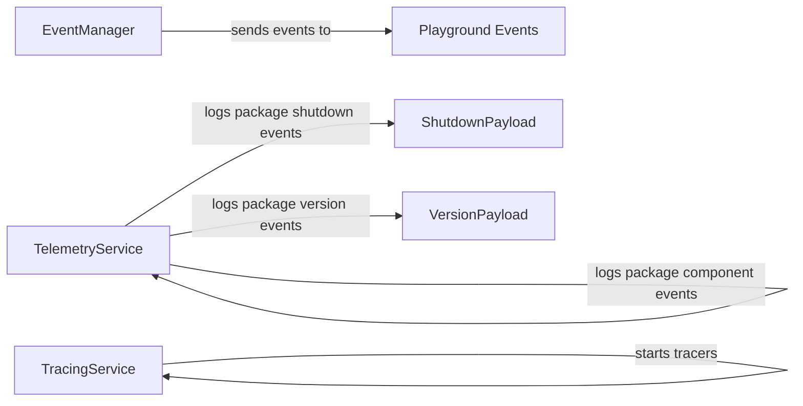

## Component Details

The Observability subsystem in Langflow provides critical insights into the application's behavior and performance through event management, telemetry collection, and tracing capabilities. It allows developers to monitor application usage, identify performance bottlenecks, and track the execution of flows. The EventManager dispatches events to registered handlers. The TelemetryService collects and sends telemetry data asynchronously. The TracingService initializes and manages tracing backends to track execution flow.

### EventManager
The EventManager class is responsible for managing and dispatching events within the Langflow application. It allows registering different event types and sending events to registered handlers. It is initialized with a dictionary of event handlers and provides methods for registering new handlers and sending events.
**Related Classes/Methods**:

- <a href="https://github.com/langflow-ai/langflow/blob/master/src/backend/base/langflow/events/event_manager.py#L30-L86" target="_blank" rel="noopener noreferrer">`src.backend.base.langflow.events.event_manager.EventManager` (30:86)</a>
- <a href="https://github.com/langflow-ai/langflow/blob/master/src/backend/base/langflow/events/event_manager.py#L50-L66" target="_blank" rel="noopener noreferrer">`src.backend.base.langflow.events.event_manager.EventManager.register_event` (50:66)</a>
- <a href="https://github.com/langflow-ai/langflow/blob/master/src/backend/base/langflow/events/event_manager.py#L68-L80" target="_blank" rel="noopener noreferrer">`src.backend.base.langflow.events.event_manager.EventManager.send_event` (68:80)</a>

### TelemetryService
The TelemetryService class is responsible for collecting and sending telemetry data about Langflow usage. It tracks events such as package runs, shutdowns, versions, playground usage, and component usage. The service queues these events and sends them asynchronously to a telemetry endpoint. It also handles starting and stopping the telemetry collection process.
**Related Classes/Methods**:

- <a href="https://github.com/langflow-ai/langflow/blob/master/src/backend/base/langflow/services/telemetry/service.py#L29-L167" target="_blank" rel="noopener noreferrer">`src.backend.base.langflow.services.telemetry.service.TelemetryService` (29:167)</a>
- <a href="https://github.com/langflow-ai/langflow/blob/master/src/backend/base/langflow/services/telemetry/service.py#L82-L83" target="_blank" rel="noopener noreferrer">`src.backend.base.langflow.services.telemetry.service.TelemetryService.log_package_run` (82:83)</a>
- <a href="https://github.com/langflow-ai/langflow/blob/master/src/backend/base/langflow/services/telemetry/service.py#L85-L87" target="_blank" rel="noopener noreferrer">`src.backend.base.langflow.services.telemetry.service.TelemetryService.log_package_shutdown` (85:87)</a>
- <a href="https://github.com/langflow-ai/langflow/blob/master/src/backend/base/langflow/services/telemetry/service.py#L98-L114" target="_blank" rel="noopener noreferrer">`src.backend.base.langflow.services.telemetry.service.TelemetryService.log_package_version` (98:114)</a>
- <a href="https://github.com/langflow-ai/langflow/blob/master/src/backend/base/langflow/services/telemetry/service.py#L116-L117" target="_blank" rel="noopener noreferrer">`src.backend.base.langflow.services.telemetry.service.TelemetryService.log_package_playground` (116:117)</a>
- <a href="https://github.com/langflow-ai/langflow/blob/master/src/backend/base/langflow/services/telemetry/service.py#L119-L120" target="_blank" rel="noopener noreferrer">`src.backend.base.langflow.services.telemetry.service.TelemetryService.log_package_component` (119:120)</a>
- <a href="https://github.com/langflow-ai/langflow/blob/master/src/backend/base/langflow/services/telemetry/service.py#L122-L131" target="_blank" rel="noopener noreferrer">`src.backend.base.langflow.services.telemetry.service.TelemetryService.start` (122:131)</a>
- <a href="https://github.com/langflow-ai/langflow/blob/master/src/backend/base/langflow/services/telemetry/service.py#L150-L164" target="_blank" rel="noopener noreferrer">`src.backend.base.langflow.services.telemetry.service.TelemetryService.stop` (150:164)</a>
- <a href="https://github.com/langflow-ai/langflow/blob/master/src/backend/base/langflow/services/telemetry/service.py#L166-L167" target="_blank" rel="noopener noreferrer">`src.backend.base.langflow.services.telemetry.service.TelemetryService.teardown` (166:167)</a>

### TracingService
The TracingService class is responsible for initializing and managing tracing capabilities within Langflow. It supports multiple tracing backends, including LangSmith, LangWatch, Langfuse, Arize Phoenix, and Opik. The service initializes the appropriate tracer based on the configured environment variables and provides a context manager for tracing execution.
**Related Classes/Methods**:

- <a href="https://github.com/langflow-ai/langflow/blob/master/src/backend/base/langflow/services/tracing/service.py#L104-L431" target="_blank" rel="noopener noreferrer">`src.backend.base.langflow.services.tracing.service.TracingService` (104:431)</a>
- <a href="https://github.com/langflow-ai/langflow/blob/master/src/backend/base/langflow/services/tracing/service.py#L204-L231" target="_blank" rel="noopener noreferrer">`src.backend.base.langflow.services.tracing.service.TracingService.start_tracers` (204:231)</a>

### Playground Events
This component is responsible for creating events related to the playground environment. It likely defines the structure and types of events that can occur within the playground, such as node creations, executions, and deletions.
**Related Classes/Methods**:

- <a href="https://github.com/langflow-ai/langflow/blob/master/src/backend/base/langflow/schema/playground_events.py#L173-L181" target="_blank" rel="noopener noreferrer">`langflow.schema.playground_events.create_event_by_type` (173:181)</a>

### ShutdownPayload
This component defines the data structure for the payload sent when the Langflow application shuts down. It likely includes information about the session, user, and any errors that occurred during the session.
**Related Classes/Methods**:

- <a href="https://github.com/langflow-ai/langflow/blob/master/src/backend/base/langflow/services/telemetry/schema.py#L11-L12" target="_blank" rel="noopener noreferrer">`langflow.services.telemetry.schema.ShutdownPayload` (11:12)</a>

### VersionPayload
This component defines the data structure for the payload sent when the Langflow application starts. It includes information about the Langflow version, Python version, and operating system.
**Related Classes/Methods**:

- <a href="https://github.com/langflow-ai/langflow/blob/master/src/backend/base/langflow/services/telemetry/schema.py#L15-L24" target="_blank" rel="noopener noreferrer">`langflow.services.telemetry.schema.VersionPayload` (15:24)</a>