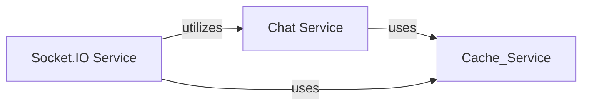

## Component Details

This component manages real-time communication and chat state within Langflow. It leverages Socket.IO for handling WebSocket connections and events, and a dedicated chat service for managing and caching chat-related data, ensuring interactive and responsive user experiences.

### Chat Service
Manages chat-related operations, including caching of chat data. It uses a cache service to store and retrieve chat messages and other relevant information.

**Related Classes/Methods**:

- <a href="https://github.com/langflow-ai/langflow/blob/master/src/backend/base/langflow/services/chat/service.py#L11-L67" target="_blank" rel="noopener noreferrer">`langflow.services.chat.service.ChatService` (11:67)</a>

### Socket.IO Service
Handles real-time communication using Socket.IO. It manages connections, disconnections, and message emissions, and interacts with the chat service for specific operations like getting and building vertices.

**Related Classes/Methods**:

- <a href="https://github.com/langflow-ai/langflow/blob/master/src/backend/base/langflow/services/socket/service.py#L12-L84" target="_blank" rel="noopener noreferrer">`langflow.services.socket.service.SocketIOService` (12:84)</a>

### [FAQ](https://github.com/CodeBoarding/GeneratedOnBoardings/tree/main?tab=readme-ov-file#faq)