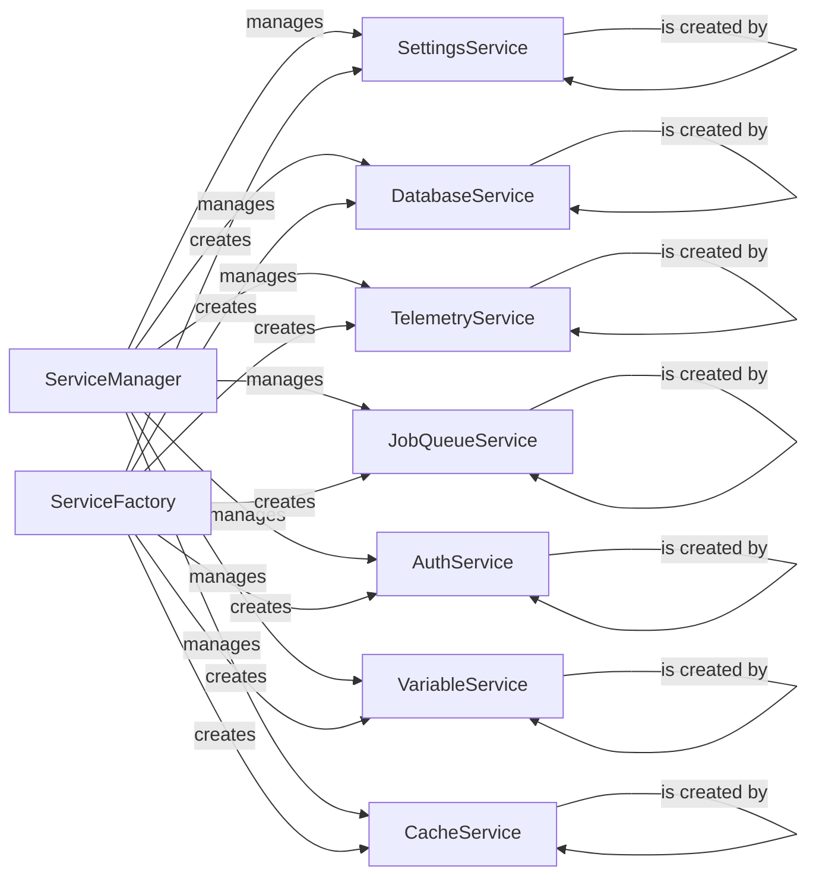

## Component Details

The Service Management component in Langflow is responsible for initializing, managing, and providing access to various background services required by the application. It uses a ServiceManager to handle the lifecycle of services and ServiceFactories to create service instances. The component ensures that services like settings, database, authentication, telemetry, tracing, job queue, variable, cache, state, chat, socket, task, and shared component cache are properly configured and available to other parts of the application. It also provides dependency injection for services.

### ServiceManager
The ServiceManager is a central component responsible for managing the lifecycle of all services within the Langflow application. It handles the registration of service factories, creation of services, and retrieval of services. It ensures that services are properly initialized and torn down, providing a consistent and reliable way to access and manage services throughout the application.
- **Related Classes/Methods**: `langflow.services.manager.ServiceManager`

### ServiceFactory
The ServiceFactory is an abstract base class for all service factories. It defines the interface for creating service instances. Concrete service factories inherit from this class and implement the `create` method to instantiate specific services. This abstraction allows for a flexible and extensible service creation mechanism.
- **Related Classes/Methods**: `langflow.services.factory.ServiceFactory`

### SettingsService
The SettingsService provides access to application settings and configurations. It is responsible for loading, storing, and managing settings. It is initialized early in the application lifecycle and used by other services to configure their behavior. It interacts with the ServiceManager for lifecycle management and the SettingsServiceFactory for instance creation.
- **Related Classes/Methods**: `langflow.services.settings.service.SettingsService`, `langflow.services.settings.factory.SettingsServiceFactory`

### DatabaseService
The DatabaseService manages the database connection and provides access to database operations. It is responsible for running migrations and ensuring that the database is properly initialized and maintained. It interacts with the ServiceManager for lifecycle management and the DatabaseServiceFactory for instance creation.
- **Related Classes/Methods**: `langflow.services.database.service.DatabaseService`, `langflow.services.database.factory.DatabaseServiceFactory`

### TelemetryService
The TelemetryService collects and reports application telemetry data. It is responsible for tracking application usage and performance. It is started and stopped along with the application lifecycle. It interacts with the ServiceManager for lifecycle management and the TelemetryServiceFactory for instance creation.
- **Related Classes/Methods**: `langflow.services.telemetry.service.TelemetryService`, `langflow.services.telemetry.factory.TelemetryServiceFactory`

### JobQueueService
The JobQueueService manages background jobs and tasks. It is responsible for queuing, processing, and monitoring jobs. It is started and stopped along with the application lifecycle. It interacts with the ServiceManager for lifecycle management and the JobQueueServiceFactory for instance creation.
- **Related Classes/Methods**: `langflow.services.job_queue.service.JobQueueService`, `langflow.services.job_queue.factory.JobQueueServiceFactory`

### AuthService
The AuthService handles authentication and authorization for the Langflow application. It manages user accounts, sessions, and permissions. It interacts with the ServiceManager for lifecycle management and the AuthServiceFactory for instance creation.
- **Related Classes/Methods**: `langflow.services.auth.factory.AuthServiceFactory`

### VariableService
The VariableService manages variables and their values within the Langflow application. It provides a centralized location for storing and retrieving variables. It interacts with the ServiceManager for lifecycle management and the VariableServiceFactory for instance creation.
- **Related Classes/Methods**: `langflow.services.variable.factory.VariableServiceFactory`

### CacheService
The CacheService provides caching functionality for the Langflow application. It is used to store frequently accessed data in memory to improve performance. It interacts with the ServiceManager for lifecycle management and the CacheServiceFactory for instance creation.
- **Related Classes/Methods**: `langflow.services.cache.factory.CacheServiceFactory`
