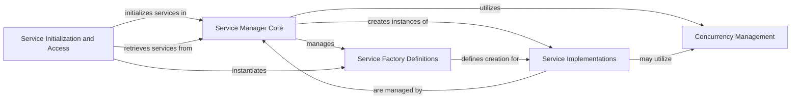

## Component Details

This graph illustrates the architecture of the Service Manager subsystem in Langflow. The core functionality revolves around the `Service Manager Core` which orchestrates the lifecycle of various services. `Service Initialization and Access` handles the initial setup and provides interfaces for retrieving services. `Service Factory Definitions` define how services are created, while `Service Implementations` are the actual service classes providing specific functionalities. `Concurrency Management` ensures thread safety for shared resources. The overall purpose is to provide a robust and extensible dependency injection system for managing Langflow's services.

### Service Manager Core
The central orchestrator for managing the lifecycle of services within Langflow. It handles registration, creation, retrieval, updating, and teardown of services, ensuring proper dependency injection and validation.

**Related Classes/Methods**:

- <a href="https://github.com/langflow-ai/langflow/blob/master/src/backend/base/langflow/services/manager.py#L21-L128" target="_blank" rel="noopener noreferrer">`langflow.services.manager.ServiceManager` (21:128)</a>
- <a href="https://github.com/langflow-ai/langflow/blob/master/src/backend/base/langflow/services/manager.py#L24-L28" target="_blank" rel="noopener noreferrer">`langflow.services.manager.ServiceManager:__init__` (24:28)</a>
- <a href="https://github.com/langflow-ai/langflow/blob/master/src/backend/base/langflow/services/manager.py#L30-L35" target="_blank" rel="noopener noreferrer">`langflow.services.manager.ServiceManager.register_factories` (30:35)</a>
- <a href="https://github.com/langflow-ai/langflow/blob/master/src/backend/base/langflow/services/manager.py#L104-L128" target="_blank" rel="noopener noreferrer">`langflow.services.manager.ServiceManager.get_factories` (104:128)</a>
- <a href="https://github.com/langflow-ai/langflow/blob/master/src/backend/base/langflow/services/manager.py#L37-L43" target="_blank" rel="noopener noreferrer">`langflow.services.manager.ServiceManager.register_factory` (37:43)</a>
- <a href="https://github.com/langflow-ai/langflow/blob/master/src/backend/base/langflow/services/manager.py#L45-L51" target="_blank" rel="noopener noreferrer">`langflow.services.manager.ServiceManager.get` (45:51)</a>
- <a href="https://github.com/langflow-ai/langflow/blob/master/src/backend/base/langflow/services/manager.py#L53-L75" target="_blank" rel="noopener noreferrer">`langflow.services.manager.ServiceManager._create_service` (53:75)</a>
- <a href="https://github.com/langflow-ai/langflow/blob/master/src/backend/base/langflow/services/manager.py#L77-L81" target="_blank" rel="noopener noreferrer">`langflow.services.manager.ServiceManager._validate_service_creation` (77:81)</a>
- <a href="https://github.com/langflow-ai/langflow/blob/master/src/backend/base/langflow/services/manager.py#L83-L88" target="_blank" rel="noopener noreferrer">`langflow.services.manager.ServiceManager.update` (83:88)</a>
- <a href="https://github.com/langflow-ai/langflow/blob/master/src/backend/base/langflow/services/manager.py#L90-L101" target="_blank" rel="noopener noreferrer">`langflow.services.manager.ServiceManager.teardown` (90:101)</a>
- <a href="https://github.com/langflow-ai/langflow/blob/master/src/backend/base/langflow/services/manager.py#L17-L18" target="_blank" rel="noopener noreferrer">`langflow.services.manager.NoFactoryRegisteredError` (17:18)</a>

### Service Initialization and Access
This component is responsible for the initial setup and registration of foundational services into the Service Manager. It also provides the primary interface for other parts of the application to access initialized services and includes utility functions for system-wide service management operations like teardown.

**Related Classes/Methods**:

- <a href="https://github.com/langflow-ai/langflow/blob/master/src/backend/base/langflow/services/manager.py#L134-L138" target="_blank" rel="noopener noreferrer">`langflow.services.manager:initialize_settings_service` (134:138)</a>
- <a href="https://github.com/langflow-ai/langflow/blob/master/src/backend/base/langflow/services/manager.py#L141-L150" target="_blank" rel="noopener noreferrer">`langflow.services.manager:initialize_session_service` (141:150)</a>
- <a href="https://github.com/langflow-ai/langflow/blob/master/src/backend/base/langflow/services/deps.py#L31-L49" target="_blank" rel="noopener noreferrer">`langflow.services.deps:get_service` (31:49)</a>
- <a href="https://github.com/langflow-ai/langflow/blob/master/src/backend/base/langflow/services/deps.py#L133-L142" target="_blank" rel="noopener noreferrer">`langflow.services.deps.get_db_service` (133:142)</a>
- <a href="https://github.com/langflow-ai/langflow/blob/master/src/backend/base/langflow/services/deps.py#L117-L130" target="_blank" rel="noopener noreferrer">`langflow.services.deps.get_settings_service` (117:130)</a>
- <a href="https://github.com/langflow-ai/langflow/blob/master/src/backend/base/langflow/services/utils.py#L132-L144" target="_blank" rel="noopener noreferrer">`langflow.services.utils:teardown_services` (132:144)</a>
- <a href="https://github.com/langflow-ai/langflow/blob/master/src/backend/base/langflow/services/utils.py#L105-L129" target="_blank" rel="noopener noreferrer">`langflow.services.utils.teardown_superuser` (105:129)</a>

### Service Factory Definitions
This component defines the abstract base class for service factories and includes concrete factory implementations for various services. These factories encapsulate the logic for creating and configuring specific service instances.

**Related Classes/Methods**:

- <a href="https://github.com/langflow-ai/langflow/blob/master/src/backend/base/langflow/services/factory.py#L14-L23" target="_blank" rel="noopener noreferrer">`langflow.services.factory.ServiceFactory` (14:23)</a>
- <a href="https://github.com/langflow-ai/langflow/blob/master/src/backend/base/langflow/services/settings/factory.py#L7-L22" target="_blank" rel="noopener noreferrer">`langflow.services.settings.factory.SettingsServiceFactory` (7:22)</a>
- <a href="https://github.com/langflow-ai/langflow/blob/master/src/backend/base/langflow/services/cache/factory.py#L16-L44" target="_blank" rel="noopener noreferrer">`langflow.services.cache.factory.CacheServiceFactory` (16:44)</a>
- <a href="https://github.com/langflow-ai/langflow/blob/master/src/backend/base/langflow/services/session/factory.py#L12-L18" target="_blank" rel="noopener noreferrer">`langflow.services.session.factory.SessionServiceFactory` (12:18)</a>
- <a href="https://github.com/langflow-ai/langflow/blob/master/src/backend/base/langflow/services/auth/factory.py#L7-L15" target="_blank" rel="noopener noreferrer">`langflow.services.auth.factory.AuthServiceFactory` (7:15)</a>
- <a href="https://github.com/langflow-ai/langflow/blob/master/src/backend/base/langflow/services/chat/factory.py#L5-L11" target="_blank" rel="noopener noreferrer">`langflow.services.chat.factory.ChatServiceFactory` (5:11)</a>
- <a href="https://github.com/langflow-ai/langflow/blob/master/src/backend/base/langflow/services/database/factory.py#L12-L21" target="_blank" rel="noopener noreferrer">`langflow.services.database.factory.DatabaseServiceFactory` (12:21)</a>
- <a href="https://github.com/langflow-ai/langflow/blob/master/src/backend/base/langflow/services/job_queue/factory.py#L6-L11" target="_blank" rel="noopener noreferrer">`langflow.services.job_queue.factory.JobQueueServiceFactory` (6:11)</a>
- <a href="https://github.com/langflow-ai/langflow/blob/master/src/backend/base/langflow/services/shared_component_cache/factory.py#L12-L18" target="_blank" rel="noopener noreferrer">`langflow.services.shared_component_cache.factory.SharedComponentCacheServiceFactory` (12:18)</a>
- <a href="https://github.com/langflow-ai/langflow/blob/master/src/backend/base/langflow/services/socket/factory.py#L12-L20" target="_blank" rel="noopener noreferrer">`langflow.services.socket.factory.SocketIOFactory` (12:20)</a>
- <a href="https://github.com/langflow-ai/langflow/blob/master/src/backend/base/langflow/services/state/factory.py#L8-L16" target="_blank" rel="noopener noreferrer">`langflow.services.state.factory.StateServiceFactory` (8:16)</a>
- <a href="https://github.com/langflow-ai/langflow/blob/master/src/backend/base/langflow/services/storage/factory.py#L10-L30" target="_blank" rel="noopener noreferrer">`langflow.services.storage.factory.StorageServiceFactory` (10:30)</a>
- <a href="https://github.com/langflow-ai/langflow/blob/master/src/backend/base/langflow/services/store/factory.py#L14-L20" target="_blank" rel="noopener noreferrer">`langflow.services.store.factory.StoreServiceFactory` (14:20)</a>
- <a href="https://github.com/langflow-ai/langflow/blob/master/src/backend/base/langflow/services/task/factory.py#L7-L14" target="_blank" rel="noopener noreferrer">`langflow.services.task.factory.TaskServiceFactory` (7:14)</a>
- <a href="https://github.com/langflow-ai/langflow/blob/master/src/backend/base/langflow/services/telemetry/factory.py#L14-L20" target="_blank" rel="noopener noreferrer">`langflow.services.telemetry.factory.TelemetryServiceFactory` (14:20)</a>
- <a href="https://github.com/langflow-ai/langflow/blob/master/src/backend/base/langflow/services/tracing/factory.py#L14-L20" target="_blank" rel="noopener noreferrer">`langflow.services.tracing.factory.TracingServiceFactory` (14:20)</a>
- <a href="https://github.com/langflow-ai/langflow/blob/master/src/backend/base/langflow/services/variable/factory.py#L14-L28" target="_blank" rel="noopener noreferrer">`langflow.services.variable.factory.VariableServiceFactory` (14:28)</a>
- <a href="https://github.com/langflow-ai/langflow/blob/master/src/backend/base/langflow/services/schema.py#L4-L22" target="_blank" rel="noopener noreferrer">`langflow.services.schema.ServiceType` (4:22)</a>

### Service Implementations
This component comprises the actual classes that provide the core functionalities of Langflow, such as authentication, caching, database interactions, session management, and various other application-specific services.

**Related Classes/Methods**:

- <a href="https://github.com/langflow-ai/langflow/blob/master/src/backend/base/langflow/services/base.py#L4-L28" target="_blank" rel="noopener noreferrer">`langflow.services.base.Service` (4:28)</a>
- <a href="https://github.com/langflow-ai/langflow/blob/master/src/backend/base/langflow/services/auth/service.py#L11-L15" target="_blank" rel="noopener noreferrer">`langflow.services.auth.service.AuthService` (11:15)</a>
- <a href="https://github.com/langflow-ai/langflow/blob/master/src/backend/base/langflow/services/cache/base.py#L110-L169" target="_blank" rel="noopener noreferrer">`langflow.services.cache.base.AsyncBaseCacheService` (110:169)</a>
- <a href="https://github.com/langflow-ai/langflow/blob/master/src/backend/base/langflow/services/cache/base.py#L12-L107" target="_blank" rel="noopener noreferrer">`langflow.services.cache.base.CacheService` (12:107)</a>
- <a href="https://github.com/langflow-ai/langflow/blob/master/src/backend/base/langflow/services/cache/base.py#L172-L183" target="_blank" rel="noopener noreferrer">`langflow.services.cache.base.ExternalAsyncBaseCacheService` (172:183)</a>
- <a href="https://github.com/langflow-ai/langflow/blob/master/src/backend/base/langflow/services/cache/disk.py#L13-L95" target="_blank" rel="noopener noreferrer">`langflow.services.cache.disk.AsyncDiskCache` (13:95)</a>
- <a href="https://github.com/langflow-ai/langflow/blob/master/src/backend/base/langflow/services/cache/service.py#L299-L360" target="_blank" rel="noopener noreferrer">`langflow.services.cache.service.AsyncInMemoryCache` (299:360)</a>
- <a href="https://github.com/langflow-ai/langflow/blob/master/src/backend/base/langflow/services/cache/service.py#L178-L296" target="_blank" rel="noopener noreferrer">`langflow.services.cache.service.RedisCache` (178:296)</a>
- <a href="https://github.com/langflow-ai/langflow/blob/master/src/backend/base/langflow/services/cache/service.py#L22-L175" target="_blank" rel="noopener noreferrer">`langflow.services.cache.service.ThreadingInMemoryCache` (22:175)</a>
- <a href="https://github.com/langflow-ai/langflow/blob/master/src/backend/base/langflow/services/chat/service.py#L11-L67" target="_blank" rel="noopener noreferrer">`langflow.services.chat.service.ChatService` (11:67)</a>
- <a href="https://github.com/langflow-ai/langflow/blob/master/src/backend/base/langflow/services/database/service.py#L38-L482" target="_blank" rel="noopener noreferrer">`langflow.services.database.service.DatabaseService` (38:482)</a>
- <a href="https://github.com/langflow-ai/langflow/blob/master/src/backend/base/langflow/services/job_queue/service.py#L19-L327" target="_blank" rel="noopener noreferrer">`langflow.services.job_queue.service.JobQueueService` (19:327)</a>
- <a href="https://github.com/langflow-ai/langflow/blob/master/src/backend/base/langflow/services/session/service.py#L13-L63" target="_blank" rel="noopener noreferrer">`langflow.services.session.service.SessionService` (13:63)</a>
- <a href="https://github.com/langflow-ai/langflow/blob/master/src/backend/base/langflow/services/settings/manager.py#L13-L49" target="_blank" rel="noopener noreferrer">`langflow.services.settings.manager.SettingsService` (13:49)</a>
- <a href="https://github.com/langflow-ai/langflow/blob/master/src/backend/base/langflow/services/settings/service.py#L8-L32" target="_blank" rel="noopener noreferrer">`langflow.services.settings.service.SettingsService` (8:32)</a>
- <a href="https://github.com/langflow-ai/langflow/blob/master/src/backend/base/langflow/services/shared_component_cache/service.py#L4-L7" target="_blank" rel="noopener noreferrer">`langflow.services.shared_component_cache.service.SharedComponentCacheService` (4:7)</a>
- <a href="https://github.com/langflow-ai/langflow/blob/master/src/backend/base/langflow/services/socket/service.py#L12-L84" target="_blank" rel="noopener noreferrer">`langflow.services.socket.service.SocketIOService` (12:84)</a>
- <a href="https://github.com/langflow-ai/langflow/blob/master/src/backend/base/langflow/services/state/service.py#L33-L83" target="_blank" rel="noopener noreferrer">`langflow.services.state.service.InMemoryStateService` (33:83)</a>
- <a href="https://github.com/langflow-ai/langflow/blob/master/src/backend/base/langflow/services/state/service.py#L11-L30" target="_blank" rel="noopener noreferrer">`langflow.services.state.service.StateService` (11:30)</a>
- <a href="https://github.com/langflow-ai/langflow/blob/master/src/backend/base/langflow/services/storage/local.py#L8-L126" target="_blank" rel="noopener noreferrer">`langflow.services.storage.local.LocalStorageService` (8:126)</a>
- <a href="https://github.com/langflow-ai/langflow/blob/master/src/backend/base/langflow/services/storage/s3.py#L8-L100" target="_blank" rel="noopener noreferrer">`langflow.services.storage.s3.S3StorageService` (8:100)</a>
- <a href="https://github.com/langflow-ai/langflow/blob/master/src/backend/base/langflow/services/storage/service.py#L15-L47" target="_blank" rel="noopener noreferrer">`langflow.services.storage.service.StorageService` (15:47)</a>
- <a href="https://github.com/langflow-ai/langflow/blob/master/src/backend/base/langflow/services/store/service.py#L75-L600" target="_blank" rel="noopener noreferrer">`langflow.services.store.service.StoreService` (75:600)</a>
- <a href="https://github.com/langflow-ai/langflow/blob/master/src/backend/base/langflow/services/task/backends/anyio.py#L54-L117" target="_blank" rel="noopener noreferrer">`langflow.services.task.backends.anyio.AnyIOBackend` (54:117)</a>
- <a href="https://github.com/langflow-ai/langflow/blob/master/src/backend/base/langflow/services/task/backends/celery.py#L13-L29" target="_blank" rel="noopener noreferrer">`langflow.services.task.backends.celery.CeleryBackend` (13:29)</a>
- <a href="https://github.com/langflow-ai/langflow/blob/master/src/backend/base/langflow/services/task/service.py#L14-L40" target="_blank" rel="noopener noreferrer">`langflow.services.task.service.TaskService` (14:40)</a>
- <a href="https://github.com/langflow-ai/langflow/blob/master/src/backend/base/langflow/services/telemetry/service.py#L29-L167" target="_blank" rel="noopener noreferrer">`langflow.services.telemetry.service.TelemetryService` (29:167)</a>
- <a href="https://github.com/langflow-ai/langflow/blob/master/src/backend/base/langflow/services/tracing/arize_phoenix.py#L36-L375" target="_blank" rel="noopener noreferrer">`langflow.services.tracing.arize_phoenix.ArizePhoenixTracer` (36:375)</a>
- <a href="https://github.com/langflow-ai/langflow/blob/master/src/backend/base/langflow/services/tracing/langfuse.py#L24-L170" target="_blank" rel="noopener noreferrer">`langflow.services.tracing.langfuse.LangFuseTracer` (24:170)</a>
- <a href="https://github.com/langflow-ai/langflow/blob/master/src/backend/base/langflow/services/tracing/langsmith.py#L26-L175" target="_blank" rel="noopener noreferrer">`langflow.services.tracing.langsmith.LangSmithTracer` (26:175)</a>
- <a href="https://github.com/langflow-ai/langflow/blob/master/src/backend/base/langflow/services/tracing/langwatch.py#L24-L185" target="_blank" rel="noopener noreferrer">`langflow.services.tracing.langwatch.LangWatchTracer` (24:185)</a>
- <a href="https://github.com/langflow-ai/langflow/blob/master/src/backend/base/langflow/services/tracing/opik.py#L31-L235" target="_blank" rel="noopener noreferrer">`langflow.services.tracing.opik.OpikTracer` (31:235)</a>
- <a href="https://github.com/langflow-ai/langflow/blob/master/src/backend/base/langflow/services/tracing/service.py#L104-L431" target="_blank" rel="noopener noreferrer">`langflow.services.tracing.service.TracingService` (104:431)</a>
- <a href="https://github.com/langflow-ai/langflow/blob/master/src/backend/base/langflow/services/variable/base.py#L10-L119" target="_blank" rel="noopener noreferrer">`langflow.services.variable.base.VariableService` (10:119)</a>
- <a href="https://github.com/langflow-ai/langflow/blob/master/src/backend/base/langflow/services/variable/kubernetes.py#L26-L204" target="_blank" rel="noopener noreferrer">`langflow.services.variable.kubernetes.KubernetesSecretService` (26:204)</a>
- <a href="https://github.com/langflow-ai/langflow/blob/master/src/backend/base/langflow/services/variable/service.py#L26-L196" target="_blank" rel="noopener noreferrer">`langflow.services.variable.service.DatabaseVariableService` (26:196)</a>

### Concurrency Management
This component provides mechanisms for ensuring thread safety and managing concurrent access to shared resources within the service layer.

**Related Classes/Methods**:

- <a href="https://github.com/langflow-ai/langflow/blob/master/src/backend/base/langflow/utils/concurrency.py#L10-L30" target="_blank" rel="noopener noreferrer">`langflow.utils.concurrency.KeyedMemoryLockManager` (10:30)</a>
- <a href="https://github.com/langflow-ai/langflow/blob/master/src/backend/base/langflow/utils/concurrency.py#L24-L30" target="_blank" rel="noopener noreferrer">`langflow.utils.concurrency.KeyedMemoryLockManager.lock` (24:30)</a>

### [FAQ](https://github.com/CodeBoarding/GeneratedOnBoardings/tree/main?tab=readme-ov-file#faq)