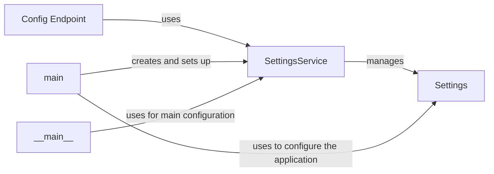

## Component Details

The Settings and Configuration component in Langflow is responsible for managing the application's settings and configurations. It provides functionalities for initializing, accessing, and updating settings, ensuring that the application can be configured and customized according to the user's needs. The component includes a service for managing settings, a data model for representing settings, and an API endpoint for retrieving the configuration.

### SettingsService
The SettingsService manages the application settings, providing functionalities for initializing, accessing, and updating settings. It acts as a central point for managing the application's configuration, loading settings from environment variables and providing access to them throughout the application.
**Related Classes/Methods**:

- <a href="https://github.com/langflow-ai/langflow/blob/master/src/backend/base/langflow/services/settings/service.py#L17-L28" target="_blank" rel="noopener noreferrer">`src.backend.base.langflow.services.settings.service.SettingsService:initialize` (17:28)</a>

### Settings
The Settings class represents the application settings and provides methods for setting configuration parameters, such as the database URL. It holds the actual settings values and allows them to be accessed and modified.
**Related Classes/Methods**:

- <a href="https://github.com/langflow-ai/langflow/blob/master/src/backend/base/langflow/services/settings/base.py#L321-L391" target="_blank" rel="noopener noreferrer">`src.backend.base.langflow.services.settings.base.Settings:set_database_url` (321:391)</a>

### Config Endpoint
The Config Endpoint is an API endpoint that retrieves the application's configuration. It provides a way to access the settings through an HTTP request, allowing external systems to query the application's configuration.
**Related Classes/Methods**:

- <a href="https://github.com/langflow-ai/langflow/blob/master/src/backend/base/langflow/api/v1/endpoints.py#L749-L758" target="_blank" rel="noopener noreferrer">`src.backend.base.langflow.api.v1.endpoints:get_config` (749:758)</a>

### main
The entry point of the Langflow application, responsible for creating the FastAPI app and setting up the lifespan events. It initializes the SettingsService and makes the settings available to the application.
**Related Classes/Methods**:

- <a href="https://github.com/langflow-ai/langflow/blob/master/src/backend/base/langflow/main.py#L206-L323" target="_blank" rel="noopener noreferrer">`src.backend.base.langflow.main:create_app` (206:323)</a>
- <a href="https://github.com/langflow-ai/langflow/blob/master/src/backend/base/langflow/main.py#L112-L203" target="_blank" rel="noopener noreferrer">`src.backend.base.langflow.main:get_lifespan` (112:203)</a>
- <a href="https://github.com/langflow-ai/langflow/blob/master/src/backend/base/langflow/main.py#L326-L337" target="_blank" rel="noopener noreferrer">`src.backend.base.langflow.main:setup_sentry` (326:337)</a>

### __main__
The __main__ module contains the main function that starts the Langflow application, configuring logging, setting environment variables, and running the app using Uvicorn. It uses the SettingsService for main configuration.
**Related Classes/Methods**:

- <a href="https://github.com/langflow-ai/langflow/blob/master/src/backend/base/langflow/__main__.py#L88-L258" target="_blank" rel="noopener noreferrer">`src.backend.base.langflow.__main__:run` (88:258)</a>