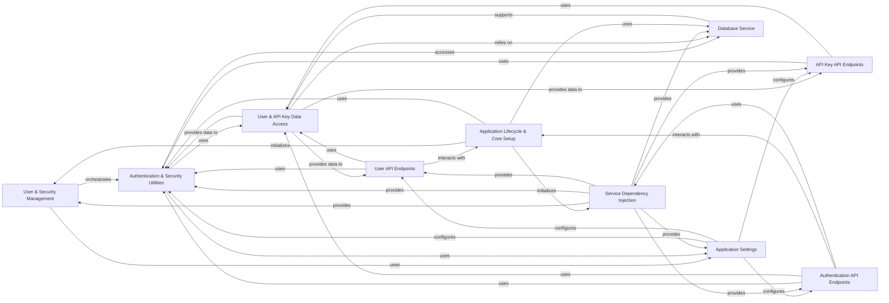

## Component Details

The User & Security Management subsystem is responsible for all aspects of user authentication, authorization, and API key management within the Langflow application. It encompasses core authentication services, utility functions for security operations like password hashing and token creation, and dedicated API endpoints for user and API key lifecycle management. This subsystem interacts closely with the database for user and API key data persistence and relies on application settings for configuration. It also plays a crucial role during the application's lifecycle for initial superuser setup.

### User & Security Management
Orchestrates user authentication, authorization, password hashing, token creation, and API key management, and exposes these functionalities via dedicated API endpoints.

**Related Classes/Methods**:

- <a href="https://github.com/langflow-ai/langflow/blob/master/src/backend/base/langflow/services/auth/service.py#L11-L15" target="_blank" rel="noopener noreferrer">`langflow.services.auth.service.AuthService` (11:15)</a>
- <a href="https://github.com/langflow-ai/langflow/blob/master/src/backend/base/langflow/services/auth/factory.py#L7-L15" target="_blank" rel="noopener noreferrer">`langflow.src.backend.base.langflow.services.auth.factory.AuthServiceFactory` (7:15)</a>

### Authentication & Security Utilities
Provides a suite of utility functions for user authentication, token generation, password management, and secure API key handling (encryption/decryption).

**Related Classes/Methods**:

- `langflow.src.backend.base.langflow.services.auth.utils` (full file reference)
- <a href="https://github.com/langflow-ai/langflow/blob/master/src/backend/base/langflow/services/auth/utils.py#L403-L414" target="_blank" rel="noopener noreferrer">`langflow.services.auth.utils.authenticate_user` (403:414)</a>

### User & API Key Data Access
Provides CRUD operations and data models for managing user accounts and API keys within the database.

**Related Classes/Methods**:

- `langflow.services.database.models.user.crud` (full file reference)
- `langflow.services.database.models.user.model` (full file reference)
- `langflow.services.database.models.api_key.crud` (full file reference)
- `langflow.services.database.models.api_key.model` (full file reference)

### Application Settings
Manages the configuration and settings for the Langflow application, including authentication parameters and secret key handling.

**Related Classes/Methods**:

- <a href="https://github.com/langflow-ai/langflow/blob/master/src/backend/base/langflow/services/settings/service.py#L8-L32" target="_blank" rel="noopener noreferrer">`langflow.src.backend.base.langflow.services.settings.service.SettingsService` (8:32)</a>
- <a href="https://github.com/langflow-ai/langflow/blob/master/src/backend/base/langflow/services/settings/auth.py#L14-L110" target="_blank" rel="noopener noreferrer">`langflow.src.backend.base.langflow.services.settings.auth.AuthSettings` (14:110)</a>
- <a href="https://github.com/langflow-ai/langflow/blob/master/src/backend/base/langflow/services/settings/factory.py#L7-L22" target="_blank" rel="noopener noreferrer">`langflow.src.backend.base.langflow.services.settings.factory.SettingsServiceFactory` (7:22)</a>
- <a href="https://github.com/langflow-ai/langflow/blob/master/src/backend/base/langflow/services/settings/base.py#L66-L467" target="_blank" rel="noopener noreferrer">`langflow.src.backend.base.langflow.services.settings.base.Settings` (66:467)</a>
- `langflow.src.backend.base.langflow.services.settings.utils` (full file reference)

### User API Endpoints
Exposes RESTful API endpoints for managing user accounts, including creation, modification, and password resets.

**Related Classes/Methods**:

- `langflow.api.v1.users` (full file reference)

### API Key API Endpoints
Provides RESTful API endpoints for managing API keys, allowing users to create, retrieve, delete, and securely store their API keys.

**Related Classes/Methods**:

- `langflow.api.v1.api_key` (full file reference)

### Authentication API Endpoints
Offers RESTful API endpoints for user authentication, including login, automatic login, and token refreshing.

**Related Classes/Methods**:

- `langflow.api.v1.login` (full file reference)

### Service Dependency Injection
Provides a central mechanism for retrieving and managing instances of various services, ensuring proper dependency resolution across the application.

**Related Classes/Methods**:

- `langflow.src.backend.base.langflow.services.deps` (full file reference)

### Database Service
Encapsulates the core database operations, including engine creation, session management, and schema health checks.

**Related Classes/Methods**:

- `langflow.src.backend.base.langflow.services.database.service` (full file reference)
- `langflow.src.backend.base.langflow.services.database.factory` (full file reference)
- `langflow.src.backend.base.langflow.services.database.utils` (full file reference)

### Application Lifecycle & Core Setup
Manages the startup and shutdown procedures of the Langflow application, including the initialization of superusers and default user folders.

**Related Classes/Methods**:

- `langflow.src.backend.base.langflow.main` (full file reference)
- `langflow.src.backend.base.langflow.__main__` (full file reference)
- `langflow.src.backend.base.langflow.initial_setup.setup` (full file reference)
- `langflow.src.backend.base.langflow.services.utils` (full file reference)

### [FAQ](https://github.com/CodeBoarding/GeneratedOnBoardings/tree/main?tab=readme-ov-file#faq)