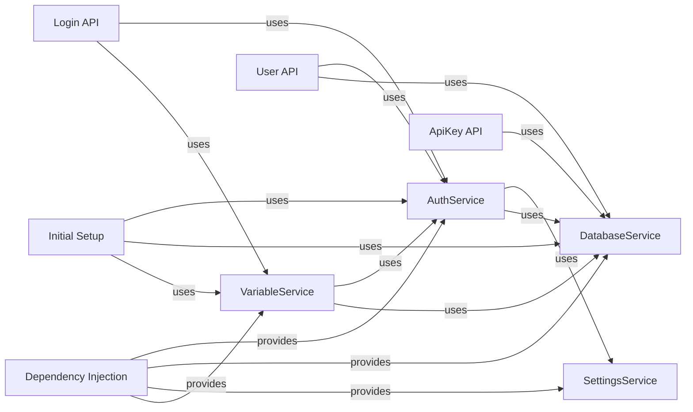

## Component Details

### AuthService
The AuthService component is responsible for handling user authentication, authorization, and token management. It provides functionalities for user login, logout, password hashing, token creation, and API key management. It interacts with the SettingsService to access authentication settings and the DatabaseService to manage users and API keys.
- **Related Classes/Methods**: `langflow.services.auth.service.AuthService`, `langflow.services.auth.utils`

### DatabaseService
The DatabaseService component manages database interactions, including user and API key CRUD operations. It provides methods for creating, reading, updating, and deleting users and API keys, as well as managing database sessions. It uses the Models for data representation.
- **Related Classes/Methods**: `langflow.services.database.service.DatabaseService`, `langflow.services.database.models.user.crud`, `langflow.services.database.models.api_key.crud`

### SettingsService
The SettingsService component provides access to application settings and configurations. It allows retrieving settings related to authentication, database connections, and other application-wide parameters. It is used by AuthService and other services to configure their behavior.
- **Related Classes/Methods**: `langflow.services.settings.service.SettingsService`, `langflow.services.settings.auth.AuthSettings`

### VariableService
The VariableService component manages variables, including creating, retrieving, updating, and deleting them. It also handles encryption and decryption of sensitive variables like API keys. It interacts with AuthService for encryption and decryption and DatabaseService for variable storage.
- **Related Classes/Methods**: `langflow.services.variable.service.DatabaseVariableService`, `langflow.services.variable.kubernetes.KubernetesSecretService`

### Login API
The Login API component provides API endpoints for user login, auto-login, and token refresh. It uses the AuthService for authentication and token management and VariableService for managing login related variables.
- **Related Classes/Methods**: `langflow.api.v1.login`

### User API
The User API component provides API endpoints for managing users, including adding, patching, and resetting passwords. It interacts with the AuthService and DatabaseService for user management.
- **Related Classes/Methods**: `langflow.api.v1.users`

### ApiKey API
The ApiKey API component provides API endpoints for managing API keys, including creating and deleting them. It interacts with the DatabaseService for API key management.
- **Related Classes/Methods**: `langflow.api.v1.api_key`

### Initial Setup
The Initial Setup component handles the initial setup of the application, including creating the superuser and default folder. It interacts with the AuthService, DatabaseService, and VariableService to set up the initial user and configurations.
- **Related Classes/Methods**: `langflow.initial_setup.setup`

### Dependency Injection
The Dependency Injection component provides dependency injection for services. It is used to retrieve instances of services like AuthService, DatabaseService, and SettingsService.
- **Related Classes/Methods**: `langflow.services.deps`
