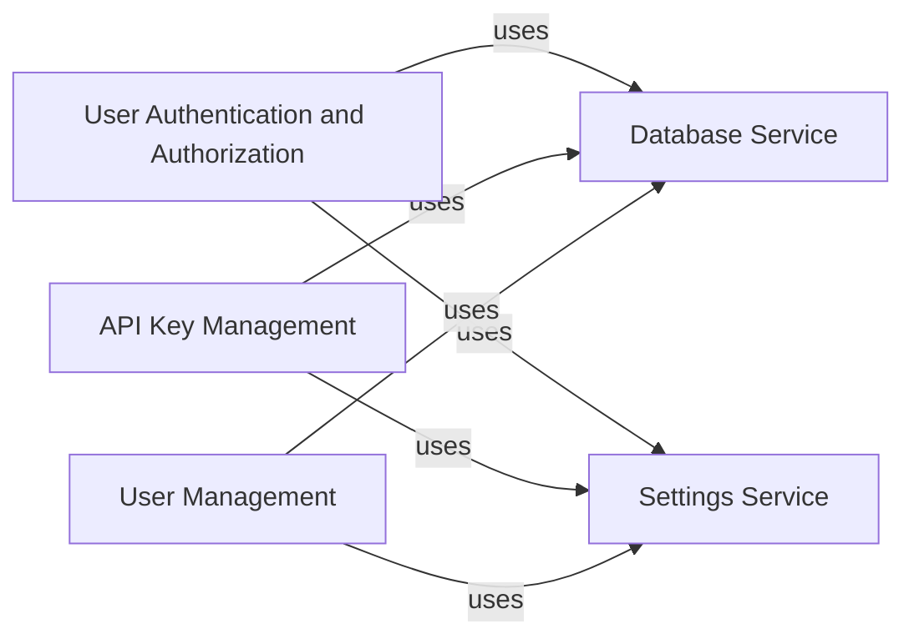

## Component Details

The User Management and Security component is responsible for managing user authentication, authorization, and API key management within the Langflow application. It ensures secure access to the system's functionalities by verifying user credentials, generating authentication tokens, and managing API keys for external access. The component interacts with the database to store and retrieve user information and API keys, and it utilizes encryption to protect sensitive data. It also handles the creation and management of superusers for administrative purposes.

### User Authentication and Authorization
This component handles user login, token generation, and authentication. It interacts with the database to verify user credentials and generate tokens for secure access. It also handles API key-based authentication.
**Related Classes/Methods**:

- <a href="https://github.com/langflow-ai/langflow/blob/master/src/backend/base/langflow/api/v1/login.py#L24-L77" target="_blank" rel="noopener noreferrer">`src.backend.base.langflow.api.v1.login:login_to_get_access_token` (24:77)</a>
- <a href="https://github.com/langflow-ai/langflow/blob/master/src/backend/base/langflow/api/v1/login.py#L81-L120" target="_blank" rel="noopener noreferrer">`src.backend.base.langflow.api.v1.login:auto_login` (81:120)</a>
- <a href="https://github.com/langflow-ai/langflow/blob/master/src/backend/base/langflow/api/v1/login.py#L124-L158" target="_blank" rel="noopener noreferrer">`src.backend.base.langflow.api.v1.login:refresh_token` (124:158)</a>
- <a href="https://github.com/langflow-ai/langflow/blob/master/src/backend/base/langflow/services/auth/utils.py#L403-L414" target="_blank" rel="noopener noreferrer">`langflow.services.auth.utils.authenticate_user` (403:414)</a>
- <a href="https://github.com/langflow-ai/langflow/blob/master/src/backend/base/langflow/services/auth/utils.py#L344-L367" target="_blank" rel="noopener noreferrer">`langflow.services.auth.utils.create_user_tokens` (344:367)</a>
- <a href="https://github.com/langflow-ai/langflow/blob/master/src/backend/base/langflow/services/auth/utils.py#L304-L324" target="_blank" rel="noopener noreferrer">`langflow.services.auth.utils.create_user_longterm_token` (304:324)</a>
- <a href="https://github.com/langflow-ai/langflow/blob/master/src/backend/base/langflow/services/auth/utils.py#L370-L400" target="_blank" rel="noopener noreferrer">`langflow.services.auth.utils.create_refresh_token` (370:400)</a>
- <a href="https://github.com/langflow-ai/langflow/blob/master/src/backend/base/langflow/services/auth/utils.py#L138-L153" target="_blank" rel="noopener noreferrer">`langflow.services.auth.utils.get_current_user` (138:153)</a>
- <a href="https://github.com/langflow-ai/langflow/blob/master/src/backend/base/langflow/services/auth/utils.py#L156-L214" target="_blank" rel="noopener noreferrer">`langflow.services.auth.utils.get_current_user_by_jwt` (156:214)</a>
- <a href="https://github.com/langflow-ai/langflow/blob/master/src/backend/base/langflow/services/auth/utils.py#L217-L240" target="_blank" rel="noopener noreferrer">`langflow.services.auth.utils.get_current_user_for_websocket` (217:240)</a>
- <a href="https://github.com/langflow-ai/langflow/blob/master/src/backend/base/langflow/services/auth/utils.py#L37-L86" target="_blank" rel="noopener noreferrer">`langflow.services.auth.utils.api_key_security` (37:86)</a>
- <a href="https://github.com/langflow-ai/langflow/blob/master/src/backend/base/langflow/services/auth/utils.py#L89-L135" target="_blank" rel="noopener noreferrer">`langflow.services.auth.utils.ws_api_key_security` (89:135)</a>
- <a href="https://github.com/langflow-ai/langflow/blob/master/src/backend/base/langflow/services/database/models/user/crud.py#L14-L16" target="_blank" rel="noopener noreferrer">`langflow.services.database.models.user.crud.get_user_by_username` (14:16)</a>
- <a href="https://github.com/langflow-ai/langflow/blob/master/src/backend/base/langflow/services/database/models/user/crud.py#L19-L23" target="_blank" rel="noopener noreferrer">`langflow.services.database.models.user.crud.get_user_by_id` (19:23)</a>
- <a href="https://github.com/langflow-ai/langflow/blob/master/src/backend/base/langflow/services/database/models/user/crud.py#L56-L62" target="_blank" rel="noopener noreferrer">`langflow.services.database.models.user.crud.update_user_last_login_at` (56:62)</a>
- <a href="https://github.com/langflow-ai/langflow/blob/master/src/backend/base/langflow/services/auth/utils.py#L257-L259" target="_blank" rel="noopener noreferrer">`langflow.services.auth.utils.verify_password` (257:259)</a>
- <a href="https://github.com/langflow-ai/langflow/blob/master/src/backend/base/langflow/services/auth/utils.py#L267-L278" target="_blank" rel="noopener noreferrer">`langflow.services.auth.utils.create_token` (267:278)</a>

### API Key Management
This component is responsible for managing API keys, including their creation, retrieval, and deletion. It interacts with the database to store and manage the keys, and uses encryption to protect them.
**Related Classes/Methods**:

- <a href="https://github.com/langflow-ai/langflow/blob/master/src/backend/base/langflow/api/v1/api_key.py#L18-L28" target="_blank" rel="noopener noreferrer">`src.backend.base.langflow.api.v1.api_key:get_api_keys_route` (18:28)</a>
- <a href="https://github.com/langflow-ai/langflow/blob/master/src/backend/base/langflow/api/v1/api_key.py#L32-L41" target="_blank" rel="noopener noreferrer">`src.backend.base.langflow.api.v1.api_key:create_api_key_route` (32:41)</a>
- <a href="https://github.com/langflow-ai/langflow/blob/master/src/backend/base/langflow/api/v1/api_key.py#L45-L53" target="_blank" rel="noopener noreferrer">`src.backend.base.langflow.api.v1.api_key:delete_api_key_route` (45:53)</a>
- <a href="https://github.com/langflow-ai/langflow/blob/master/src/backend/base/langflow/api/v1/api_key.py#L57-L88" target="_blank" rel="noopener noreferrer">`src.backend.base.langflow.api.v1.api_key:save_store_api_key` (57:88)</a>
- <a href="https://github.com/langflow-ai/langflow/blob/master/src/backend/base/langflow/services/database/models/api_key/crud.py#L19-L22" target="_blank" rel="noopener noreferrer">`langflow.services.database.models.api_key.crud.get_api_keys` (19:22)</a>
- <a href="https://github.com/langflow-ai/langflow/blob/master/src/backend/base/langflow/services/database/models/api_key/crud.py#L25-L41" target="_blank" rel="noopener noreferrer">`langflow.services.database.models.api_key.crud.create_api_key` (25:41)</a>
- <a href="https://github.com/langflow-ai/langflow/blob/master/src/backend/base/langflow/services/database/models/api_key/crud.py#L44-L50" target="_blank" rel="noopener noreferrer">`langflow.services.database.models.api_key.crud.delete_api_key` (44:50)</a>
- <a href="https://github.com/langflow-ai/langflow/blob/master/src/backend/base/langflow/services/auth/utils.py#L442-L446" target="_blank" rel="noopener noreferrer">`langflow.services.auth.utils.encrypt_api_key` (442:446)</a>
- <a href="https://github.com/langflow-ai/langflow/blob/master/src/backend/base/langflow/services/auth/utils.py#L449-L475" target="_blank" rel="noopener noreferrer">`langflow.services.auth.utils.decrypt_api_key` (449:475)</a>
- <a href="https://github.com/langflow-ai/langflow/blob/master/src/backend/base/langflow/services/database/models/api_key/crud.py#L56-L65" target="_blank" rel="noopener noreferrer">`langflow.services.database.models.api_key.crud.check_key` (56:65)</a>

### User Management
This component deals with the creation and management of superusers. It ensures that a superuser exists and can be used for administrative purposes.
**Related Classes/Methods**:

- <a href="https://github.com/langflow-ai/langflow/blob/master/src/backend/base/langflow/services/utils.py#L28-L76" target="_blank" rel="noopener noreferrer">`src.backend.base.langflow.services.utils:get_or_create_super_user` (28:76)</a>
- <a href="https://github.com/langflow-ai/langflow/blob/master/src/backend/base/langflow/services/utils.py#L79-L102" target="_blank" rel="noopener noreferrer">`src.backend.base.langflow.services.utils:setup_superuser` (79:102)</a>
- <a href="https://github.com/langflow-ai/langflow/blob/master/src/backend/base/langflow/services/auth/utils.py#L281-L301" target="_blank" rel="noopener noreferrer">`langflow.services.auth.utils.create_super_user` (281:301)</a>
- <a href="https://github.com/langflow-ai/langflow/blob/master/src/backend/base/langflow/services/database/models/user/model.py#L25-L51" target="_blank" rel="noopener noreferrer">`langflow.services.database.models.user.model.User` (25:51)</a>

### Database Service
This component provides access to the database.
**Related Classes/Methods**:

- <a href="https://github.com/langflow-ai/langflow/blob/master/src/backend/base/langflow/services/deps.py#L133-L142" target="_blank" rel="noopener noreferrer">`langflow.services.deps.get_db_service` (133:142)</a>

### Settings Service
This component provides access to application settings.
**Related Classes/Methods**:

- <a href="https://github.com/langflow-ai/langflow/blob/master/src/backend/base/langflow/services/deps.py#L117-L130" target="_blank" rel="noopener noreferrer">`langflow.services.deps.get_settings_service` (117:130)</a>