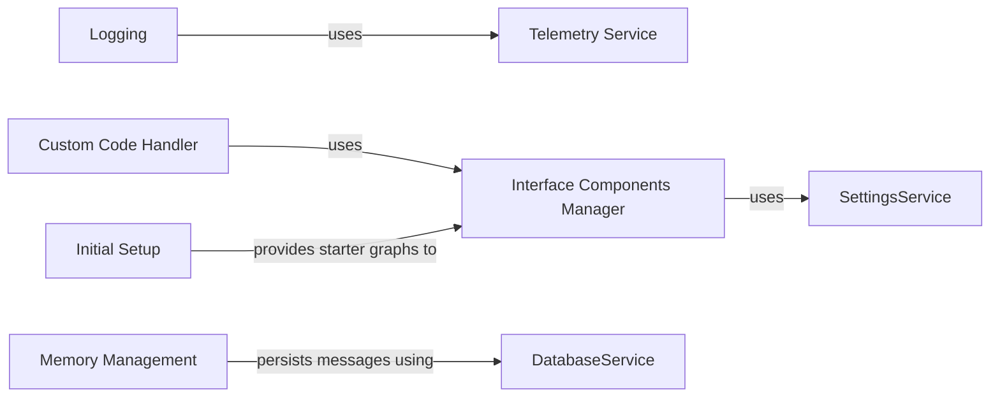

## Component Details

### Custom Code Handler
This component manages custom code execution and component building. It handles the evaluation of custom component code, builds custom component templates, and manages the addition of custom fields to components. It interacts with the frontend node representation of components and manages the execution of custom code.
- **Related Classes/Methods**: `repos.langflow.src.backend.base.langflow.custom`

### Initial Setup
This component provides the initial setup for Langflow, including defining and retrieving starter project graphs. It is responsible for loading default graphs when the application starts. It interacts with the graph loading mechanism to provide pre-built graphs.
- **Related Classes/Methods**: `repos.langflow.src.backend.base.langflow.initial_setup`

### Logging
This component configures and manages logging for the Langflow application. It sets up different log handlers, including console output and file logging, and provides utilities for formatting and serializing log messages. It interacts with the standard logging library and the Loguru library to provide flexible logging capabilities.
- **Related Classes/Methods**: `repos.langflow.src.backend.base.langflow.logging`

### Telemetry Service
This component provides telemetry services for Langflow, allowing the collection and reporting of application usage data. It is responsible for initializing and managing the telemetry service. It interacts with the settings service to retrieve configuration settings.
- **Related Classes/Methods**: `repos.langflow.src.backend.base.langflow.services.telemetry`

### Interface Components Manager
This component manages the interface components of Langflow, including discovering, caching, and loading components. It handles both full and partial loading of components, allowing for lazy loading of components to improve performance. It interacts with the settings service to retrieve component paths and loading configurations.
- **Related Classes/Methods**: `repos.langflow.src.backend.base.langflow.interface.components`

### Memory Management
This component manages the memory and message storage for Langflow. It provides functions for adding, retrieving, updating, and deleting messages, as well as a chat memory class for storing conversation history. It interacts with the database service to persist messages and conversation history.
- **Related Classes/Methods**: `repos.langflow.src.backend.base.langflow.memory`
