```mermaid
graph LR
    Flow_Management["Flow Management"]
    Graph_Execution["Graph Execution"]
    Component_Library["Component Library"]
    Data_Processing_Pipeline["Data Processing Pipeline"]
    External_Resource_Integration["External Resource Integration"]
    API_and_Service_Management["API and Service Management"]
    User_Authentication_and_Authorization["User Authentication and Authorization"]
    Configuration_Management["Configuration Management"]
    Utilities_and_Support["Utilities and Support"]
    Flow_Management -- "orchestrates" --> Graph_Execution
    Graph_Execution -- "builds upon" --> Component_Library
    Component_Library -- "utilizes" --> Data_Processing_Pipeline
    Data_Processing_Pipeline -- "processes data with" --> External_Resource_Integration
    API_and_Service_Management -- "provides access to" --> Flow_Management
    API_and_Service_Management -- "secures access via" --> User_Authentication_and_Authorization
    API_and_Service_Management -- "configures via" --> Configuration_Management
    Graph_Execution -- "supports operations with" --> Utilities_and_Support
    Component_Library -- "integrates" --> External_Resource_Integration
    click Flow_Management href "https://github.com/CodeBoarding/GeneratedOnBoardings/blob/main/langflow/Flow Management.md" "Details"
    click Graph_Execution href "https://github.com/CodeBoarding/GeneratedOnBoardings/blob/main/langflow/Graph Execution.md" "Details"
    click Component_Library href "https://github.com/CodeBoarding/GeneratedOnBoardings/blob/main/langflow/Component Library.md" "Details"
    click Data_Processing_Pipeline href "https://github.com/CodeBoarding/GeneratedOnBoardings/blob/main/langflow/Data Processing Pipeline.md" "Details"
    click External_Resource_Integration href "https://github.com/CodeBoarding/GeneratedOnBoardings/blob/main/langflow/External Resource Integration.md" "Details"
    click API_and_Service_Management href "https://github.com/CodeBoarding/GeneratedOnBoardings/blob/main/langflow/API and Service Management.md" "Details"
    click User_Authentication_and_Authorization href "https://github.com/CodeBoarding/GeneratedOnBoardings/blob/main/langflow/User Authentication and Authorization.md" "Details"
    click Configuration_Management href "https://github.com/CodeBoarding/GeneratedOnBoardings/blob/main/langflow/Configuration Management.md" "Details"
    click Utilities_and_Support href "https://github.com/CodeBoarding/GeneratedOnBoardings/blob/main/langflow/Utilities and Support.md" "Details"
```

## Component Details

### Flow Management
This component is responsible for the creation, reading, updating, and deletion of flows within Langflow. It orchestrates the entire flow lifecycle, from initial design to execution and persistence. It provides the high-level interface for defining and managing the structure of Langflow applications.
- **Related Classes/Methods**: `repos.langflow.src.backend.base.langflow.api.v1.flows`, `repos.langflow.src.backend.base.langflow.helpers.flow`, `repos.langflow.src.backend.base.langflow.load.load`, `repos.langflow.src.backend.base.langflow.load.utils`

### Graph Execution
This component manages the execution of the Langflow graph. It takes a flow definition and translates it into an executable graph, handling the state and managing runnable vertices. It serves as the core execution engine, driving the data processing and interactions between components.
- **Related Classes/Methods**: `repos.langflow.src.backend.base.langflow.graph.graph.base`, `repos.langflow.src.backend.base.langflow.graph.graph.utils`, `repos.langflow.src.backend.base.langflow.graph.graph.runnable_vertices_manager`, `repos.langflow.src.backend.base.langflow.graph.graph.state_manager`

### Component Library
This component provides a catalog of reusable building blocks for constructing flows. It handles the loading, building, and management of components, including custom components. It also manages the interaction between components and the graph, providing a standardized interface for component integration.
- **Related Classes/Methods**: `repos.langflow.src.backend.base.langflow.components`, `repos.langflow.src.backend.base.langflow.custom.custom_component.component`, `repos.langflow.src.backend.base.langflow.custom.utils`, `repos.langflow.src.backend.base.langflow.interface.components`

### Data Processing Pipeline
This component provides functionalities for processing data within Langflow. It includes parsing, splitting, combining, and transforming data, as well as components for handling different data types. It acts as the data pipeline, transforming and routing data between components to achieve the desired outcome.
- **Related Classes/Methods**: `repos.langflow.src.backend.base.langflow.components.processing`, `repos.langflow.src.backend.base.langflow.base.data`, `repos.langflow.src.backend.base.langflow.processing.process`

### External Resource Integration
This component integrates various external services and resources into Langflow, including language models, vector stores, and tools. It handles the building and configuration of these integrations, providing a unified interface for accessing external capabilities. It serves as the bridge to external resources, enabling Langflow to leverage external capabilities.
- **Related Classes/Methods**: `repos.langflow.src.backend.base.langflow.components.models`, `repos.langflow.src.backend.base.langflow.base.models`, `repos.langflow.src.backend.base.langflow.components.vectorstores`, `repos.langflow.src.backend.base.langflow.base.vectorstores`, `repos.langflow.src.backend.base.langflow.components.tools`, `repos.langflow.src.backend.base.langflow.base.tools`

### API and Service Management
This component handles the API endpoints for Langflow, including building flows, running flows, and managing users and API keys. It also manages the different services used by Langflow, including the database service, cache service, and settings service. It exposes Langflow's functionality through APIs and manages the underlying services required for its operation.
- **Related Classes/Methods**: `repos.langflow.src.backend.base.langflow.api`, `repos.langflow.src.backend.base.langflow.services`

### User Authentication and Authorization
This component handles user authentication and authorization, including creating users, managing API keys, and verifying passwords. It secures Langflow by managing user access and permissions, ensuring that only authorized users can access sensitive data and functionality.
- **Related Classes/Methods**: `repos.langflow.src.backend.base.langflow.services.auth`

### Configuration Management
This component manages the settings for Langflow, including loading settings from YAML files and providing access to settings values. It configures Langflow's behavior based on user-defined settings, allowing for customization and adaptation to different environments.
- **Related Classes/Methods**: `repos.langflow.src.backend.base.langflow.services.settings`

### Utilities and Support
This component encompasses a range of supporting functionalities, including custom code handling, initial setup, logging, task management, telemetry, interface components, and memory management. It provides essential services that underpin Langflow's operation and enhance its usability.
- **Related Classes/Methods**: `repos.langflow.src.backend.base.langflow.custom`, `repos.langflow.src.backend.base.langflow.initial_setup`, `repos.langflow.src.backend.base.langflow.logging`, `repos.langflow.src.backend.base.langflow.services.task`, `repos.langflow.src.backend.base.langflow.services.telemetry`, `repos.langflow.src.backend.base.langflow.interface.components`, `repos.langflow.src.backend.base.langflow.memory`