```mermaid
graph LR
    Service_Manager["Service Manager"]
    Database_Persistence["Database & Persistence"]
    Application_Configuration["Application Configuration"]
    User_Security_Management["User & Security Management"]
    Flow_Graph_Engine["Flow Graph Engine"]
    Flow_Execution_Orchestration["Flow Execution & Orchestration"]
    API_Gateway["API Gateway"]
    Component_Base_System["Component Base System"]
    Real_time_Communication_Chat_State["Real-time Communication & Chat State"]
    Initial_Application_Bootstrapping["Initial Application Bootstrapping"]
    Service_Manager -- "orchestrates" --> Database_Persistence
    Service_Manager -- "orchestrates" --> Application_Configuration
    Service_Manager -- "orchestrates" --> User_Security_Management
    Service_Manager -- "provides services to" --> API_Gateway
    Service_Manager -- "provides services to" --> Flow_Execution_Orchestration
    Service_Manager -- "provides services to" --> Component_Base_System
    API_Gateway -- "uses" --> Flow_Execution_Orchestration
    API_Gateway -- "manages" --> User_Security_Management
    API_Gateway -- "manages" --> Database_Persistence
    API_Gateway -- "manages" --> Component_Base_System
    Flow_Execution_Orchestration -- "orchestrates" --> Flow_Graph_Engine
    Flow_Graph_Engine -- "instantiates and executes" --> Component_Base_System
    Flow_Graph_Engine -- "sends updates to" --> Real_time_Communication_Chat_State
    Database_Persistence -- "stores data for" --> Flow_Graph_Engine
    Database_Persistence -- "stores data for" --> User_Security_Management
    Application_Configuration -- "configures" --> Service_Manager
    Application_Configuration -- "configures" --> Database_Persistence
    Application_Configuration -- "configures" --> Real_time_Communication_Chat_State
    Initial_Application_Bootstrapping -- "initializes" --> Service_Manager
    Initial_Application_Bootstrapping -- "initializes" --> Database_Persistence
    Initial_Application_Bootstrapping -- "initializes" --> Application_Configuration
    Real_time_Communication_Chat_State -- "sends events from" --> Flow_Execution_Orchestration
    click Service_Manager href "https://github.com/CodeBoarding/GeneratedOnBoardings/blob/main/langflow/Service Manager.md" "Details"
    click Database_Persistence href "https://github.com/CodeBoarding/GeneratedOnBoardings/blob/main/langflow/Database & Persistence.md" "Details"
    click Application_Configuration href "https://github.com/CodeBoarding/GeneratedOnBoardings/blob/main/langflow/Application Configuration.md" "Details"
    click User_Security_Management href "https://github.com/CodeBoarding/GeneratedOnBoardings/blob/main/langflow/User & Security Management.md" "Details"
    click Flow_Graph_Engine href "https://github.com/CodeBoarding/GeneratedOnBoardings/blob/main/langflow/Flow Graph Engine.md" "Details"
    click Flow_Execution_Orchestration href "https://github.com/CodeBoarding/GeneratedOnBoardings/blob/main/langflow/Flow Execution & Orchestration.md" "Details"
    click API_Gateway href "https://github.com/CodeBoarding/GeneratedOnBoardings/blob/main/langflow/API Gateway.md" "Details"
    click Component_Base_System href "https://github.com/CodeBoarding/GeneratedOnBoardings/blob/main/langflow/Component Base System.md" "Details"
    click Real_time_Communication_Chat_State href "https://github.com/CodeBoarding/GeneratedOnBoardings/blob/main/langflow/Real-time Communication & Chat State.md" "Details"
    click Initial_Application_Bootstrapping href "https://github.com/CodeBoarding/GeneratedOnBoardings/blob/main/langflow/Initial Application Bootstrapping.md" "Details"
```

## Component Details

The Langflow architecture is centered around a Service Manager that orchestrates various core services like Database & Persistence, Application Configuration, and User & Security Management. The API Gateway serves as the primary external interface, leveraging the Flow Execution & Orchestration component to run AI flows defined by the Flow Graph Engine. The Component Base System provides the foundational framework for all AI components, while Real-time Communication & Chat State handles interactive elements. Initial Application Bootstrapping ensures the system's proper setup and initialization.

### Service Manager
Manages the lifecycle and dependency injection of all services within Langflow, ensuring proper initialization and teardown. It acts as a central registry for service factories.

**Related Classes/Methods**:

- <a href="https://github.com/langflow-ai/langflow/blob/master/src/backend/base/langflow/services/manager.py#L21-L128" target="_blank" rel="noopener noreferrer">`langflow.services.manager.ServiceManager` (21:128)</a>

### Database & Persistence
Provides an interface for interacting with the underlying database, handling data models for flows, users, messages, API keys, and other persistent data. It also manages database migrations.

**Related Classes/Methods**:

- <a href="https://github.com/langflow-ai/langflow/blob/master/src/backend/base/langflow/services/database/service.py#L38-L482" target="_blank" rel="noopener noreferrer">`langflow.services.database.service.DatabaseService` (38:482)</a>

### Application Configuration
Manages all application-wide settings and configurations, including sensitive information and feature flags.

**Related Classes/Methods**:

- <a href="https://github.com/langflow-ai/langflow/blob/master/src/backend/base/langflow/services/settings/service.py#L8-L32" target="_blank" rel="noopener noreferrer">`langflow.services.settings.service.SettingsService` (8:32)</a>

### User & Security Management
Handles user authentication, authorization, password hashing, token creation, and API key management.

**Related Classes/Methods**:

- <a href="https://github.com/langflow-ai/langflow/blob/master/src/backend/base/langflow/services/auth/utils.py#L403-L414" target="_blank" rel="noopener noreferrer">`langflow.services.auth.utils.authenticate_user` (403:414)</a>

### Flow Graph Engine
The foundational engine responsible for representing AI flows as directed acyclic graphs (DAGs), managing vertices (components) and edges (connections), and orchestrating their execution.

**Related Classes/Methods**:

- <a href="https://github.com/langflow-ai/langflow/blob/master/src/backend/base/langflow/graph/graph/base.py#L60-L2147" target="_blank" rel="noopener noreferrer">`langflow.graph.graph.base.Graph` (60:2147)</a>

### Flow Execution & Orchestration
Handles the high-level execution of AI flows, including loading, preprocessing, running the graph, and managing the flow's state.

**Related Classes/Methods**:

- <a href="https://github.com/langflow-ai/langflow/blob/master/src/backend/base/langflow/processing/process.py#L65-L121" target="_blank" rel="noopener noreferrer">`langflow.processing.process.run_graph` (65:121)</a>

### API Gateway
Exposes various REST and WebSocket endpoints for external interaction with the Langflow backend, enabling flow execution, component management, and data retrieval.

**Related Classes/Methods**:

- <a href="https://github.com/langflow-ai/langflow/blob/master/src/backend/base/langflow/api/v1/endpoints.py#L109-L162" target="_blank" rel="noopener noreferrer">`langflow.api.v1.endpoints.simple_run_flow` (109:162)</a>

### Component Base System
Provides the foundational classes and utilities for defining, building, and managing all types of components within Langflow, including input/output handling and state management.

**Related Classes/Methods**:

- <a href="https://github.com/langflow-ai/langflow/blob/master/src/backend/base/langflow/custom/custom_component/component.py#L94-L1597" target="_blank" rel="noopener noreferrer">`langflow.custom.custom_component.component.Component` (94:1597)</a>

### Real-time Communication & Chat State
Manages real-time communication via WebSockets (Socket.IO) and handles chat-related state and events for interactive flows.

**Related Classes/Methods**:

- <a href="https://github.com/langflow-ai/langflow/blob/master/src/backend/base/langflow/services/chat/service.py#L11-L67" target="_blank" rel="noopener noreferrer">`langflow.services.chat.service.ChatService` (11:67)</a>
- <a href="https://github.com/langflow-ai/langflow/blob/master/src/backend/base/langflow/services/socket/service.py#L12-L84" target="_blank" rel="noopener noreferrer">`langflow.services.socket.service.SocketIOService` (12:84)</a>

### Initial Application Bootstrapping
Handles the initial setup of the Langflow application, including loading starter projects, creating default users, and ensuring the database is ready.

**Related Classes/Methods**:

- <a href="https://github.com/langflow-ai/langflow/blob/master/src/backend/base/langflow/initial_setup/setup.py#L927-L941" target="_blank" rel="noopener noreferrer">`langflow.initial_setup.setup:initialize_super_user_if_needed` (927:941)</a>
- <a href="https://github.com/langflow-ai/langflow/blob/master/src/backend/base/langflow/main.py#L112-L203" target="_blank" rel="noopener noreferrer">`langflow.main:get_lifespan` (112:203)</a>

### [FAQ](https://github.com/CodeBoarding/GeneratedOnBoardings/tree/main?tab=readme-ov-file#faq)