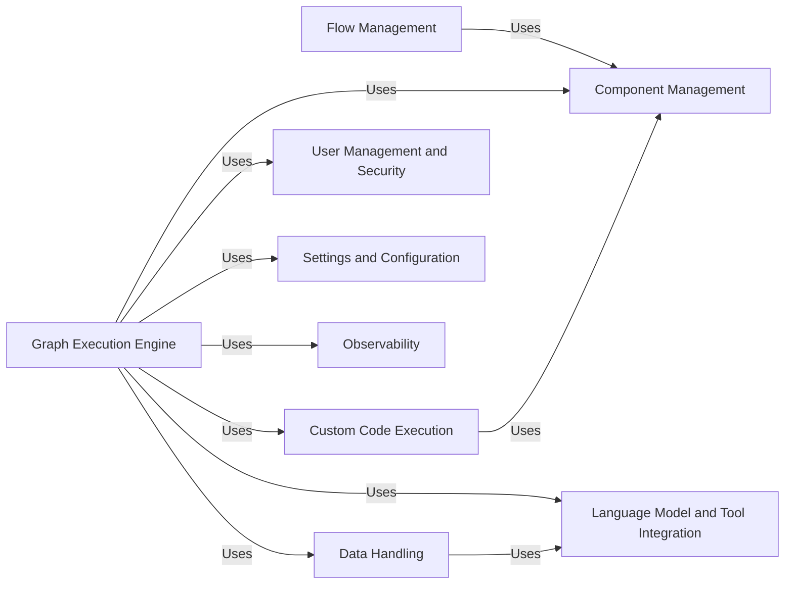

## Component Details

Langflow is a visual programming tool for building LangChain applications. It provides a user-friendly interface for creating and managing flows, which are composed of interconnected components. The system handles component management, graph execution, data handling, language model integration, user management, settings configuration, observability, and custom code execution. These components work together to enable users to design, build, and deploy complex LangChain applications with ease.

### Flow Management
This component is responsible for the creation, retrieval, updating, and deletion of flows. It manages the persistence of flow data, handles file system operations for flow storage, and provides API endpoints for flow management. It acts as the central point for managing and interacting with flows, coordinating the execution of graphs and managing the state of flows.
**Related Classes/Methods**:

- <a href="https://github.com/langflow-ai/langflow/blob/master/src/backend/base/langflow/api/v1/flows.py#L140-L168" target="_blank" rel="noopener noreferrer">`src.backend.base.langflow.api.v1.flows:create_flow` (140:168)</a>
- <a href="https://github.com/langflow-ai/langflow/blob/master/src/backend/base/langflow/api/v1/flows.py#L172-L260" target="_blank" rel="noopener noreferrer">`src.backend.base.langflow.api.v1.flows:read_flows` (172:260)</a>
- <a href="https://github.com/langflow-ai/langflow/blob/master/src/backend/base/langflow/api/v1/flows.py#L282-L291" target="_blank" rel="noopener noreferrer">`src.backend.base.langflow.api.v1.flows:read_flow` (282:291)</a>
- <a href="https://github.com/langflow-ai/langflow/blob/master/src/backend/base/langflow/api/v1/flows.py#L310-L375" target="_blank" rel="noopener noreferrer">`src.backend.base.langflow.api.v1.flows:update_flow` (310:375)</a>
- <a href="https://github.com/langflow-ai/langflow/blob/master/src/backend/base/langflow/api/v1/flows.py#L379-L396" target="_blank" rel="noopener noreferrer">`src.backend.base.langflow.api.v1.flows:delete_flow` (379:396)</a>
- <a href="https://github.com/langflow-ai/langflow/blob/master/src/backend/base/langflow/helpers/flow.py#L31-L44" target="_blank" rel="noopener noreferrer">`src.backend.base.langflow.helpers.flow:list_flows` (31:44)</a>
- <a href="https://github.com/langflow-ai/langflow/blob/master/src/backend/base/langflow/helpers/flow.py#L47-L69" target="_blank" rel="noopener noreferrer">`src.backend.base.langflow.helpers.flow:load_flow` (47:69)</a>

### Component Management
This component is responsible for managing the components used in Langflow, including custom components. It handles loading, building, and updating component configurations. It provides the building blocks for creating flows, managing the available components, and ensuring that components are properly configured and loaded.
**Related Classes/Methods**:

- <a href="https://github.com/langflow-ai/langflow/blob/master/src/backend/base/langflow/interface/components.py#L26-L45" target="_blank" rel="noopener noreferrer">`src.backend.base.langflow.interface.components:get_and_cache_all_types_dict` (26:45)</a>
- <a href="https://github.com/langflow-ai/langflow/blob/master/src/backend/base/langflow/interface/components.py#L48-L50" target="_blank" rel="noopener noreferrer">`src.backend.base.langflow.interface.components:aget_all_types_dict` (48:50)</a>
- <a href="https://github.com/langflow-ai/langflow/blob/master/src/backend/base/langflow/interface/components.py#L53-L81" target="_blank" rel="noopener noreferrer">`src.backend.base.langflow.interface.components:aget_component_metadata` (53:81)</a>
- <a href="https://github.com/langflow-ai/langflow/blob/master/src/backend/base/langflow/custom/utils.py#L393-L446" target="_blank" rel="noopener noreferrer">`src.backend.base.langflow.custom.utils:build_custom_component_template` (393:446)</a>
- <a href="https://github.com/langflow-ai/langflow/blob/master/src/backend/base/langflow/custom/utils.py#L463-L485" target="_blank" rel="noopener noreferrer">`src.backend.base.langflow.custom.utils:build_custom_components` (463:485)</a>

### Graph Execution Engine
This component is the core of Langflow's execution engine. It takes a graph representation of a flow and executes it, managing the state of vertices and edges, and handling asynchronous execution. It orchestrates the execution of the flow, managing the state of vertices and edges, and handling asynchronous execution. It is responsible for running the flow and producing the desired output.
**Related Classes/Methods**:

- <a href="https://github.com/langflow-ai/langflow/blob/master/src/backend/base/langflow/graph/graph/base.py#L63-L151" target="_blank" rel="noopener noreferrer">`src.backend.base.langflow.graph.graph.base.Graph:__init__` (63:151)</a>
- <a href="https://github.com/langflow-ai/langflow/blob/master/src/backend/base/langflow/graph/graph/base.py#L242-L256" target="_blank" rel="noopener noreferrer">`src.backend.base.langflow.graph.graph.base.Graph:add_nodes_and_edges` (242:256)</a>
- <a href="https://github.com/langflow-ai/langflow/blob/master/src/backend/base/langflow/graph/graph/base.py#L1064-L1098" target="_blank" rel="noopener noreferrer">`src.backend.base.langflow.graph.graph.base.Graph:from_payload` (1064:1098)</a>
- <a href="https://github.com/langflow-ai/langflow/blob/master/src/backend/base/langflow/graph/graph/base.py#L816-L878" target="_blank" rel="noopener noreferrer">`src.backend.base.langflow.graph.graph.base.Graph:arun` (816:878)</a>
- <a href="https://github.com/langflow-ai/langflow/blob/master/src/backend/base/langflow/graph/graph/base.py#L1315-L1351" target="_blank" rel="noopener noreferrer">`src.backend.base.langflow.graph.graph.base.Graph:astep` (1315:1351)</a>
- <a href="https://github.com/langflow-ai/langflow/blob/master/src/backend/base/langflow/processing/process.py#L26-L62" target="_blank" rel="noopener noreferrer">`src.backend.base.langflow.processing.process:run_graph_internal` (26:62)</a>
- <a href="https://github.com/langflow-ai/langflow/blob/master/src/backend/base/langflow/processing/process.py#L65-L121" target="_blank" rel="noopener noreferrer">`src.backend.base.langflow.processing.process:run_graph` (65:121)</a>

### Data Handling
This component provides functionalities for loading data from various sources, transforming data, and managing vector stores. It handles data loading from files, URLs, and APIs, data transformation including parsing, cleaning, and converting data between different formats, and vector store management for creating, searching, and storing documents. It acts as the data pipeline, responsible for loading, transforming, and storing data used in the flows.
**Related Classes/Methods**:

- <a href="https://github.com/langflow-ai/langflow/blob/master/src/backend/base/langflow/components/data/file.py#L43-L93" target="_blank" rel="noopener noreferrer">`src.backend.base.langflow.components.data.file.FileComponent:process_files` (43:93)</a>
- <a href="https://github.com/langflow-ai/langflow/blob/master/src/backend/base/langflow/components/processing/parser.py#L115-L134" target="_blank" rel="noopener noreferrer">`src.backend.base.langflow.components.processing.parser.ParserComponent:parse_combined_text` (115:134)</a>
- <a href="https://github.com/langflow-ai/langflow/blob/master/src/backend/base/langflow/components/vectorstores/astradb.py#L1084-L1154" target="_blank" rel="noopener noreferrer">`src.backend.base.langflow.components.vectorstores.astradb.AstraDBVectorStoreComponent:build_vector_store` (1084:1154)</a>

### Language Model and Tool Integration
This component integrates various language models and tools into Langflow, providing a unified interface for interacting with them. It handles model selection, configuration, and execution, as well as tool management including building toolkits and executing tools. It acts as the interface to external language models and tools, allowing flows to leverage their capabilities.
**Related Classes/Methods**:

- <a href="https://github.com/langflow-ai/langflow/blob/master/src/backend/base/langflow/components/languagemodels/openai_chat_model.py#L99-L121" target="_blank" rel="noopener noreferrer">`src.backend.base.langflow.components.languagemodels.openai_chat_model.OpenAIModelComponent:build_model` (99:121)</a>
- <a href="https://github.com/langflow-ai/langflow/blob/master/src/backend/base/langflow/base/tools/component_tool.py#L176-L283" target="_blank" rel="noopener noreferrer">`src.backend.base.langflow.base.tools.component_tool.ComponentToolkit:get_tools` (176:283)</a>
- <a href="https://github.com/langflow-ai/langflow/blob/master/src/backend/base/langflow/components/tools/calculator.py#L33-L34" target="_blank" rel="noopener noreferrer">`src.backend.base.langflow.components.tools.calculator.CalculatorToolComponent:run_model` (33:34)</a>

### User Management and Security
This component manages user authentication and authorization, providing functionalities for user login, API key management, and access control. It ensures the security of the system by managing user access and authentication. It also handles API key management for secure access to the system's functionalities.
**Related Classes/Methods**:

- <a href="https://github.com/langflow-ai/langflow/blob/master/src/backend/base/langflow/api/v1/login.py#L24-L77" target="_blank" rel="noopener noreferrer">`src.backend.base.langflow.api.v1.login:login_to_get_access_token` (24:77)</a>
- <a href="https://github.com/langflow-ai/langflow/blob/master/src/backend/base/langflow/api/v1/api_key.py#L32-L41" target="_blank" rel="noopener noreferrer">`src.backend.base.langflow.api.v1.api_key:create_api_key_route` (32:41)</a>
- <a href="https://github.com/langflow-ai/langflow/blob/master/src/backend/base/langflow/services/auth/utils.py#L37-L86" target="_blank" rel="noopener noreferrer">`src.backend.base.langflow.services.auth.utils:api_key_security` (37:86)</a>

### Settings and Configuration
This component manages the settings and configurations of Langflow, providing functionalities for loading, updating, and accessing settings values. It allows the system to be configured and customized. It manages the settings and configurations of Langflow, providing functionalities for loading, updating, and accessing settings values.
**Related Classes/Methods**:

- <a href="https://github.com/langflow-ai/langflow/blob/master/src/backend/base/langflow/services/settings/service.py#L17-L28" target="_blank" rel="noopener noreferrer">`src.backend.base.langflow.services.settings.service.SettingsService:initialize` (17:28)</a>
- <a href="https://github.com/langflow-ai/langflow/blob/master/src/backend/base/langflow/services/settings/base.py#L321-L391" target="_blank" rel="noopener noreferrer">`src.backend.base.langflow.services.settings.base.Settings:set_database_url` (321:391)</a>
- <a href="https://github.com/langflow-ai/langflow/blob/master/src/backend/base/langflow/api/v1/endpoints.py#L749-L758" target="_blank" rel="noopener noreferrer">`src.backend.base.langflow.api.v1.endpoints:get_config` (749:758)</a>

### Observability
This component manages events within Langflow, providing functionalities for registering and sending events. It is used for logging, telemetry, and tracing. It provides insights into the system's behavior and performance. It collects and reports telemetry data about Langflow usage, providing insights into performance and user behavior. It also provides tracing capabilities for Langflow, allowing developers to track the execution of flows and identify performance bottlenecks.
**Related Classes/Methods**:

- <a href="https://github.com/langflow-ai/langflow/blob/master/src/backend/base/langflow/events/event_manager.py#L68-L80" target="_blank" rel="noopener noreferrer">`src.backend.base.langflow.events.event_manager.EventManager:send_event` (68:80)</a>
- <a href="https://github.com/langflow-ai/langflow/blob/master/src/backend/base/langflow/services/telemetry/service.py#L82-L83" target="_blank" rel="noopener noreferrer">`src.backend.base.langflow.services.telemetry.service.TelemetryService:log_package_run` (82:83)</a>
- <a href="https://github.com/langflow-ai/langflow/blob/master/src/backend/base/langflow/services/tracing/service.py#L204-L231" target="_blank" rel="noopener noreferrer">`src.backend.base.langflow.services.tracing.service.TracingService:start_tracers` (204:231)</a>

### Custom Code Execution
This component handles custom code execution and validation within Langflow, providing functionalities for evaluating code and building custom components. It allows users to extend the functionality of Langflow by adding custom code. It handles custom code execution and validation within Langflow, providing functionalities for evaluating code and building custom components.
**Related Classes/Methods**:

- <a href="https://github.com/langflow-ai/langflow/blob/master/src/backend/base/langflow/custom/eval.py#L9-L12" target="_blank" rel="noopener noreferrer">`src.backend.base.langflow.custom.eval:eval_custom_component_code` (9:12)</a>
- <a href="https://github.com/langflow-ai/langflow/blob/master/src/backend/base/langflow/custom/utils.py#L393-L446" target="_blank" rel="noopener noreferrer">`src.backend.base.langflow.custom.utils:build_custom_component_template` (393:446)</a>
- <a href="https://github.com/langflow-ai/langflow/blob/master/src/backend/base/langflow/utils/validate.py#L24-L63" target="_blank" rel="noopener noreferrer">`src.backend.base.langflow.utils.validate:validate_code` (24:63)</a>