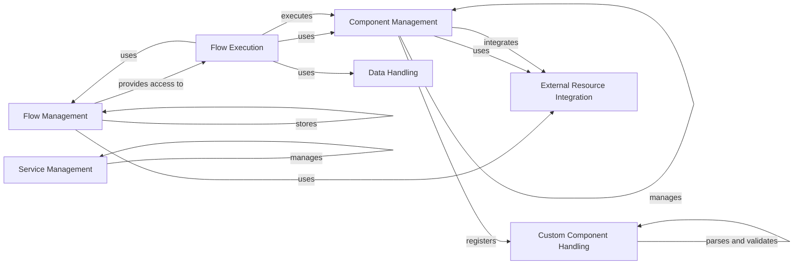

## Component Details

Langflow is a visual programming framework for building applications using language models and other components. It provides a drag-and-drop interface for creating flow graphs, which define the data flow between components. The framework supports both built-in and custom components, allowing users to extend its functionality. Langflow also includes features for managing settings, storing data, and integrating with external resources.

### Flow Management
This component is responsible for creating, storing, retrieving, and managing flow graphs. It provides the core functionality for defining and persisting the structure of Langflow applications. It interacts with the database to persist and retrieve flow definitions, and it provides an interface for the API endpoints to access and manipulate flows.
- **Related Classes/Methods**: `langflow.graph.graph.base.Graph`, `langflow.api.v1.flows`, `langflow.services.database.models`

### Component Management
This component manages the available components within Langflow, including both built-in and custom components. It handles loading, registering, and providing access to these components. It also interacts with the Custom Component Handler to manage user-defined components, ensuring they adhere to the Langflow component interface.
- **Related Classes/Methods**: `langflow.interface.components`, `langflow.components`, `langflow.custom.custom_component.component.Component`

### Custom Component Handling
This component enables users to define and integrate their own components into Langflow. It handles code parsing, validation, and compilation of custom components, making them available for use in flow graphs. It ensures that custom components adhere to the Langflow component interface and provides utilities for working with custom code.
- **Related Classes/Methods**: `langflow.custom.custom_component.component.Component`, `langflow.custom.utils`, `langflow.custom.code_parser.code_parser.CodeParser`

### Flow Execution
This component is responsible for executing flow graphs. It traverses the graph, executes components in the correct order, and manages the data flow between them. It uses the Data Abstraction Layer to handle data representation and conversion. It also integrates with the Tracing Service to provide debugging and monitoring capabilities.
- **Related Classes/Methods**: `langflow.services.flow.flow_runner.LangflowRunnerExperimental`, `langflow.processing.process`, `langflow.graph.graph.base.Graph`

### Data Handling
This component provides a consistent way to represent and manipulate data within Langflow. It includes classes for representing text, dataframes, and other data types, as well as utilities for converting between them. It ensures that data can be seamlessly passed between different components in a flow graph.
- **Related Classes/Methods**: `langflow.schema.data.Data`, `langflow.schema.dataframe.DataFrame`, `langflow.helpers.data`

### Service Management
This component manages the various background services required by Langflow, such as settings, database, authentication, telemetry, tracing, and job queue services. It provides a centralized way to access and configure these services, ensuring that they are properly initialized and available to other components.
- **Related Classes/Methods**: `langflow.services.settings.service.SettingsService`, `langflow.services.database.service.DatabaseService`, `langflow.services.auth.service.AuthService`, `langflow.services.telemetry.service.TelemetryService`, `langflow.services.tracing.service.TracingService`, `langflow.services.job_queue.service.JobQueueService`

### External Resource Integration
This component provides components for interacting with external resources, such as vector stores and language models. It abstracts the interaction with these resources, allowing Langflow applications to perform similarity searches and generate text using different LLMs. It provides a unified interface for different LLMs.
- **Related Classes/Methods**: `langflow.components.vectorstores`, `langflow.base.vectorstores`, `langflow.base.models`, `langflow.components.models`