```mermaid
graph LR
    API_Gateway_Application_Lifecycle["API Gateway & Application Lifecycle"]
    Flow_Graph_Execution_Engine["Flow & Graph Execution Engine"]
    Component_Management_System["Component Management System"]
    Core_Backend_Services["Core Backend Services"]
    Data_Models_Utilities["Data Models & Utilities"]
    API_Gateway_Application_Lifecycle -- "routes requests to" --> Flow_Graph_Execution_Engine
    API_Gateway_Application_Lifecycle -- "utilizes services from" --> Core_Backend_Services
    API_Gateway_Application_Lifecycle -- "uses for data serialization" --> Data_Models_Utilities
    Flow_Graph_Execution_Engine -- "instantiates and executes components from" --> Component_Management_System
    Flow_Graph_Execution_Engine -- "leverages services from" --> Core_Backend_Services
    Flow_Graph_Execution_Engine -- "processes data using" --> Data_Models_Utilities
    Component_Management_System -- "provides components to" --> Flow_Graph_Execution_Engine
    Component_Management_System -- "accesses services via" --> Core_Backend_Services
    Component_Management_System -- "defines components operating on" --> Data_Models_Utilities
    Core_Backend_Services -- "provides services to" --> API_Gateway_Application_Lifecycle
    Core_Backend_Services -- "provides services to" --> Flow_Graph_Execution_Engine
    Core_Backend_Services -- "manages structured data for" --> Data_Models_Utilities
    Data_Models_Utilities -- "provides data structures for" --> Flow_Graph_Execution_Engine
    Data_Models_Utilities -- "provides data structures for" --> Component_Management_System
    Data_Models_Utilities -- "provides utilities for" --> Core_Backend_Services
    click API_Gateway_Application_Lifecycle href "https://github.com/CodeBoarding/GeneratedOnBoardings/blob/main//langflow/API_Gateway_Application_Lifecycle.md" "Details"
    click Flow_Graph_Execution_Engine href "https://github.com/CodeBoarding/GeneratedOnBoardings/blob/main//langflow/Flow_Graph_Execution_Engine.md" "Details"
    click Component_Management_System href "https://github.com/CodeBoarding/GeneratedOnBoardings/blob/main//langflow/Component_Management_System.md" "Details"
    click Core_Backend_Services href "https://github.com/CodeBoarding/GeneratedOnBoardings/blob/main//langflow/Core_Backend_Services.md" "Details"
    click Data_Models_Utilities href "https://github.com/CodeBoarding/GeneratedOnBoardings/blob/main//langflow/Data_Models_Utilities.md" "Details"
```

## Component Details

The `langflow` architecture is designed around a modular, service-oriented approach, enabling flexible AI workflow creation and execution. At its core, it processes user requests through an API layer, orchestrates AI graph execution, manages a diverse set of components, and relies on a robust backend services infrastructure, all underpinned by standardized data models and utility functions.

### API Gateway & Application Lifecycle
This component serves as the primary entry point for all external interactions. It manages the application's startup and shutdown, routes incoming HTTP requests to the appropriate handlers, and enforces core security policies like authentication and authorization. It also exposes specialized APIs for features like Multi-Component Protocol (MCP), voice mode, and file management.

**Related Classes/Methods**:

- <a href="https://github.com/langflow-ai/langflow/blob/master/src/backend/base/langflow/main.py#L1-L1" target="_blank" rel="noopener noreferrer">`src/backend/base/langflow/main.py` (1:1)</a>
- <a href="https://github.com/langflow-ai/langflow/blob/master/src/backend/base/langflow/server.py#L1-L1" target="_blank" rel="noopener noreferrer">`src/backend/base/langflow/server.py` (1:1)</a>
- <a href="https://github.com/langflow-ai/langflow/blob/master/src/backend/base/langflow/api/router.py#L1-L1" target="_blank" rel="noopener noreferrer">`src/backend/base/langflow/api/router.py` (1:1)</a>
- <a href="https://github.com/langflow-ai/langflow/blob/master/src/backend/base/langflow/api/v1/login.py#L1-L1" target="_blank" rel="noopener noreferrer">`src/backend/base/langflow/api/v1/login.py` (1:1)</a>
- <a href="https://github.com/langflow-ai/langflow/blob/master/src/backend/base/langflow/api/v1/mcp.py#L1-L1" target="_blank" rel="noopener noreferrer">`src/backend/base/langflow/api/v1/mcp.py` (1:1)</a>
- <a href="https://github.com/langflow-ai/langflow/blob/master/src/backend/base/langflow/api/v1/voice_mode.py#L1-L1" target="_blank" rel="noopener noreferrer">`src/backend/base/langflow/api/v1/voice_mode.py` (1:1)</a>
- <a href="https://github.com/langflow-ai/langflow/blob/master/src/backend/base/langflow/api/v1/files.py#L1-L1" target="_blank" rel="noopener noreferrer">`src/backend/base/langflow/api/v1/files.py` (1:1)</a>
- <a href="https://github.com/langflow-ai/langflow/blob/master/src/backend/base/langflow/api/v2/files.py#L1-L1" target="_blank" rel="noopener noreferrer">`src/backend/base/langflow/api/v2/files.py` (1:1)</a>

### Flow & Graph Execution Engine
This is the central orchestrator for AI workflows. It handles the complete lifecycle of flow definitions (creation, reading, updating, deletion), constructs and validates the underlying flow graphs, and manages the state and execution of individual components within a running flow. It ensures the correct sequence and data flow between AI components.

**Related Classes/Methods**:

- <a href="https://github.com/langflow-ai/langflow/blob/master/src/backend/base/langflow/api/v1/flows.py#L1-L1" target="_blank" rel="noopener noreferrer">`src/backend/base/langflow/api/v1/flows.py` (1:1)</a>
- <a href="https://github.com/langflow-ai/langflow/blob/master/src/backend/base/langflow/graph/graph/base.py#L1-L1" target="_blank" rel="noopener noreferrer">`src/backend/base/langflow/graph/graph/base.py` (1:1)</a>
- <a href="https://github.com/langflow-ai/langflow/blob/master/src/backend/base/langflow/processing/process.py#L1-L1" target="_blank" rel="noopener noreferrer">`src/backend/base/langflow/processing/process.py` (1:1)</a>
- <a href="https://github.com/langflow-ai/langflow/blob/master/src/backend/base/langflow/graph/vertex/base.py#L1-L1" target="_blank" rel="noopener noreferrer">`src/backend/base/langflow/graph/vertex/base.py` (1:1)</a>
- <a href="https://github.com/langflow-ai/langflow/blob/master/src/backend/base/langflow/helpers/flow.py#L1-L1" target="_blank" rel="noopener noreferrer">`src/backend/base/langflow/helpers/flow.py` (1:1)</a>
- <a href="https://github.com/langflow-ai/langflow/blob/master/src/backend/base/langflow/graph/graph/state_manager.py#L1-L1" target="_blank" rel="noopener noreferrer">`src/backend/base/langflow/graph/graph/state_manager.py` (1:1)</a>

### Component Management System
This component provides the foundational framework for defining, loading, and managing all reusable AI components (e.g., LLMs, Agents, Tools, Data Loaders, Vector Stores). It ensures components are properly instantiated, configured, and integrated into the graph execution environment. It also facilitates interaction with an external component store for sharing and discovery.

**Related Classes/Methods**:

- <a href="https://github.com/langflow-ai/langflow/blob/master/src/backend/base/langflow/interface/components.py#L1-L1" target="_blank" rel="noopener noreferrer">`src/backend/base/langflow/interface/components.py` (1:1)</a>
- <a href="https://github.com/langflow-ai/langflow/blob/master/src/backend/base/langflow/custom/custom_component/component.py#L1-L1" target="_blank" rel="noopener noreferrer">`src/backend/base/langflow/custom/custom_component/component.py` (1:1)</a>
- <a href="https://github.com/langflow-ai/langflow/blob/master/src/backend/base/langflow/custom/utils.py#L1-L1" target="_blank" rel="noopener noreferrer">`src/backend/base/langflow/custom/utils.py` (1:1)</a>
- <a href="https://github.com/langflow-ai/langflow/blob/master/src/backend/base/langflow/services/store/service.py#L1-L1" target="_blank" rel="noopener noreferrer">`src/backend/base/langflow/services/store/service.py` (1:1)</a>
- <a href="https://github.com/langflow-ai/langflow/blob/master/src/backend/base/langflow/api/v1/store.py#L1-L1" target="_blank" rel="noopener noreferrer">`src/backend/base/langflow/api/v1/store.py` (1:1)</a>

### Core Backend Services
This is a centralized dependency injection system that initializes, registers, and provides access to all core application services. It encompasses persistent data storage (database), caching, application-wide configurations, global variable management, background task processing, chat history, user sessions, and telemetry/tracing data collection. It acts as the backbone for all other components requiring shared functionalities.

**Related Classes/Methods**:

- <a href="https://github.com/langflow-ai/langflow/blob/master/src/backend/base/langflow/services/manager.py#L1-L1" target="_blank" rel="noopener noreferrer">`src/backend/base/langflow/services/manager.py` (1:1)</a>
- <a href="https://github.com/langflow-ai/langflow/blob/master/src/backend/base/langflow/services/deps.py#L1-L1" target="_blank" rel="noopener noreferrer">`src/backend/base/langflow/services/deps.py` (1:1)</a>
- <a href="https://github.com/langflow-ai/langflow/blob/master/src/backend/base/langflow/services/database/service.py#L1-L1" target="_blank" rel="noopener noreferrer">`src/backend/base/langflow/services/database/service.py` (1:1)</a>
- <a href="https://github.com/langflow-ai/langflow/blob/master/src/backend/base/langflow/services/settings/service.py#L1-L1" target="_blank" rel="noopener noreferrer">`src/backend/base/langflow/services/settings/service.py` (1:1)</a>
- <a href="https://github.com/langflow-ai/langflow/blob/master/src/backend/base/langflow/services/variable/service.py#L1-L1" target="_blank" rel="noopener noreferrer">`src/backend/base/langflow/services/variable/service.py` (1:1)</a>
- <a href="https://github.com/langflow-ai/langflow/blob/master/src/backend/base/langflow/services/telemetry/service.py#L1-L1" target="_blank" rel="noopener noreferrer">`src/backend/base/langflow/services/telemetry/service.py` (1:1)</a>
- <a href="https://github.com/langflow-ai/langflow/blob/master/src/backend/base/langflow/services/job_queue/service.py#L1-L1" target="_blank" rel="noopener noreferrer">`src/backend/base/langflow/services/job_queue/service.py` (1:1)</a>
- <a href="https://github.com/langflow-ai/langflow/blob/master/src/backend/base/langflow/services/chat/service.py#L1-L1" target="_blank" rel="noopener noreferrer">`src/backend/base/langflow/services/chat/service.py` (1:1)</a>
- <a href="https://github.com/langflow-ai/langflow/blob/master/src/backend/base/langflow/services/session/service.py#L1-L1" target="_blank" rel="noopener noreferrer">`src/backend/base/langflow/services/session/service.py` (1:1)</a>
- <a href="https://github.com/langflow-ai/langflow/blob/master/src/backend/base/langflow/alembic/env.py#L1-L1" target="_blank" rel="noopener noreferrer">`src/backend/base/langflow/alembic/env.py` (1:1)</a>

### Data Models & Utilities
This component defines the standardized data structures and schemas used for communication and processing throughout the entire application. It ensures data consistency and facilitates interoperability between different parts of the system (e.g., `Data`, `Message`, `DataFrame` objects). Additionally, it provides a collection of common, reusable helper functions for data manipulation, validation, version management, and other general-purpose tasks.

**Related Classes/Methods**:

- <a href="https://github.com/langflow-ai/langflow/blob/master/src/backend/base/langflow/schema/data.py#L1-L1" target="_blank" rel="noopener noreferrer">`src/backend/base/langflow/schema/data.py` (1:1)</a>
- <a href="https://github.com/langflow-ai/langflow/blob/master/src/backend/base/langflow/schema/message.py#L1-L1" target="_blank" rel="noopener noreferrer">`src/backend/base/langflow/schema/message.py` (1:1)</a>
- <a href="https://github.com/langflow-ai/langflow/blob/master/src/backend/base/langflow/schema/dataframe.py#L1-L1" target="_blank" rel="noopener noreferrer">`src/backend/base/langflow/schema/dataframe.py` (1:1)</a>
- <a href="https://github.com/langflow-ai/langflow/blob/master/src/backend/base/langflow/graph/schema.py#L1-L1" target="_blank" rel="noopener noreferrer">`src/backend/base/langflow/graph/schema.py` (1:1)</a>
- <a href="https://github.com/langflow-ai/langflow/blob/master/src/backend/base/langflow/utils/util.py#L1-L1" target="_blank" rel="noopener noreferrer">`src/backend/base/langflow/utils/util.py` (1:1)</a>
- <a href="https://github.com/langflow-ai/langflow/blob/master/src/backend/base/langflow/utils/validate.py#L1-L1" target="_blank" rel="noopener noreferrer">`src/backend/base/langflow/utils/validate.py` (1:1)</a>
- <a href="https://github.com/langflow-ai/langflow/blob/master/src/backend/base/langflow/utils/version.py#L1-L1" target="_blank" rel="noopener noreferrer">`src/backend/base/langflow/utils/version.py` (1:1)</a>
- <a href="https://github.com/langflow-ai/langflow/blob/master/src/backend/base/langflow/helpers/data.py#L1-L1" target="_blank" rel="noopener noreferrer">`src/backend/base/langflow/helpers/data.py` (1:1)</a>

### [FAQ](https://github.com/CodeBoarding/GeneratedOnBoardings/tree/main?tab=readme-ov-file#faq)