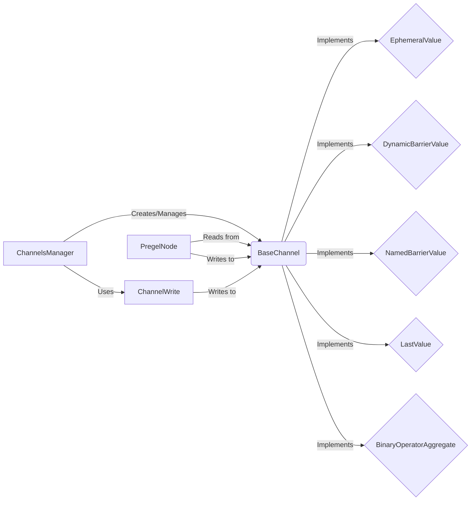

## Channel Management System Overview

This document provides an overview of the Channel Management System within the `langgraph` framework. The system is responsible for managing communication and state between nodes in the graph. It defines channels, manages value reads and writes, and oversees checkpoints. The core components and their interactions are described below.

### Component Descriptions:

*   **ChannelsManager**
    *   **Description**: Manages the lifecycle of channels, including creation, access, and checkpointing. It acts as a central registry for all channels within the Pregel graph.
    *   **Interaction**: Creates and manages `BaseChannel` instances. `PregelNode` interacts with `ChannelsManager` to access channels for reading and writing.
    *   **Relevant source files**: `langgraph.pregel.manager.ChannelsManager`, `langgraph.pregel.manager.AsyncChannelsManager`

*   **BaseChannel**
    *   **Description**: Abstract base class defining the interface for all channel implementations. It provides methods for copying, checkpointing, updating, and accessing channel values.
    *   **Interaction**: Serves as the base class for various channel types like `EphemeralValue`, `DynamicBarrierValue`, `NamedBarrierValue`, `LastValue`, and `BinaryOperatorAggregate`. `PregelNode` reads and writes to channels via the `BaseChannel` interface.
    *   **Relevant source files**: `langgraph.channels.base.BaseChannel`

*   **EphemeralValue**
    *   **Description**: A channel that holds a single, non-persistent value. It's suitable for temporary data that doesn't need to be saved across checkpoints.
    *   **Interaction**: Implements the `BaseChannel` interface. `PregelNode` can read and write temporary values to this channel.
    *   **Relevant source files**: `langgraph.channels.ephemeral_value.EphemeralValue`

*   **DynamicBarrierValue**
    *   **Description**: A channel that acts as a dynamic barrier, pausing execution until a specific condition is met. This allows for synchronization between different parts of the graph based on runtime conditions.
    *   **Interaction**: Implements the `BaseChannel` interface. `PregelNode` interacts with this channel to synchronize execution based on dynamic conditions.
    *   **Relevant source files**: `langgraph.channels.dynamic_barrier_value.DynamicBarrierValue`

*   **NamedBarrierValue**
    *   **Description**: A channel that acts as a named barrier, blocking execution until a specific named event occurs. This is useful for synchronizing based on external signals or events.
    *   **Interaction**: Implements the `BaseChannel` interface. `PregelNode` interacts with this channel to synchronize execution based on named events.
    *   **Relevant source files**: `langgraph.channels.named_barrier_value.NamedBarrierValue`

*   **LastValue**
    *   **Description**: A channel that stores only the most recent value written to it. This is suitable for scenarios where only the latest state is relevant.
    *   **Interaction**: Implements the `BaseChannel` interface. `PregelNode` reads and writes the latest values to this channel.
    *   **Relevant source files**: `langgraph.channels.last_value.LastValue`

*   **BinaryOperatorAggregate**
    *   **Description**: A channel that aggregates values using a binary operator. This allows for combining multiple updates into a single value within the channel.
    *   **Interaction**: Implements the `BaseChannel` interface. `PregelNode` writes values to this channel, which are then aggregated using a binary operator.
    *   **Relevant source files**: `langgraph.channels.binop.BinaryOperatorAggregate`

*   **PregelNode**
    *   **Description**: Represents a node in the Pregel graph, responsible for reading from and writing to channels. It orchestrates the flow of data between nodes during graph execution.
    *   **Interaction**: Reads from and writes to various `BaseChannel` implementations via the `ChannelsManager`. Uses `ChannelWrite` to perform write operations.
    *   **Relevant source files**: `langgraph.pregel.read.PregelNode`

*   **ChannelWrite**
    *   **Description**: Represents a write operation to a channel within the Pregel framework. It encapsulates the logic for writing data to a specific channel.
    *   **Interaction**: Used by `PregelNode` to write data to channels. The `ChannelsManager` might be involved in resolving the channel to write to.
    *   **Relevant source files**: `langgraph.pregel.write.ChannelWrite`