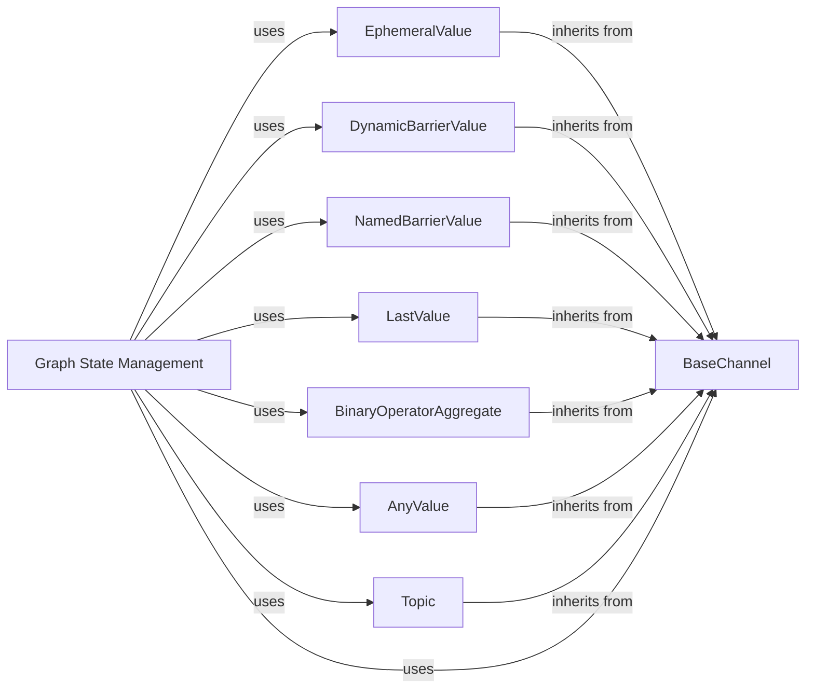

## Component Details

The Channel Management component in LangGraph provides a flexible and extensible mechanism for nodes within a graph to communicate and exchange data. It defines a set of channel types, each designed to support different communication patterns, such as last-value persistence, any-value storage, and binary operator aggregation. These channels act as typed message queues, enabling nodes to share information and update the graph's state in a controlled and predictable manner. The core of this component is the `BaseChannel` class, which serves as the abstract base for all channel implementations, ensuring a consistent interface for channel operations. Graph state management functions leverage these channels to facilitate data flow and state updates within the graph.

### BaseChannel
Abstract base class for defining channels in LangGraph. It provides a common interface for channel operations like copying and checkpointing. All channel implementations inherit from this class, ensuring a consistent API for interacting with different channel types.
- **Related Classes/Methods**: `langgraph.libs.langgraph.langgraph.channels.base.BaseChannel`

### EphemeralValue
A channel that holds a single value that is not persisted across graph iterations. It's useful for temporary data storage within a single execution cycle, such as passing intermediate results between nodes during a single graph traversal.
- **Related Classes/Methods**: `langgraph.libs.langgraph.langgraph.channels.ephemeral_value.EphemeralValue`

### DynamicBarrierValue
A channel that acts as a dynamic barrier, allowing data to pass through only when certain conditions are met. It's useful for synchronizing data flow between different parts of the graph, ensuring that certain nodes only execute after specific conditions are satisfied.
- **Related Classes/Methods**: `langgraph.libs.langgraph.langgraph.channels.dynamic_barrier_value.DynamicBarrierValue`, `langgraph.libs.langgraph.langgraph.channels.dynamic_barrier_value.DynamicBarrierValueAfterFinish`

### NamedBarrierValue
A channel that acts as a named barrier, similar to DynamicBarrierValue but identified by a name. It's useful for synchronizing data flow based on specific named conditions, providing a more explicit and manageable way to control execution order.
- **Related Classes/Methods**: `langgraph.libs.langgraph.langgraph.channels.named_barrier_value.NamedBarrierValue`, `langgraph.libs.langgraph.langgraph.channels.named_barrier_value.NamedBarrierValueAfterFinish`

### LastValue
A channel that stores the last value written to it. It's useful for keeping track of the most recent data in a stream, allowing nodes to access the latest state of a particular variable or parameter.
- **Related Classes/Methods**: `langgraph.libs.langgraph.langgraph.channels.last_value.LastValue`, `langgraph.libs.langgraph.langgraph.channels.last_value.LastValueAfterFinish`

### BinaryOperatorAggregate
A channel that aggregates values using a binary operator. It's useful for combining data from multiple sources into a single value, such as summing up scores or merging lists.
- **Related Classes/Methods**: `langgraph.libs.langgraph.langgraph.channels.binop.BinaryOperatorAggregate`, `langgraph.libs.langgraph.langgraph.channels.binop._strip_extras`

### AnyValue
A channel that can hold any type of value. It's a generic channel for storing arbitrary data, providing flexibility when the data type is not known in advance or when different types of data need to be stored in the same channel.
- **Related Classes/Methods**: `langgraph.libs.langgraph.langgraph.channels.any_value.AnyValue`

### Topic
A channel that represents a topic or category of data. It's useful for organizing and routing data based on its topic, allowing nodes to subscribe to specific topics and receive only relevant information.
- **Related Classes/Methods**: `langgraph.libs.langgraph.langgraph.channels.topic.Topic`

### Graph State Management
Functions responsible for managing the state of the graph, including retrieving and checking channels. These functions interact with the different channel types to ensure proper data flow and state updates within the graph, providing a centralized mechanism for accessing and manipulating channel data.
- **Related Classes/Methods**: `langgraph.libs.langgraph.langgraph.graph.state._get_channels`, `langgraph.libs.langgraph.langgraph.graph.state._get_channel`, `langgraph.libs.langgraph.langgraph.graph.state._is_field_binop`, `langgraph.libs.langgraph.langgraph.graph.state._is_field_managed_value`
