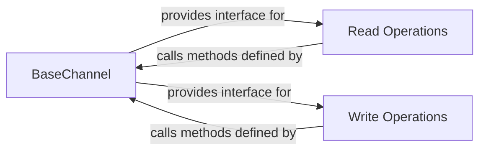

## Details

The core of the `langgraph` channel management subsystem revolves around the `BaseChannel` abstract component, which establishes the foundational contract for data handling. `Read Operations` and `Write Operations` are key components that interact with `BaseChannel` to manage the flow of data within the graph. `Read Operations` is responsible for consuming data from channels, acting as the input gateway for computational nodes, while `Write Operations` handles the persistence and propagation of state changes back to the channels, serving as the output gateway. This clear separation of concerns ensures efficient and consistent data flow, state management, and extensibility for various channel implementations.
Critical Interaction Pathways:
- Data Retrieval: `Read Operations` utilizes the interface provided by `BaseChannel` to retrieve data, ensuring that nodes receive the necessary inputs.
- Data Persistence: `Write Operations` leverages the `BaseChannel` interface to commit data updates and propagate state changes, maintaining the graph's integrity.

### BaseChannel
This component defines the fundamental abstract interface for all data channels within the graph. It establishes the contract for how data is managed, including methods for copying, checkpointing, and verifying data availability. It is crucial for ensuring consistent data flow, state persistence, and enabling diverse channel implementations (e.g., in-memory, distributed).

**Related Classes/Methods**:

- <a href="https://github.com/langchain-ai/langgraph/blob/main/libs/langgraph/langgraph/channels/base.py#L19-L105" target="_blank" rel="noopener noreferrer">`langgraph.channels.base.BaseChannel`:19-105</a>

### Read Operations
This component is responsible for orchestrating the retrieval of data from various channels. It supports both synchronous and asynchronous operations, ensuring that nodes and agent executors receive the necessary inputs for their execution. It acts as the input gateway for computational units within the graph.

**Related Classes/Methods**:

### Write Operations
This component manages the process of writing data and propagating state changes back to the channels. It handles both synchronous and asynchronous operations, preparing and committing data updates from node outputs and agent results. It acts as the output gateway, ensuring that the graph's state is correctly updated and propagated.

**Related Classes/Methods**:

### [FAQ](https://github.com/CodeBoarding/GeneratedOnBoardings/tree/main?tab=readme-ov-file#faq)