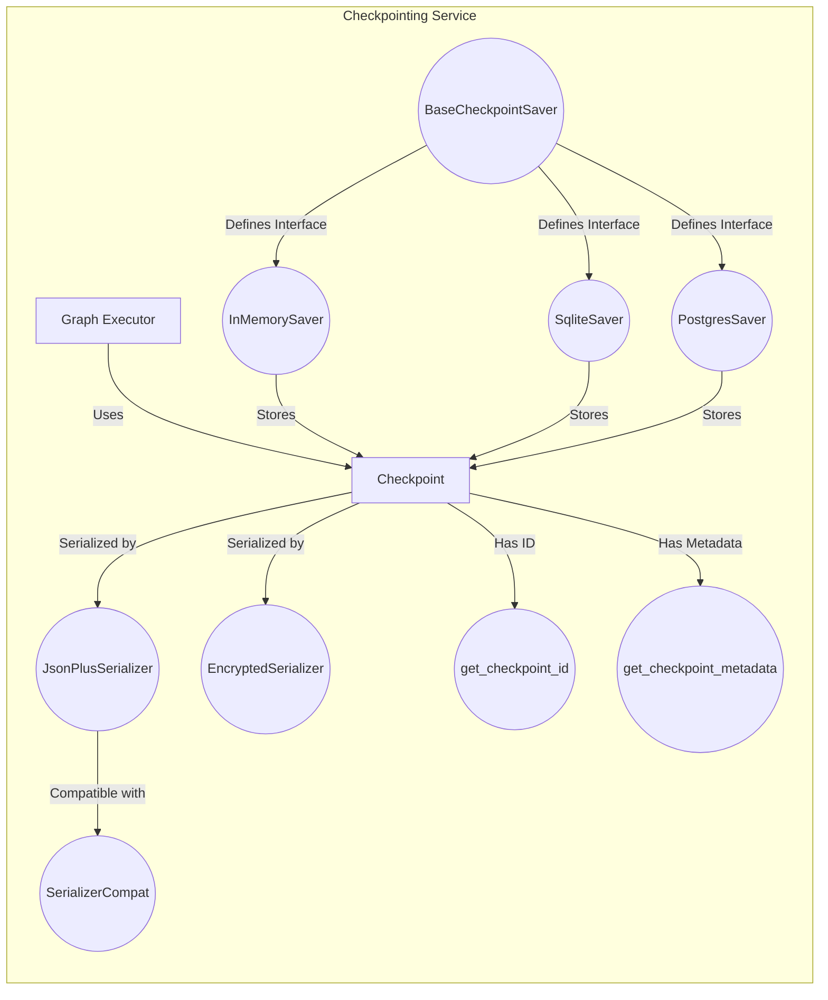

## Checkpointing Service Overview

The Checkpointing Service provides a mechanism to save and load the state of a LangGraph, allowing execution to be resumed from specific points. It supports various storage backends, including in-memory storage, SQLite databases, and Postgres databases. The service also includes serialization and encryption capabilities to handle complex data types and protect sensitive information.

Here's a data flow diagram illustrating the main components and their interactions:

### Component Descriptions:

- **BaseCheckpointSaver:** Abstract base class that defines the interface for saving and retrieving checkpoints. It ensures that all concrete checkpoint savers implement the necessary methods. It interacts with `InMemorySaver`, `SqliteSaver`, and `PostgresSaver` by defining the methods they must implement.
  - Relevant source files: `langgraph.checkpoint.base.BaseCheckpointSaver`

- **JsonPlusSerializer:** Serializer responsible for handling the serialization and deserialization of data, including custom types. It uses a combination of JSON and msgpack for efficient and flexible data handling. It interacts with `Checkpoint` to serialize and deserialize the graph state.
  - Relevant source files: `langgraph.checkpoint.serde.jsonplus.JsonPlusSerializer`

- **EncryptedSerializer:** Serializer that encrypts data before serialization and decrypts it after deserialization, providing a layer of security for sensitive data. It interacts with `Checkpoint` to serialize and deserialize the graph state in an encrypted format.
  - Relevant source files: `langgraph.checkpoint.serde.encrypted.EncryptedSerializer`

- **SerializerCompat:** Compatibility layer for serializers, providing methods for typed serialization and deserialization. It ensures compatibility across different data types and serialization methods. It interacts with `JsonPlusSerializer` to provide compatibility.
  - Relevant source files: `langgraph.checkpoint.serde.base.SerializerCompat`

- **InMemorySaver:** Concrete checkpoint saver that stores checkpoints in memory. It's suitable for development and testing but not for production. It interacts with `BaseCheckpointSaver` by implementing its interface and stores `Checkpoint` objects in memory.
  - Relevant source files: `langgraph.checkpoint.memory.InMemorySaver`

- **SqliteSaver:** Concrete checkpoint saver that stores checkpoints in a SQLite database. It's a good option for single-node deployments and development environments. It interacts with `BaseCheckpointSaver` by implementing its interface and stores `Checkpoint` objects in a SQLite database.
  - Relevant source files: `langgraph.checkpoint.sqlite.SqliteSaver`, `langgraph.checkpoint.sqlite.aio.AsyncSqliteSaver`

- **PostgresSaver:** Concrete checkpoint saver that stores checkpoints in a Postgres database. It's suitable for production environments and supports concurrent access. It interacts with `BaseCheckpointSaver` by implementing its interface and stores `Checkpoint` objects in a Postgres database.
  - Relevant source files: `langgraph.checkpoint.postgres.PostgresSaver`, `langgraph.checkpoint.postgres.aio.AsyncPostgresSaver`, `langgraph.checkpoint.postgres.shallow.ShallowPostgresSaver`, `langgraph.checkpoint.postgres.shallow.AsyncShallowPostgresSaver`

- **Checkpoint:** Represents a snapshot of the state of a LangGraph. It contains the data that needs to be saved and restored. It interacts with the `GraphExecutor` to save and load the graph state, and with the serializers to handle the data format.
  - Relevant source files: `langgraph.checkpoint.base.Checkpoint`

- **get_checkpoint_id:** Utility function to generate a unique ID for each checkpoint. It interacts with `Checkpoint` to assign a unique identifier.
  - Relevant source files: `langgraph.checkpoint.base.get_checkpoint_id`

- **get_checkpoint_metadata:** Utility function to generate metadata for checkpoints, such as timestamps and user information. It interacts with `Checkpoint` to add additional information.
  - Relevant source files: `langgraph.checkpoint.base.get_checkpoint_metadata`

- **Graph Executor:** Component responsible for executing the LangGraph. It uses the Checkpointing Service to save and load the graph's state, enabling resuming execution from specific points.
  - Relevant source files: N/A (This is a conceptual component representing the graph execution engine)
