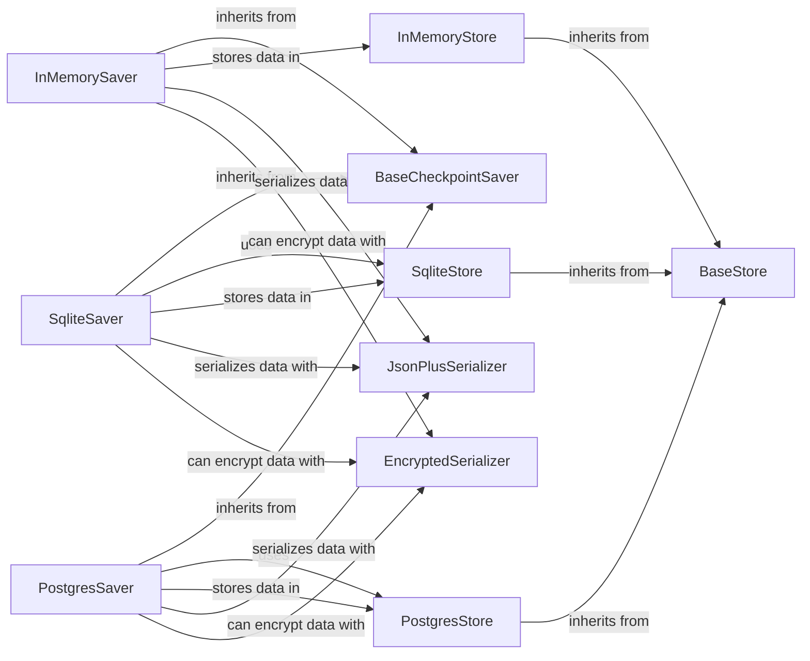

## Component Details

The Checkpointing and Persistence component provides the ability to save and restore the state of a LangGraph, enabling long-running and fault-tolerant workflows. It offers a flexible architecture with abstract base classes for savers and stores, along with concrete implementations for in-memory, SQLite, and Postgres storage. Serialization is handled by JsonPlusSerializer, with optional encryption provided by EncryptedSerializer. Caching mechanisms using InMemoryCache and SqliteCache are also available to optimize performance.

### BaseCheckpointSaver
Abstract base class defining the interface for checkpoint savers. It declares abstract methods for saving and loading data, providing a common interface for different storage implementations.
- **Related Classes/Methods**: `langgraph.libs.checkpoint.langgraph.checkpoint.base.BaseCheckpointSaver`

### InMemorySaver
A checkpoint saver that stores checkpoints in memory, suitable for testing and development. It utilizes an InMemoryStore for data storage and JsonPlusSerializer for serialization.
- **Related Classes/Methods**: `langgraph.libs.checkpoint.langgraph.checkpoint.memory.InMemorySaver`

### SqliteSaver
A checkpoint saver that persists checkpoints to a SQLite database. It uses a SqliteStore for data storage and JsonPlusSerializer for serialization. Encryption is supported via EncryptedSerializer.
- **Related Classes/Methods**: `langgraph.libs.checkpoint-sqlite.langgraph.checkpoint.sqlite.SqliteSaver`, `langgraph.libs.checkpoint-sqlite.langgraph.checkpoint.sqlite.aio.AsyncSqliteSaver`

### PostgresSaver
A checkpoint saver that persists checkpoints to a Postgres database. It uses a PostgresStore for data storage and JsonPlusSerializer for serialization. Encryption is supported via EncryptedSerializer.
- **Related Classes/Methods**: `langgraph.libs.checkpoint-postgres.langgraph.checkpoint.postgres.PostgresSaver`, `langgraph.libs.checkpoint-postgres.langgraph.checkpoint.postgres.aio.AsyncPostgresSaver`, `langgraph.libs.checkpoint-postgres.langgraph.checkpoint.postgres.shallow.ShallowPostgresSaver`, `langgraph.libs.checkpoint-postgres.langgraph.checkpoint.postgres.shallow.AsyncShallowPostgresSaver`

### JsonPlusSerializer
A serializer that extends JSON serialization to handle more data types, such as datetime objects.
- **Related Classes/Methods**: `langgraph.libs.checkpoint.langgraph.checkpoint.serde.jsonplus.JsonPlusSerializer`

### EncryptedSerializer
A serializer that encrypts data before saving, providing data privacy and security.
- **Related Classes/Methods**: `langgraph.libs.checkpoint.langgraph.checkpoint.serde.encrypted.EncryptedSerializer`

### BaseStore
Abstract base class defining the interface for data stores. It declares abstract methods for setting, getting, and deleting data, providing a common interface for different storage implementations.
- **Related Classes/Methods**: `langgraph.libs.checkpoint.langgraph.store.base.BaseStore`

### InMemoryStore
A data store that stores data in memory, inheriting from BaseStore.
- **Related Classes/Methods**: `langgraph.libs.checkpoint.langgraph.store.memory.InMemoryStore`

### SqliteStore
A data store that persists data to a SQLite database, inheriting from BaseStore.
- **Related Classes/Methods**: `langgraph.libs.checkpoint-sqlite.langgraph.store.sqlite.base.SqliteStore`, `langgraph.libs.checkpoint-sqlite.langgraph.store.sqlite.aio.AsyncSqliteStore`

### PostgresStore
A data store that persists data to a Postgres database, inheriting from BaseStore.
- **Related Classes/Methods**: `langgraph.libs.checkpoint-postgres.langgraph.store.postgres.base.PostgresStore`, `langgraph.libs.checkpoint-postgres.langgraph.store.postgres.aio.AsyncPostgresStore`
