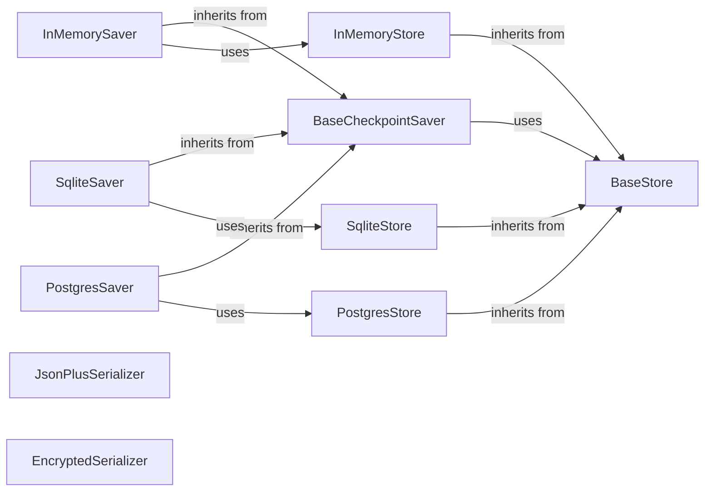

## Component Details

The Checkpointing and Persistence component provides the ability to save and load the state of a LangGraph, enabling the resumption of execution from a specific point. It offers various storage backends, including in-memory, SQLite, and Postgres, and supports serialization and encryption for data integrity and security. The core functionality revolves around the `BaseCheckpointSaver` and `BaseStore` abstract classes, which define the interfaces for saving/retrieving checkpoints and interacting with different storage mechanisms, respectively. Concrete implementations like `InMemorySaver`, `SqliteSaver`, and `PostgresSaver` provide specific storage solutions, while serializers like `JsonPlusSerializer` and `EncryptedSerializer` handle data transformation and security.

### BaseCheckpointSaver
Abstract base class defining the interface for checkpoint savers. It uses a `BaseStore` to interact with the underlying storage, providing methods for saving and retrieving checkpoint data. Concrete implementations inherit from this class to provide specific storage solutions.
- **Related Classes/Methods**: `langgraph.libs.checkpoint.langgraph.checkpoint.base.BaseCheckpointSaver`

### BaseStore
Abstract base class defining the interface for data stores. It provides methods for storing and retrieving data items. `BaseCheckpointSaver` implementations use this class to interact with different storage backends.
- **Related Classes/Methods**: `langgraph.libs.checkpoint.langgraph.store.base.BaseStore`

### InMemorySaver
A checkpoint saver that stores data in memory. It inherits from `BaseCheckpointSaver` and uses `InMemoryStore` for storage, making it suitable for testing and development purposes where persistence is not required.
- **Related Classes/Methods**: `langgraph.libs.checkpoint.langgraph.checkpoint.memory.InMemorySaver`

### SqliteSaver
A checkpoint saver that stores data in a SQLite database. It inherits from `BaseCheckpointSaver` and uses `SqliteStore` for storage, providing persistent storage using SQLite. It's suitable for applications requiring local, file-based persistence.
- **Related Classes/Methods**: `langgraph.libs.checkpoint-sqlite.langgraph.checkpoint.sqlite.SqliteSaver`

### PostgresSaver
A checkpoint saver that stores data in a Postgres database. It inherits from `BaseCheckpointSaver` and uses `PostgresStore` for storage, providing persistent storage using Postgres. It's suitable for applications requiring a robust, networked database solution.
- **Related Classes/Methods**: `langgraph.libs.checkpoint-postgres.langgraph.checkpoint.postgres.PostgresSaver`

### InMemoryStore
A data store that stores data in memory. It inherits from `BaseStore` and is used by `InMemorySaver` for in-memory storage. It's useful for testing and development.
- **Related Classes/Methods**: `langgraph.libs.checkpoint.langgraph.store.memory.InMemoryStore`

### SqliteStore
A data store that stores data in a SQLite database. It inherits from `BaseStore` and is used by `SqliteSaver` for persistent storage using SQLite.
- **Related Classes/Methods**: `langgraph.libs.checkpoint-sqlite.langgraph.store.sqlite.base.SqliteStore`

### PostgresStore
A data store that stores data in a Postgres database. It inherits from `BaseStore` and is used by `PostgresSaver` for persistent storage using Postgres.
- **Related Classes/Methods**: `langgraph.libs.checkpoint-postgres.langgraph.store.postgres.base.PostgresStore`

### JsonPlusSerializer
A serializer that handles serialization and deserialization of data to/from JSON format, with support for custom types. It's used to serialize data before storing it in the store and deserialize it after retrieval, ensuring data can be properly stored and retrieved.
- **Related Classes/Methods**: `langgraph.libs.checkpoint.langgraph.checkpoint.serde.jsonplus.JsonPlusSerializer`

### EncryptedSerializer
A serializer that encrypts data before storing it and decrypts it after retrieval, providing data security. It ensures that sensitive data is protected while stored in the chosen backend.
- **Related Classes/Methods**: `langgraph.libs.checkpoint.langgraph.checkpoint.serde.encrypted.EncryptedSerializer`
