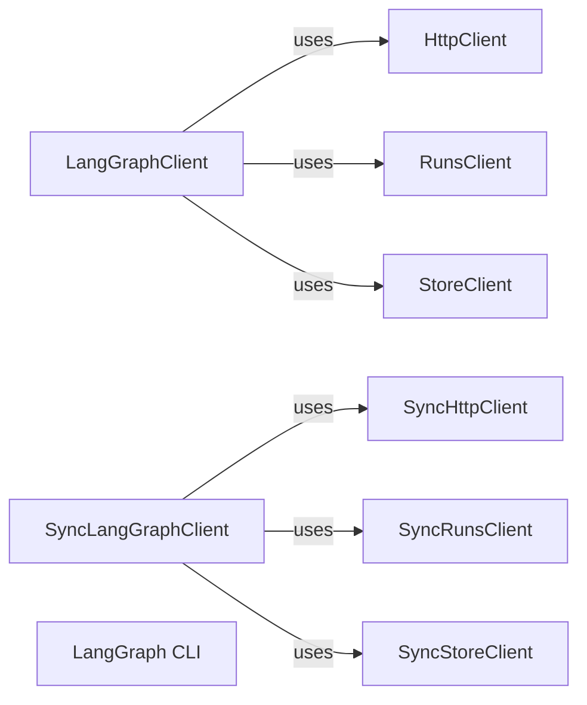

## Component Details

The External Interface component provides the entry points for interacting with LangGraph, offering both a Command Line Interface (CLI) and a Software Development Kit (SDK). The CLI allows users to manage and deploy LangGraph applications through command-line interactions, while the SDK provides programmatic access to LangGraph services via Python code. This enables users to create, build, deploy, and interact with LangGraph applications either from the command line or through Python scripts.

### LangGraphClient
The LangGraphClient is the primary asynchronous client for interacting with the LangGraph API. It offers methods for creating, monitoring, and managing LangGraph runs and data. It serves as the main interface for asynchronous operations against the LangGraph service.
- **Related Classes/Methods**: `langgraph.libs.sdk-py.langgraph_sdk.client.LangGraphClient`

### HttpClient
The HttpClient is an asynchronous HTTP client utilized by LangGraphClient to send requests to the LangGraph API. It manages authentication and handles potential errors during communication with the API.
- **Related Classes/Methods**: `langgraph.libs.sdk-py.langgraph_sdk.client.HttpClient`

### RunsClient
The RunsClient is an asynchronous client specifically designed for interacting with LangGraph runs. It provides methods for creating, streaming, and waiting for runs to complete, enabling users to manage the execution of LangGraph applications.
- **Related Classes/Methods**: `langgraph.libs.sdk-py.langgraph_sdk.client.RunsClient`

### StoreClient
The StoreClient is an asynchronous client responsible for interacting with the LangGraph data store. It offers methods for putting items, searching for items, and listing namespaces, allowing users to manage the data associated with LangGraph applications.
- **Related Classes/Methods**: `langgraph.libs.sdk-py.langgraph_sdk.client.StoreClient`

### SyncLangGraphClient
The SyncLangGraphClient is the synchronous counterpart to LangGraphClient, providing the same functionality but in a blocking manner. It's suitable for use cases where asynchronous operations are not required or desired.
- **Related Classes/Methods**: `langgraph.libs.sdk-py.langgraph_sdk.client.SyncLangGraphClient`

### SyncHttpClient
The SyncHttpClient is a synchronous HTTP client used by SyncLangGraphClient to make requests to the LangGraph API. It provides the same functionality as HttpClient but in a blocking manner.
- **Related Classes/Methods**: `langgraph.libs.sdk-py.langgraph_sdk.client.SyncHttpClient`

### SyncRunsClient
The SyncRunsClient is a synchronous client for interacting with LangGraph runs, mirroring the functionality of RunsClient but in a blocking manner.
- **Related Classes/Methods**: `langgraph.libs.sdk-py.langgraph_sdk.client.SyncRunsClient`

### SyncStoreClient
The SyncStoreClient is a synchronous client for interacting with the LangGraph data store, providing the same functionality as StoreClient but in a blocking manner.
- **Related Classes/Methods**: `langgraph.libs.sdk-py.langgraph_sdk.client.SyncStoreClient`

### LangGraph CLI
The LangGraph CLI provides a command-line interface for managing and deploying LangGraph applications. It allows users to perform tasks such as creating, building, and deploying LangGraph applications from the command line.
- **Related Classes/Methods**: `langgraph.libs.cli.langgraph_cli.cli`, `langgraph.libs.cli.langgraph_cli.config`, `langgraph.libs.cli.langgraph_cli.docker`, `langgraph.libs.cli.langgraph_cli.exec`
