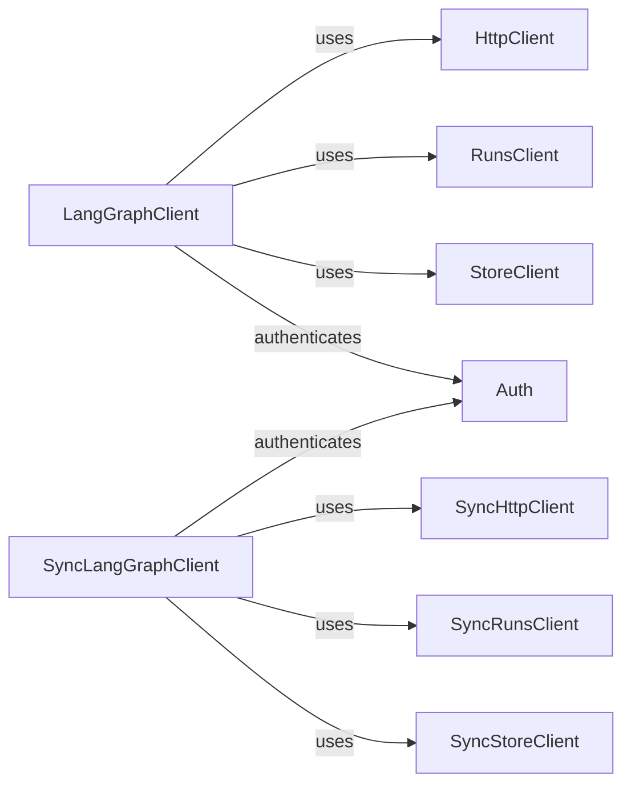

## Component Details

The LangGraph SDK provides a client for interacting with LangGraph services, enabling remote management and monitoring of graph executions. It includes both synchronous and asynchronous clients, along with supporting classes for handling HTTP requests, managing runs, and interacting with the LangGraph store. The SDK simplifies the process of integrating with LangGraph, allowing users to programmatically control and observe graph workflows.

### LangGraphClient
Asynchronous client for interacting with LangGraph services. It provides methods for making HTTP requests and managing runs and stores. It uses HttpClient for network requests, Auth for authentication, and RunsClient and StoreClient for managing runs and interacting with the store, respectively.
- **Related Classes/Methods**: `langgraph.libs.sdk-py.langgraph_sdk.client.LangGraphClient`

### SyncLangGraphClient
Synchronous client for interacting with LangGraph services. It mirrors the functionality of LangGraphClient but operates in a synchronous manner. It uses SyncHttpClient for network requests, Auth for authentication, and SyncRunsClient and SyncStoreClient for managing runs and interacting with the store, respectively.
- **Related Classes/Methods**: `langgraph.libs.sdk-py.langgraph_sdk.client.SyncLangGraphClient`

### HttpClient
Asynchronous HTTP client used by LangGraphClient to make requests to LangGraph endpoints. It handles the underlying HTTP communication with the LangGraph service.
- **Related Classes/Methods**: `langgraph.libs.sdk-py.langgraph_sdk.client.HttpClient`

### SyncHttpClient
Synchronous HTTP client used by SyncLangGraphClient to make requests to LangGraph endpoints. It handles the underlying HTTP communication with the LangGraph service in a synchronous manner.
- **Related Classes/Methods**: `langgraph.libs.sdk-py.langgraph_sdk.client.SyncHttpClient`

### RunsClient
Client for managing runs within LangGraph. It provides methods for creating batches of runs. It interacts with LangGraphClient to perform run-related operations.
- **Related Classes/Methods**: `langgraph.libs.sdk-py.langgraph_sdk.client.RunsClient`

### SyncRunsClient
Synchronous client for managing runs within LangGraph. It interacts with SyncLangGraphClient to perform run-related operations in a synchronous manner.
- **Related Classes/Methods**: `langgraph.libs.sdk-py.langgraph_sdk.client.SyncRunsClient`

### StoreClient
Client for interacting with the LangGraph store. It provides methods for putting items, searching items, and listing namespaces. It interacts with LangGraphClient to perform store-related operations.
- **Related Classes/Methods**: `langgraph.libs.sdk-py.langgraph_sdk.client.StoreClient`

### SyncStoreClient
Synchronous client for interacting with the LangGraph store. It interacts with SyncLangGraphClient to perform store-related operations in a synchronous manner.
- **Related Classes/Methods**: `langgraph.libs.sdk-py.langgraph_sdk.client.SyncStoreClient`

### Auth
Handles authentication for LangGraph clients. It is used by both LangGraphClient and SyncLangGraphClient to authenticate requests to the LangGraph service.
- **Related Classes/Methods**: `langgraph.libs.sdk-py.langgraph_sdk.auth.Auth`
