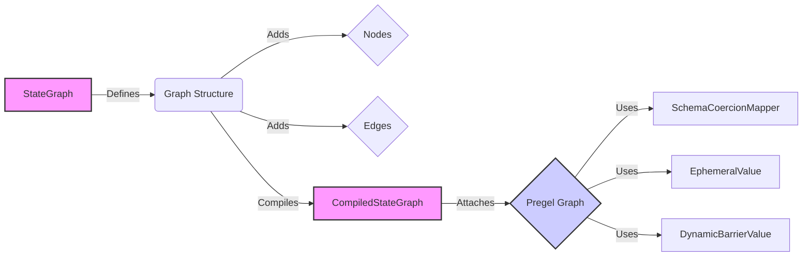

### Component Descriptions:

*   **StateGraph:** Defines the structure of the graph, including nodes, edges, and state schema, and compiles it into an executable form. It manages the overall graph structure and prepares it for execution. **Relevant source files:** `langgraph.graph.state.StateGraph`
*   **Graph Structure:** Represents the overall structure of the graph, holding nodes and edges. It's the blueprint for the graph. **Relevant source files:** `langgraph.graph.graph.Graph`
*   **Nodes:** Represents individual nodes within the graph. Nodes can perform actions or hold state. **Relevant source files:** `langgraph.graph.graph.Graph.add_node`
*   **Edges:** Represents connections between nodes in the graph, defining the flow of execution. **Relevant source files:** `langgraph.graph.graph.Graph.add_edge`
*   **CompiledStateGraph:** Represents a compiled state graph, ready for execution. It attaches nodes and edges to the underlying Pregel graph. **Relevant source files:** `langgraph.graph.state.CompiledStateGraph`
*   **Pregel Graph:** Represents the Pregel computation framework used for graph processing. It manages subgraphs, state snapshots, and validation. **Relevant source files:** `langgraph.pregel.Pregel`
*   **SchemaCoercionMapper:** Responsible for coercing the schema of the graph's state. It builds coercers for different types and handles passthrough cases. **Relevant source files:** `langgraph.graph.schema_utils.SchemaCoercionMapper`
*   **EphemeralValue:** Represents a channel that holds a single value that is not persisted. **Relevant source files:** `langgraph.channels.ephemeral_value.EphemeralValue`
*   **DynamicBarrierValue:** Represents a channel that acts as a dynamic barrier, waiting for a certain condition to be met. **Relevant source files:** `langgraph.channels.dynamic_barrier_value.DynamicBarrierValue`