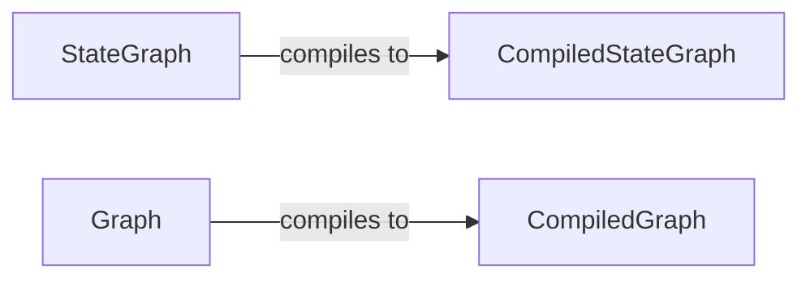

## Component Details

The Graph Definition and Compilation component provides the core classes and methods for defining and compiling both stateful and stateless graphs. It enables the creation of complex workflows with nodes, edges, and conditional transitions. The compilation process optimizes the graph structure for efficient execution. The main flow involves defining the graph structure using either `StateGraph` or `Graph`, adding nodes and edges to represent the workflow, and then compiling the graph into its executable form (`CompiledStateGraph` or `CompiledGraph`).

### StateGraph
The `StateGraph` class is a fundamental building block for defining stateful graphs. It allows users to add nodes, edges, and conditional edges, and compile the graph into a `CompiledStateGraph` for execution. It manages the state transitions within the graph, making it suitable for workflows that require maintaining and updating state.
- **Related Classes/Methods**: `langgraph.libs.langgraph.langgraph.graph.state.StateGraph`

### CompiledStateGraph
The `CompiledStateGraph` class represents a compiled stateful graph, ready for execution. It provides methods for attaching nodes, edges, and branches, as well as retrieving input and output schemas. It is the executable form of a `StateGraph`, optimized for efficient traversal and execution of stateful workflows.
- **Related Classes/Methods**: `langgraph.libs.langgraph.langgraph.graph.state.CompiledStateGraph`

### Graph
The `Graph` class is used to define stateless graphs. It allows users to add nodes, edges, set entry/conditional/finish points, and compile the graph into a `CompiledGraph` for execution. It represents a stateless graph structure, suitable for workflows that do not require maintaining state across transitions.
- **Related Classes/Methods**: `langgraph.libs.langgraph.langgraph.graph.graph.Graph`

### CompiledGraph
The `CompiledGraph` class represents a compiled graph, ready for execution. It provides methods for attaching nodes, edges, and branches. It is the executable form of a `Graph`, optimized for efficient traversal and execution of stateless workflows.
- **Related Classes/Methods**: `langgraph.libs.langgraph.langgraph.graph.graph.CompiledGraph`
