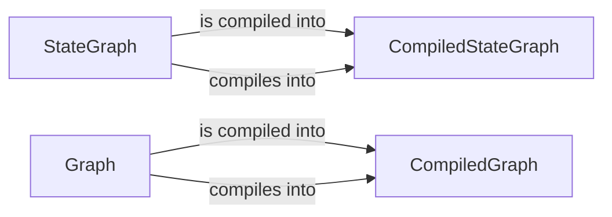

## Component Details

The Graph Definition and Compilation component is responsible for defining and compiling graph structures, including both standard graphs and stateful graphs. It provides the classes and methods necessary to define the nodes, edges, and overall flow of execution for these graphs. The compilation process optimizes the graph for performance and ensures that all dependencies are properly resolved, resulting in a runnable graph.

### StateGraph
The `StateGraph` class is responsible for defining the structure of a stateful graph. It allows adding nodes, edges, conditional edges, and sequences of nodes. It also handles the schema definition for the graph's state. It serves as a blueprint for creating stateful graphs with defined states and transitions.
- **Related Classes/Methods**: `langgraph.libs.langgraph.langgraph.graph.state.StateGraph`

### CompiledStateGraph
The `CompiledStateGraph` class represents the compiled version of a `StateGraph`. It is responsible for attaching nodes and edges to the compiled graph, as well as providing methods for getting the input and output schemas. It takes the structure defined in `StateGraph` and creates an executable graph, ready for execution.
- **Related Classes/Methods**: `langgraph.libs.langgraph.langgraph.graph.state.CompiledStateGraph`

### Graph
The `Graph` class is responsible for defining the structure of a graph. It allows adding nodes, edges, conditional edges. It also sets entry point, conditional entry point and finish point. It serves as a blueprint for creating graphs with defined nodes and transitions.
- **Related Classes/Methods**: `langgraph.libs.langgraph.langgraph.graph.graph.Graph`

### CompiledGraph
The `CompiledGraph` class represents the compiled version of a `Graph`. It is responsible for attaching nodes and edges to the compiled graph. It takes the structure defined in `Graph` and creates an executable graph, ready for execution.
- **Related Classes/Methods**: `langgraph.libs.langgraph.langgraph.graph.graph.CompiledGraph`
