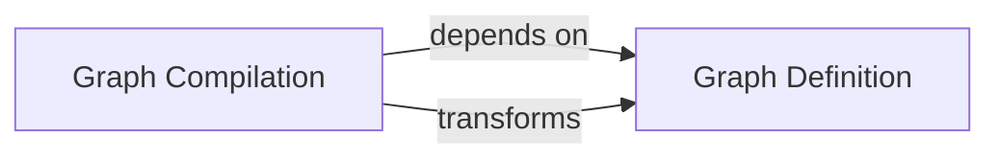

## Details

The LangGraph core subsystem is structured around two interdependent components: `Graph Definition` and `Graph Compilation`. The `Graph Definition` component provides the declarative interface for users to construct complex agentic workflows, outlining the graph's structure and state. This abstract definition is then consumed by the `Graph Compilation` component, which is responsible for transforming it into an optimized, executable representation. This transformation involves translating the high-level graph into concrete execution logic and configuring the underlying engine structures, thereby enabling the efficient execution of the defined workflow. This clear separation of concerns ensures a robust and scalable architecture for defining and running agentic applications.

### Graph Definition
This component is solely responsible for the declarative construction of the agentic workflow graph. It provides a high-level API for users to define nodes (representing agents or computational steps), specify various types of edges (direct, conditional, sequential) between these nodes, and designate entry and finish points. It also manages the schema for the graph's shared state, ensuring data consistency and validation during the definition phase.

**Related Classes/Methods**:

- <a href="https://github.com/langchain-ai/langgraph/blob/main/libs/langgraph/langgraph/graph/state.py#L117-L894" target="_blank" rel="noopener noreferrer">`langgraph.graph.state.StateGraph`:117-894</a>

### Graph Compilation
This component takes the abstract graph definition from the `Graph Definition` component and transforms it into an optimized, executable representation. It translates the high-level nodes and edges into concrete execution logic, configuring internal Pregel-like structures (nodes, channels, triggers, writers) that enable the LangGraph engine to run the workflow. It also handles the attachment of runtime concerns like checkpointing and debugging.

**Related Classes/Methods**:

- <a href="https://github.com/langchain-ai/langgraph/blob/main/libs/langgraph/langgraph/graph/state.py#L897-L1216" target="_blank" rel="noopener noreferrer">`langgraph.graph.state.CompiledStateGraph`:897-1216</a>

### [FAQ](https://github.com/CodeBoarding/GeneratedOnBoardings/tree/main?tab=readme-ov-file#faq)