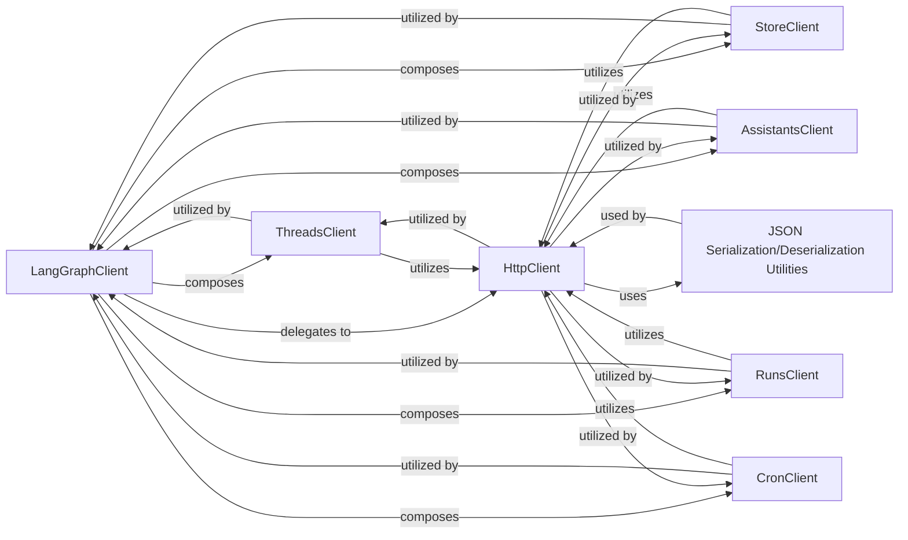

## Details

The langgraph_sdk.client subsystem provides a comprehensive client-side interface for interacting with the LangGraph API. At its core, the LangGraphClient serves as a high-level entry point, orchestrating interactions by composing specialized clients such as ThreadsClient, StoreClient, AssistantsClient, RunsClient, and CronClient. Each of these specialized clients is responsible for managing specific LangGraph entities (threads, state store, assistants, runs, and scheduled tasks, respectively). All network communication for these clients is handled by the HttpClient, which abstracts the low-level HTTP request details and incorporates internal JSON serialization/deserialization utilities for data exchange with the LangGraph API. This architecture ensures a modular and extensible client, where high-level operations are delegated to focused components, all relying on a common HTTP communication layer.

### LangGraphClient
Provides a unified, high-level programmatic interface for external applications to interact with and manage deployed LangGraph workflows. It acts as an orchestrator, abstracting the underlying API interactions.

**Related Classes/Methods**:

- <a href="https://github.com/langchain-ai/langgraph/blob/main/libs/sdk-py/langgraph_sdk/client.py#L216-L233" target="_blank" rel="noopener noreferrer">`langgraph_sdk.client.LangGraphClient`:216-233</a>

### ThreadsClient
Manages operations related to LangGraph threads, including creation, retrieval, and updates of conversational states.

**Related Classes/Methods**:

- <a href="https://github.com/langchain-ai/langgraph/blob/main/libs/sdk-py/langgraph_sdk/client.py#L996-L1490" target="_blank" rel="noopener noreferrer">`langgraph_sdk.client.ThreadsClient`:996-1490</a>

### StoreClient
Manages operations related to the LangGraph state store, enabling persistence and retrieval of workflow execution states.

**Related Classes/Methods**:

- <a href="https://github.com/langchain-ai/langgraph/blob/main/libs/sdk-py/langgraph_sdk/client.py#L2643-L2923" target="_blank" rel="noopener noreferrer">`langgraph_sdk.client.StoreClient`:2643-2923</a>

### AssistantsClient
Manages operations related to LangGraph assistants, abstracting API calls for defining, deploying, and managing AI agent configurations.

**Related Classes/Methods**:

- <a href="https://github.com/langchain-ai/langgraph/blob/main/libs/sdk-py/langgraph_sdk/client.py#L449-L993" target="_blank" rel="noopener noreferrer">`langgraph_sdk.client.AssistantsClient`:449-993</a>

### RunsClient
Manages operations related to LangGraph workflow executions (runs), including initiating, monitoring, and retrieving results of workflow instances.

**Related Classes/Methods**:

- <a href="https://github.com/langchain-ai/langgraph/blob/main/libs/sdk-py/langgraph_sdk/client.py#L1493-L2360" target="_blank" rel="noopener noreferrer">`langgraph_sdk.client.RunsClient`:1493-2360</a>

### CronClient
Manages operations related to scheduled LangGraph tasks, allowing for the scheduling and management of recurring workflow executions.

**Related Classes/Methods**:

- <a href="https://github.com/langchain-ai/langgraph/blob/main/libs/sdk-py/langgraph_sdk/client.py#L2363-L2640" target="_blank" rel="noopener noreferrer">`langgraph_sdk.client.CronClient`:2363-2640</a>

### HttpClient
Executes low-level asynchronous HTTP requests to LangGraph API endpoints, handling the direct network communication. (This component conceptually covers both HttpClient and SyncHttpClient for this high-level overview).

**Related Classes/Methods**:

- <a href="https://github.com/langchain-ai/langgraph/blob/main/libs/sdk-py/langgraph_sdk/client.py#L236-L421" target="_blank" rel="noopener noreferrer">`langgraph_sdk.client.HttpClient`:236-421</a>

### JSON Serialization/Deserialization Utilities
Provides internal helper functions (_aencode_json, _adecode_json) within the HttpClient for converting Python objects to JSON for outgoing API requests and parsing incoming JSON responses into Python objects.

**Related Classes/Methods**:

- <a href="https://github.com/langchain-ai/langgraph/blob/main/libs/sdk-py/langgraph_sdk/client.py#L424-L437" target="_blank" rel="noopener noreferrer">`langgraph_sdk.client._aencode_json`:424-437</a>
- <a href="https://github.com/langchain-ai/langgraph/blob/main/libs/sdk-py/langgraph_sdk/client.py#L440-L446" target="_blank" rel="noopener noreferrer">`langgraph_sdk.client._adecode_json`:440-446</a>

### [FAQ](https://github.com/CodeBoarding/GeneratedOnBoardings/tree/main?tab=readme-ov-file#faq)