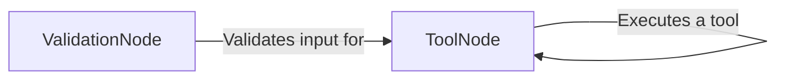

## Component Details

The Node Tooling component provides the building blocks for integrating external tools into LangGraph. It offers a structured way to define and execute tools within a graph, including input validation and output handling. The main flow involves defining a tool using the ToolNode, optionally validating its input with the ValidationNode, executing the tool, and then combining the output with the graph's state. This allows for seamless integration of external functionalities into the graph's workflow.

### ToolNode
The ToolNode class is responsible for encapsulating and executing a tool within a LangGraph graph. It handles input parsing, tool execution, output combination, and argument injection. It interacts with the tool's functionality and manages the state of the graph.
- **Related Classes/Methods**: `langgraph.libs.prebuilt.langgraph.prebuilt.tool_node.ToolNode`, `langgraph.libs.prebuilt.langgraph.prebuilt.tool_node.ToolNode:__init__`, `langgraph.libs.prebuilt.langgraph.prebuilt.tool_node.ToolNode:_func`, `langgraph.libs.prebuilt.langgraph.prebuilt.tool_node.ToolNode:_afunc`, `langgraph.libs.prebuilt.langgraph.prebuilt.tool_node.ToolNode:_combine_tool_outputs`, `langgraph.libs.prebuilt.langgraph.prebuilt.tool_node.ToolNode:_run_one`, `langgraph.libs.prebuilt.langgraph.prebuilt.tool_node.ToolNode:_arun_one`, `langgraph.libs.prebuilt.langgraph.prebuilt.tool_node.ToolNode:_parse_input`, `langgraph.libs.prebuilt.langgraph.prebuilt.tool_node.ToolNode:inject_tool_args`, `langgraph.libs.prebuilt.langgraph.prebuilt.tool_node.ToolNode:_validate_tool_command`, `langgraph.libs.prebuilt.langgraph.prebuilt.tool_node._is_injection`, `langgraph.libs.prebuilt.langgraph.prebuilt.tool_node._get_state_args`, `langgraph.libs.prebuilt.langgraph.prebuilt.tool_node._get_store_arg`

### ValidationNode
The ValidationNode class is responsible for validating the input to a tool before it is executed. It ensures that the input conforms to the expected schema and prevents errors during tool execution. It interacts with the `ToolNode` to validate the input before passing it to the tool.
- **Related Classes/Methods**: `langgraph.libs.prebuilt.langgraph.prebuilt.tool_validator.ValidationNode`, `langgraph.libs.prebuilt.langgraph.prebuilt.tool_validator.ValidationNode:__init__`, `langgraph.libs.prebuilt.langgraph.prebuilt.tool_validator.ValidationNode:_func`
