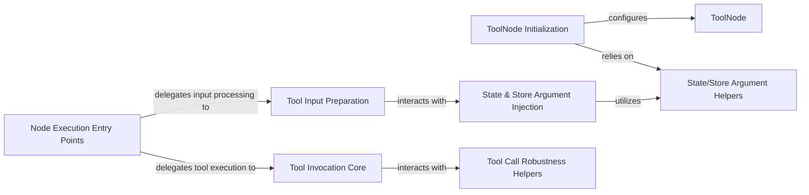

## Details

The `Node Execution & Tool Integration` subsystem is centered around the `langgraph.prebuilt.tool_node.ToolNode` class, which encapsulates the entire lifecycle of executing tools within a LangGraph workflow. This subsystem is crucial for enabling AI agents to interact with external functionalities and manage state effectively during these interactions.

### ToolNode
The primary class representing a node in the graph responsible for executing tools. It orchestrates the entire process of receiving input, preparing arguments, invoking tools, and handling outputs.

**Related Classes/Methods**:

- <a href="https://github.com/langchain-ai/langgraph/blob/main/libs/prebuilt/langgraph/prebuilt/tool_node.py#L239-L774" target="_blank" rel="noopener noreferrer">`langgraph.prebuilt.tool_node.ToolNode`:239-774</a>

### ToolNode Initialization
Initializes the `ToolNode` instance, configuring its execution functions and setting up how state and store arguments will be handled during tool invocation. This is crucial for the node's integration with the graph's state management.

**Related Classes/Methods**:

- <a href="https://github.com/langchain-ai/langgraph/blob/main/libs/prebuilt/langgraph/prebuilt/tool_node.py" target="_blank" rel="noopener noreferrer">`langgraph.prebuilt.tool_node.ToolNode.__init__`</a>

### Node Execution Entry Points
These are the primary synchronous and asynchronous entry points for executing the node's logic. They orchestrate the entire process from input reception to output generation, acting as the main "computational units" of the node.

**Related Classes/Methods**:

- <a href="https://github.com/langchain-ai/langgraph/blob/main/libs/prebuilt/langgraph/prebuilt/tool_node.py" target="_blank" rel="noopener noreferrer">`langgraph.prebuilt.tool_node.ToolNode._func`</a>
- <a href="https://github.com/langchain-ai/langgraph/blob/main/libs/prebuilt/langgraph/prebuilt/tool_node.py" target="_blank" rel="noopener noreferrer">`langgraph.prebuilt.tool_node.ToolNode._afunc`</a>

### Tool Input Preparation
Processes the input received by the node, specifically focusing on extracting and preparing the arguments required for tool invocation, including the injection of state and store data. This ensures that the tool receives correctly formatted and contextualized inputs.

**Related Classes/Methods**:

- <a href="https://github.com/langchain-ai/langgraph/blob/main/libs/prebuilt/langgraph/prebuilt/tool_node.py" target="_blank" rel="noopener noreferrer">`langgraph.prebuilt.tool_node.ToolNode._parse_input`</a>

### State & Store Argument Injection
Performs the critical task of injecting current state and/or store values into the arguments of the tool call, based on the node's configuration. This component directly supports the "State Management" aspect of the framework.

**Related Classes/Methods**:

- <a href="https://github.com/langchain-ai/langgraph/blob/main/libs/prebuilt/langgraph/prebuilt/tool_node.py" target="_blank" rel="noopener noreferrer">`langgraph.prebuilt.tool_node.ToolNode.inject_tool_args`</a>

### Tool Invocation Core
Handles the actual execution of a single tool call. This component is responsible for direct interaction with the external tool, including pre-execution validation, error management, and determining the types of outputs produced.

**Related Classes/Methods**:

- <a href="https://github.com/langchain-ai/langgraph/blob/main/libs/prebuilt/langgraph/prebuilt/tool_node.py" target="_blank" rel="noopener noreferrer">`langgraph.prebuilt.tool_node.ToolNode._run_one`</a>
- <a href="https://github.com/langchain-ai/langgraph/blob/main/libs/prebuilt/langgraph/prebuilt/tool_node.py" target="_blank" rel="noopener noreferrer">`langgraph.prebuilt.tool_node.ToolNode._arun_one`</a>

### State/Store Argument Helpers
A group of specialized helper functions that abstract the logic for determining how state and store arguments should be handled and for performing the actual injection of these objects into tool arguments. These are vital for maintaining state across agentic steps.

**Related Classes/Methods**:

- <a href="https://github.com/langchain-ai/langgraph/blob/main/libs/prebuilt/langgraph/prebuilt/tool_node.py#L1030-L1066" target="_blank" rel="noopener noreferrer">`langgraph.prebuilt.tool_node._get_state_args`:1030-1066</a>
- <a href="https://github.com/langchain-ai/langgraph/blob/main/libs/prebuilt/langgraph/prebuilt/tool_node.py#L1069-L1103" target="_blank" rel="noopener noreferrer">`langgraph.prebuilt.tool_node._get_store_arg`:1069-1103</a>
- <a href="https://github.com/langchain-ai/langgraph/blob/main/libs/prebuilt/langgraph/prebuilt/tool_node.py#L600-L643" target="_blank" rel="noopener noreferrer">`langgraph.prebuilt.tool_node._inject_state`:600-643</a>
- <a href="https://github.com/langchain-ai/langgraph/blob/main/libs/prebuilt/langgraph/prebuilt/tool_node.py#L645-L662" target="_blank" rel="noopener noreferrer">`langgraph.prebuilt.tool_node._inject_store`:645-662</a>

### Tool Call Robustness Helpers
A set of helper functions responsible for validating the structure and content of tool calls before execution and for managing and processing errors that occur during tool execution.

**Related Classes/Methods**:

- <a href="https://github.com/langchain-ai/langgraph/blob/main/libs/prebuilt/langgraph/prebuilt/tool_node.py#L588-L598" target="_blank" rel="noopener noreferrer">`langgraph.prebuilt.tool_node._validate_tool_call`:588-598</a>
- <a href="https://github.com/langchain-ai/langgraph/blob/main/libs/prebuilt/langgraph/prebuilt/tool_node.py#L715-L774" target="_blank" rel="noopener noreferrer">`langgraph.prebuilt.tool_node._validate_tool_command`:715-774</a>
- <a href="https://github.com/langchain-ai/langgraph/blob/main/libs/prebuilt/langgraph/prebuilt/tool_node.py#L125-L170" target="_blank" rel="noopener noreferrer">`langgraph.prebuilt.tool_node._handle_tool_error`:125-170</a>

### [FAQ](https://github.com/CodeBoarding/GeneratedOnBoardings/tree/main?tab=readme-ov-file#faq)