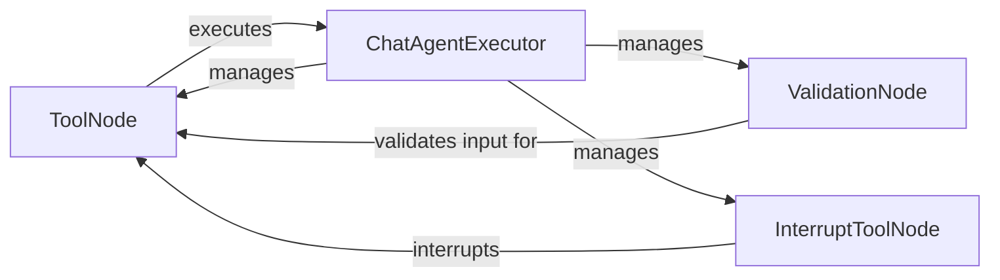

## Component Details

The Prebuilt Node Library provides reusable components for constructing LangGraph workflows. It offers pre-built nodes for common tasks such as tool validation, interrupt handling, and tool execution, simplifying graph construction and allowing developers to quickly assemble complex workflows without implementing common functionalities from scratch. The library includes nodes for validating tool inputs, executing tools, handling interruptions, and managing the overall execution of chat agents.

### ToolNode
The ToolNode class is responsible for executing a given tool within a LangGraph. It receives input, executes the specified tool, and updates the agent state with the tool's output. This node encapsulates the logic for interacting with external tools and managing their execution within the graph.
- **Related Classes/Methods**: `langgraph.libs.prebuilt.langgraph.prebuilt.tool_node.ToolNode`

### ValidationNode
The ValidationNode class is responsible for validating the input to a tool before it is executed by a ToolNode. It ensures that the input conforms to the expected schema, preventing errors during tool execution. This node acts as a gatekeeper, ensuring that only valid inputs are passed to the tool execution stage.
- **Related Classes/Methods**: `langgraph.libs.prebuilt.langgraph.prebuilt.tool_validator.ValidationNode`

### InterruptToolNode
The InterruptToolNode class is responsible for handling interruptions during tool execution. It provides a mechanism to pause or stop the execution of a tool if necessary, allowing for dynamic control over the workflow. This node enables the agent to respond to external signals or internal conditions that require interrupting tool execution.
- **Related Classes/Methods**: `langgraph.libs.prebuilt.langgraph.prebuilt.interrupt.InterruptToolNode`

### ChatAgentExecutor
The ChatAgentExecutor class is responsible for managing the overall execution of a chat agent within a LangGraph. It orchestrates the interaction between the agent, the tools, and the user, coordinating the execution of ToolNodes, ValidationNodes, and InterruptToolNodes to achieve the desired outcome. This component provides a high-level interface for managing complex chat agent workflows.
- **Related Classes/Methods**: `langgraph.libs.prebuilt.langgraph.prebuilt.chat_agent_executor`
