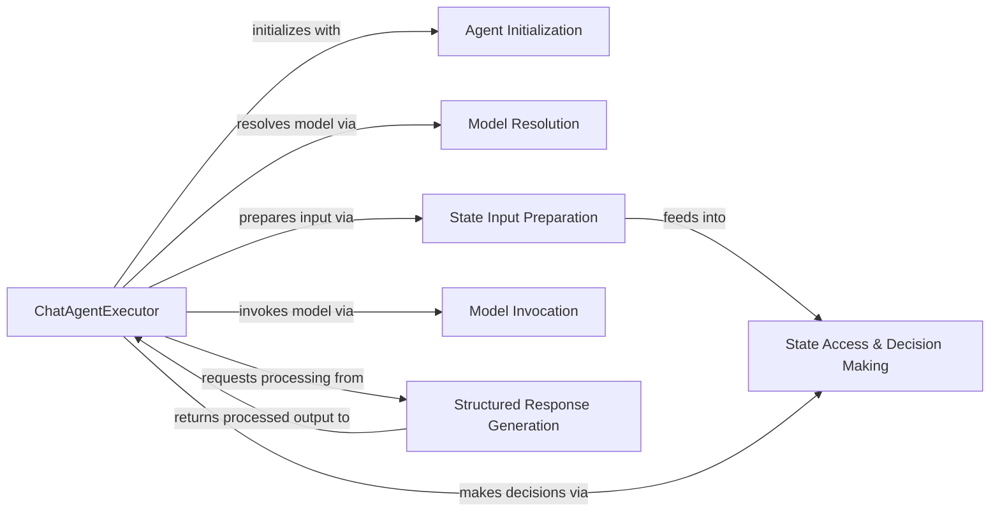

## Details

The ChatAgentExecutor subsystem forms the core of the conversational AI agent, orchestrating a dynamic flow of information and decision-making. It begins by leveraging Agent Initialization to set up the agent's operational parameters and Model Resolution to acquire the necessary language model. During execution, the ChatAgentExecutor iteratively engages State Input Preparation to contextualize inputs, which then inform State Access & Decision Making to guide the agent's next steps. Subsequently, Model Invocation handles direct interaction with the language model, and the raw output is then channeled to Structured Response Generation for transformation into a usable format before being returned to the ChatAgentExecutor for final processing or further action. This modular design ensures clear separation of concerns and facilitates the agent's adaptive conversational capabilities.

### ChatAgentExecutor
The primary component responsible for managing the entire lifecycle of a conversational AI agent. It orchestrates the flow of messages, state updates, model invocations, and tool usage within a pre-defined conversational pattern. It embodies the "Node/Agent Executor" pattern by executing the agent's logic within the graph.

**Related Classes/Methods**: _None_

### Agent Initialization
Handles the initial setup and configuration of the agent, including resolving prompts and binding necessary tools. This component prepares the agent's runnable for execution within the ChatAgentExecutor.

**Related Classes/Methods**: _None_

### Model Resolution
Responsible for obtaining and preparing the language model instance that the agent will use for its operations. It ensures the correct model is available and configured for invocation.

**Related Classes/Methods**: _None_

### State Input Preparation
Prepares the input data for the language model by extracting relevant information from the current agent state, such as chat history, and ensuring its validity and format. This is crucial for maintaining conversational context.

**Related Classes/Methods**: _None_

### State Access & Decision Making
Provides mechanisms to retrieve and evaluate the agent's current state. It includes logic to determine if more steps are needed in the workflow or to route execution based on state values, directly influencing the "Edges/Transitions" within the implicit graph.

**Related Classes/Methods**: _None_

### Model Invocation
Encapsulates the core interaction with the language model, sending prepared input and receiving raw output. This is the direct execution of the LLM within the agent's step.

**Related Classes/Methods**: _None_

### Structured Response Generation
Focuses on processing the raw output from the language model and transforming it into a structured, usable format. This may involve parsing, re-invocation, or specific output formatting, aligning with "Input/Output Handlers."

**Related Classes/Methods**: _None_

### [FAQ](https://github.com/CodeBoarding/GeneratedOnBoardings/tree/main?tab=readme-ov-file#faq)