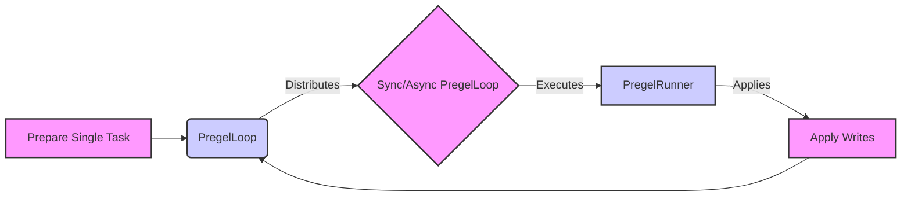

```mermaid
graph LR
    A[Prepare Single Task] --> B(PregelLoop)
    B -- Distributes --> C{Sync/Async PregelLoop}
    C -- Executes --> D[PregelRunner]
    D -- Applies --> E[Apply Writes]
    E --> B

    style A fill:#f9f,stroke:#333,stroke-width:2px
    style B fill:#ccf,stroke:#333,stroke-width:2px
    style C fill:#f9f,stroke:#333,stroke-width:2px
    style D fill:#ccf,stroke:#333,stroke-width:2px
    style E fill:#f9f,stroke:#333,stroke-width:2px
```

