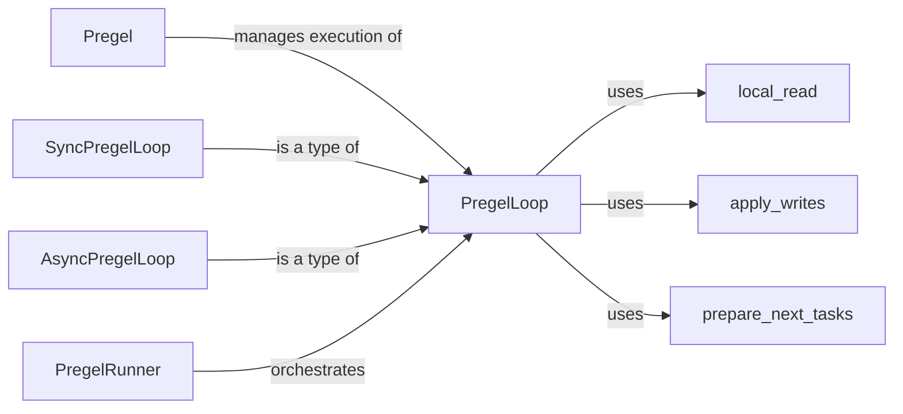

## Component Details

The Pregel Execution Engine executes a LangGraph by managing the graph's state, scheduling node execution, and handling data flow using a message-passing paradigm inspired by the Pregel distributed graph processing framework. It orchestrates the execution of nodes, manages their states, and ensures the correct flow of information between them until a convergence condition is met or a maximum number of iterations is reached. The engine supports both synchronous and asynchronous execution modes, allowing for flexibility in balancing performance and resource utilization.

### Pregel
The Pregel class is the central component representing a Pregel computation. It holds the graph structure, manages node states, and orchestrates the execution of the Pregel algorithm. It provides methods for defining the graph, initializing states, running the computation, and accessing the results. It serves as the entry point for defining and executing graph-based computations using the Pregel model.
- **Related Classes/Methods**: `langgraph.libs.langgraph.langgraph.pregel.Pregel`

### PregelLoop
PregelLoop is an abstract base class that defines the interface for executing a single iteration (tick) of the Pregel algorithm. It manages message passing, state updates, and convergence checking. Concrete implementations, such as SyncPregelLoop and AsyncPregelLoop, provide specific strategies for executing the loop, either synchronously or asynchronously.
- **Related Classes/Methods**: `langgraph.libs.langgraph.langgraph.pregel.loop.PregelLoop`

### SyncPregelLoop
SyncPregelLoop is a concrete implementation of PregelLoop that executes each iteration sequentially. It waits for all nodes to complete their computations and message passing before proceeding to the next iteration. This synchronous approach simplifies debugging and ensures deterministic behavior but may limit performance due to its sequential nature.
- **Related Classes/Methods**: `langgraph.libs.langgraph.langgraph.pregel.loop.SyncPregelLoop`

### AsyncPregelLoop
AsyncPregelLoop is a concrete implementation of PregelLoop that allows nodes to execute concurrently. It uses asynchronous programming techniques to manage message passing and state updates, potentially improving performance by overlapping computations. This asynchronous approach can be more complex to manage but can offer significant speedups for certain graph structures and computations.
- **Related Classes/Methods**: `langgraph.libs.langgraph.langgraph.pregel.loop.AsyncPregelLoop`

### PregelRunner
PregelRunner is responsible for orchestrating the overall Pregel computation. It takes a PregelLoop implementation and executes it until a convergence condition is met or a maximum number of iterations is reached. It handles exceptions, manages the overall progress of the computation, and provides a high-level interface for running Pregel computations.
- **Related Classes/Methods**: `langgraph.libs.langgraph.langgraph.pregel.runner.PregelRunner`

### local_read
The `local_read` function is responsible for reading the local state of a node during the Pregel computation. It provides access to the node's current state, allowing it to be used in computations and message generation.
- **Related Classes/Methods**: `langgraph.libs.langgraph.langgraph.pregel.algo`

### apply_writes
The `apply_writes` function applies the messages (writes) received by a node to its local state. It updates the node's state based on the incoming messages, effectively propagating information through the graph.
- **Related Classes/Methods**: `langgraph.libs.langgraph.langgraph.pregel.algo`

### prepare_next_tasks
The `prepare_next_tasks` function determines the next tasks to be executed based on the current state of the nodes and the messages they have sent. It schedules the execution of nodes that have received messages or whose state has changed, ensuring that the computation progresses towards convergence.
- **Related Classes/Methods**: `langgraph.libs.langgraph.langgraph.pregel.algo`
