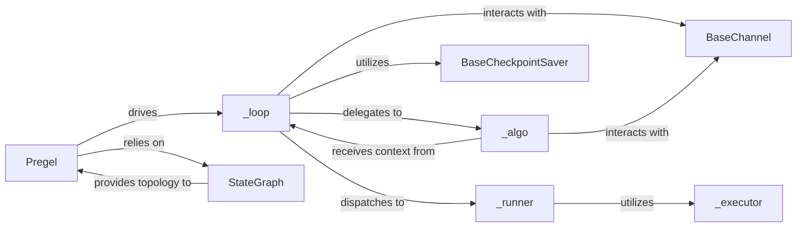

## Details

The `langgraph.pregel` subsystem orchestrates the execution of agentic workflows defined as state graphs. The central component, `Pregel`, acts as the primary entry point, managing the overall iterative execution. It relies on `StateGraph` to understand the workflow's topology, including its nodes and transitions. The core iterative process is managed by `_loop`, which coordinates "supersteps" of the Pregel algorithm. Within each superstep, `_algo` applies state updates and determines the next set of tasks to execute, interacting closely with `BaseChannel` for data flow. Individual node execution is handled by `_runner`, which dispatches tasks to `_executor` for concrete computation. `BaseCheckpointSaver` ensures the persistence and fault tolerance of the graph's state across these iterations. This architecture promotes a clear separation of concerns, with `Pregel` as the high-level orchestrator, `_loop` managing the iterative flow, `_algo` handling state transitions, and `_runner`/`_executor` responsible for task execution, all supported by robust state management and communication channels.

### Pregel
The public interface and primary orchestrator of the Pregel execution engine. It serves as the entry point for users, handling graph initialization, validation, and driving the overall iterative execution flow.

**Related Classes/Methods**:

- <a href="https://github.com/langchain-ai/langgraph/blob/main/libs/langgraph/langgraph/pregel/main.py" target="_blank" rel="noopener noreferrer">`langgraph.pregel.main.Pregel`</a>

### _loop
Manages the iterative execution of the Pregel algorithm's "supersteps." It coordinates the flow of control and data between these steps, processes channel writes, emits events, and interacts with the checkpointing system to ensure state persistence.

**Related Classes/Methods**:

- <a href="https://github.com/langchain-ai/langgraph/blob/main/libs/langgraph/langgraph/pregel/_loop.py#L1063-L1250" target="_blank" rel="noopener noreferrer">`langgraph.pregel._loop.AsyncPregelLoop`:1063-1250</a>

### _algo
Implements the fundamental Pregel logic within each superstep. It applies channel writes to the graph's state and determines which tasks (nodes) should be executed in the subsequent superstep based on the current state and the graph's topology.

**Related Classes/Methods**:

- <a href="https://github.com/langchain-ai/langgraph/blob/main/libs/langgraph/langgraph/pregel/_algo.py#L221-L324" target="_blank" rel="noopener noreferrer">`langgraph.pregel._algo.apply_writes`:221-324</a>

### StateGraph
Defines the structure of the agentic workflow, including its nodes (agents/steps) and edges (transitions). It provides the underlying graph topology that the Pregel engine traverses and executes.

**Related Classes/Methods**:

- <a href="https://github.com/langchain-ai/langgraph/blob/main/libs/langgraph/langgraph/graph/state.py#L117-L894" target="_blank" rel="noopener noreferrer">`langgraph.graph.state.StateGraph`:117-894</a>

### BaseCheckpointSaver
An abstract component responsible for persisting and retrieving the execution state of the graph. It enables long-running, stateful workflows and provides fault tolerance by allowing the engine to resume from a saved state.

**Related Classes/Methods**:

- <a href="https://github.com/langchain-ai/langgraph/blob/main/libs/checkpoint/langgraph/checkpoint/base/__init__.py#L10-L100" target="_blank" rel="noopener noreferrer">`langgraph.checkpoint.base.BaseCheckpointSaver`:10-100</a>

### BaseChannel
Provides the mechanism for communication and state propagation between nodes within the Pregel execution model. It acts as a conduit for data flow and state updates across supersteps.

**Related Classes/Methods**:

- <a href="https://github.com/langchain-ai/langgraph/blob/main/libs/langgraph/langgraph/channels/base.py#L19-L105" target="_blank" rel="noopener noreferrer">`langgraph.channels.base.BaseChannel`:19-105</a>

### _runner
Orchestrates the execution of individual nodes or tasks within a specific superstep, acting as an intermediary between the _loop and the actual task execution logic.

**Related Classes/Methods**:

- <a href="https://github.com/langchain-ai/langgraph/blob/main/libs/langgraph/langgraph/pregel/_runner.py#L117-L450" target="_blank" rel="noopener noreferrer">`langgraph.pregel._runner.PregelRunner`:117-450</a>

### _executor
Executes the concrete logic of individual nodes or agents as determined by the _runner. This component is responsible for invoking the actual computational units of the graph.

**Related Classes/Methods**:

- <a href="https://github.com/langchain-ai/langgraph/blob/main/libs/langgraph/langgraph/pregel/_executor.py#L10-L100" target="_blank" rel="noopener noreferrer">`langgraph.pregel._executor.PregelExecutor`:10-100</a>

### [FAQ](https://github.com/CodeBoarding/GeneratedOnBoardings/tree/main?tab=readme-ov-file#faq)