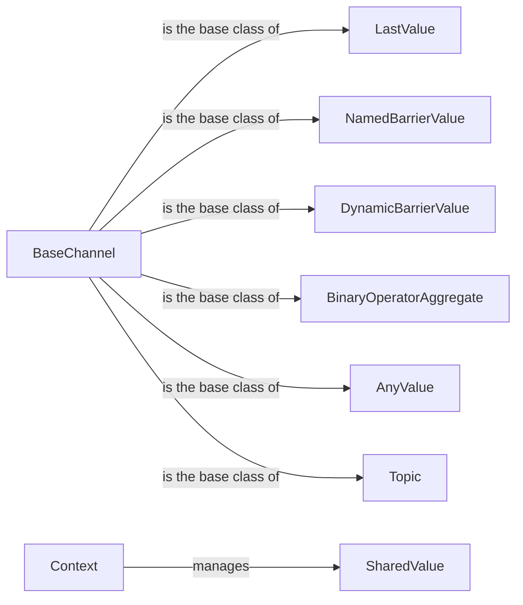

## Component Details

The State and Channel Management component in LangGraph is responsible for maintaining and updating the state of the graph during execution. It provides a variety of channel implementations, each designed for specific use cases, such as storing the last value, synchronizing execution via barriers, or aggregating values using binary operators. These channels ensure data consistency and availability throughout the graph's execution, enabling complex workflows and stateful interactions between nodes.

### BaseChannel
Abstract base class for all channel implementations. It defines the basic interface for copying and checkpointing channel state, providing a foundation for specialized channel types.
- **Related Classes/Methods**: `langgraph.libs.langgraph.langgraph.channels.base.BaseChannel`

### LastValue
Stores the most recently updated value. It's useful for tracking the latest state of a variable or data point. Includes a subclass `LastValueAfterFinish`.
- **Related Classes/Methods**: `langgraph.libs.langgraph.langgraph.channels.last_value.LastValue`, `langgraph.libs.langgraph.langgraph.channels.last_value.LastValueAfterFinish`

### NamedBarrierValue
A channel that acts as a named barrier, allowing execution to proceed only when a specific condition is met. It allows synchronization based on a predefined name, providing a more structured approach to barrier management. Includes a subclass `NamedBarrierValueAfterFinish`.
- **Related Classes/Methods**: `langgraph.libs.langgraph.langgraph.channels.named_barrier_value.NamedBarrierValue`, `langgraph.libs.langgraph.langgraph.channels.named_barrier_value.NamedBarrierValueAfterFinish`

### DynamicBarrierValue
A channel that acts as a dynamic barrier, allowing execution to proceed only when a specific condition is met. It's useful for synchronizing different parts of the graph based on runtime conditions. Includes a subclass `DynamicBarrierValueAfterFinish`.
- **Related Classes/Methods**: `langgraph.libs.langgraph.langgraph.channels.dynamic_barrier_value.DynamicBarrierValue`, `langgraph.libs.langgraph.langgraph.channels.dynamic_barrier_value.DynamicBarrierValueAfterFinish`

### BinaryOperatorAggregate
Aggregates updates to a value using a binary operator. It's useful for combining multiple updates into a single, aggregated value, such as summing or averaging.
- **Related Classes/Methods**: `langgraph.libs.langgraph.langgraph.channels.binop.BinaryOperatorAggregate`

### AnyValue
A generic channel that can hold any type of data. It provides a flexible way to store and retrieve data without type constraints.
- **Related Classes/Methods**: `langgraph.libs.langgraph.langgraph.channels.any_value.AnyValue`

### Topic
Facilitates communication between different parts of the graph through a publish-subscribe mechanism. It allows components to publish events and other components to subscribe to those events, enabling decoupled communication.
- **Related Classes/Methods**: `langgraph.libs.langgraph.langgraph.channels.topic.Topic`

### SharedValue
Represents a value shared between different parts of the graph execution, providing thread-safe access and updates. It ensures data consistency when multiple components access the same value concurrently.
- **Related Classes/Methods**: `langgraph.libs.langgraph.langgraph.managed.shared_value.SharedValue`

### Context
Represents the execution context of the graph, providing access to shared values and other resources. It acts as a central point for managing the graph's state and dependencies.
- **Related Classes/Methods**: `langgraph.libs.langgraph.langgraph.managed.context.Context`
