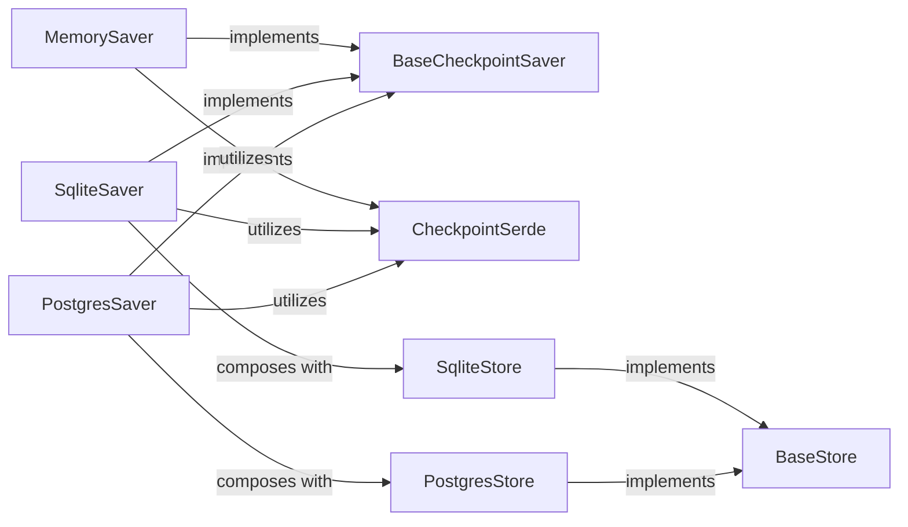

## Details

Abstract Components Overview

### BaseCheckpointSaver
The foundational abstract class defining the contract for all checkpointing operations (get, list, put, delete). It establishes the standard interface for managing graph checkpoints, ensuring extensibility for various storage implementations.

**Related Classes/Methods**:

- <a href="https://github.com/langchain-ai/langgraph/blob/main/libs/checkpoint/langgraph/checkpoint/base/__init__.py#L112-L371" target="_blank" rel="noopener noreferrer">`BaseCheckpointSaver`:112-371</a>

### MemorySaver
An in-memory implementation of `BaseCheckpointSaver`, suitable for transient states, testing, and scenarios where persistence beyond application lifetime is not required. It stores checkpoints in a Python dictionary.

**Related Classes/Methods**:

- <a href="https://github.com/langchain-ai/langgraph/blob/main/libs/checkpoint/langgraph/checkpoint/memory/__init__.py#L31-L524" target="_blank" rel="noopener noreferrer">`MemorySaver`:31-524</a>

### SqliteSaver
A persistent implementation of `BaseCheckpointSaver` using an SQLite database. It manages the storage and retrieval of checkpoints in a local file, providing lightweight, file-based persistence.

**Related Classes/Methods**:

- <a href="https://github.com/langchain-ai/langgraph/blob/main/libs/checkpoint-sqlite/langgraph/checkpoint/sqlite/__init__.py#L37-L558" target="_blank" rel="noopener noreferrer">`SqliteSaver`:37-558</a>

### PostgresSaver
A persistent implementation of `BaseCheckpointSaver` using a PostgreSQL database. It manages the storage and retrieval of checkpoints in a remote database, enabling robust, scalable, and shared persistence.

**Related Classes/Methods**:

- <a href="https://github.com/langchain-ai/langgraph/blob/main/libs/checkpoint-postgres/langgraph/checkpoint/postgres/base.py#L143-L302" target="_blank" rel="noopener noreferrer">`PostgresSaver`:143-302</a>

### CheckpointSerde
A utility component responsible for serializing and deserializing the complex Python objects representing the graph's state into a storable format (e.g., JSON) and vice-versa. It ensures that the state can be correctly persisted and retrieved.

**Related Classes/Methods**:

- <a href="https://github.com/langchain-ai/langgraph/blob/main/libs/checkpoint/langgraph/checkpoint/serde/base.py" target="_blank" rel="noopener noreferrer">`langgraph.checkpoint.serde.base.CheckpointSerde`</a>

### BaseStore
The abstract interface for generic key-value stores, providing a common API for underlying storage mechanisms. It defines the low-level contract for data persistence, decoupled from the checkpointing logic.

**Related Classes/Methods**:

- <a href="https://github.com/langchain-ai/langgraph/blob/main/libs/checkpoint/langgraph/store/base/batch.py#L58-L280" target="_blank" rel="noopener noreferrer">`BaseStore`:58-280</a>

### SqliteStore
An SQLite-backed concrete implementation of `BaseStore`, providing the actual storage for `SqliteSaver`. It handles the low-level database operations for key-value persistence in an SQLite file.

**Related Classes/Methods**:

- <a href="https://github.com/langchain-ai/langgraph/blob/main/libs/checkpoint-sqlite/langgraph/store/sqlite/aio.py#L39-L582" target="_blank" rel="noopener noreferrer">`SqliteStore`:39-582</a>

### PostgresStore
A PostgreSQL-backed concrete implementation of `BaseStore`, providing the actual storage for `PostgresSaver`. It handles the low-level database operations for key-value persistence in a PostgreSQL database.

**Related Classes/Methods**:

- <a href="https://github.com/langchain-ai/langgraph/blob/main/libs/checkpoint-postgres/langgraph/store/postgres/aio.py#L42-L563" target="_blank" rel="noopener noreferrer">`PostgresStore`:42-563</a>

### [FAQ](https://github.com/CodeBoarding/GeneratedOnBoardings/tree/main?tab=readme-ov-file#faq)