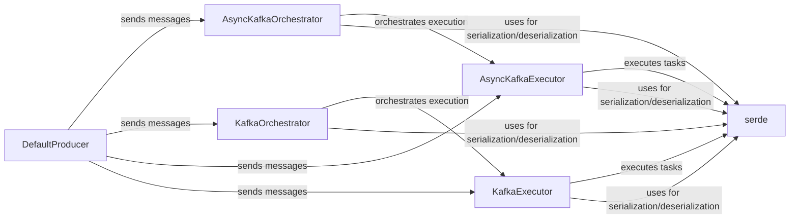

## Component Details

The Task Scheduling (Kafka) component enables distributed task scheduling and execution within LangGraph using Kafka. It provides classes for Kafka executors and orchestrators, allowing for scalable and reliable execution of graph workflows across multiple nodes. The core functionality revolves around submitting tasks to Kafka topics, processing these tasks by executors, and managing the overall workflow by orchestrators. Serialization and deserialization are handled by the serde module, ensuring data compatibility between different components.

### AsyncKafkaExecutor
Asynchronously consumes tasks from Kafka topics, executes them, and handles exceptions. It relies on `serde` for serialization/deserialization of task data. It is used by `AsyncKafkaOrchestrator` to execute tasks.
- **Related Classes/Methods**: `langgraph.libs.scheduler-kafka.langgraph.scheduler.kafka.executor.AsyncKafkaExecutor`

### KafkaExecutor
Synchronously consumes tasks from Kafka topics, executes them, and handles exceptions. It relies on `serde` for serialization/deserialization of task data. It is used by `KafkaOrchestrator` to execute tasks.
- **Related Classes/Methods**: `langgraph.libs.scheduler-kafka.langgraph.scheduler.kafka.executor.KafkaExecutor`

### DefaultProducer
A synchronous Kafka producer responsible for sending messages (tasks, updates) to Kafka topics. It is used by both `AsyncKafkaOrchestrator` and `KafkaOrchestrator` to submit tasks and updates to the Kafka broker.
- **Related Classes/Methods**: `langgraph.libs.scheduler-kafka.langgraph.scheduler.kafka.default_sync.DefaultProducer`

### AsyncKafkaOrchestrator
Asynchronously orchestrates the execution of a LangGraph using Kafka. It manages the overall workflow, including submitting initial tasks, monitoring task completion, and handling state transitions. It uses `AsyncKafkaExecutor` for task execution and `serde` for serialization/deserialization.
- **Related Classes/Methods**: `langgraph.libs.scheduler-kafka.langgraph.scheduler.kafka.orchestrator.AsyncKafkaOrchestrator`

### KafkaOrchestrator
Synchronously orchestrates the execution of a LangGraph using Kafka. It manages the overall workflow, including submitting initial tasks, monitoring task completion, and handling state transitions. It uses `KafkaExecutor` for task execution and `serde` for serialization/deserialization.
- **Related Classes/Methods**: `langgraph.libs.scheduler-kafka.langgraph.scheduler.kafka.orchestrator.KafkaOrchestrator`

### serde
Serializes and deserializes data for communication with Kafka. It converts Python objects into a format suitable for transmission over Kafka and vice versa. It is used by both executors and orchestrators.
- **Related Classes/Methods**: `langgraph.libs.scheduler-kafka.langgraph.scheduler.kafka.serde`
