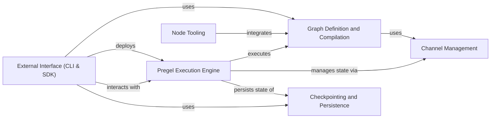

## Component Details

LangGraph is a framework for building robust and modular LLM-powered applications by representing them as graphs. It allows developers to define complex interaction flows between LLMs, tools, and other components, enabling the creation of sophisticated agents and workflows. The framework provides tools for defining graph structure, managing state, executing the graph, and persisting state for resuming execution.

### Graph Definition and Compilation
This component focuses on defining the structure of the graph, including nodes, edges, and the overall flow of execution. It handles the compilation of the graph into a runnable form, optimizing it for performance and ensuring that all dependencies are properly resolved. It includes the core graph structures and compilation logic.
- **Related Classes/Methods**: `langgraph.libs.langgraph.langgraph.graph.state.StateGraph`, `langgraph.libs.langgraph.langgraph.graph.state.CompiledStateGraph`, `langgraph.libs.langgraph.langgraph.graph.graph.Graph`, `langgraph.libs.langgraph.langgraph.graph.graph.CompiledGraph`

### Pregel Execution Engine
The Pregel Execution Engine is responsible for executing the compiled LangGraph. It manages the state of the graph, schedules the execution of nodes, and handles the flow of data between them. It uses a message-passing paradigm inspired by the Pregel distributed graph processing framework to enable efficient and scalable execution.
- **Related Classes/Methods**: `langgraph.libs.langgraph.langgraph.pregel.loop.PregelLoop`, `langgraph.libs.langgraph.langgraph.pregel.loop.SyncPregelLoop`, `langgraph.libs.langgraph.langgraph.pregel.loop.AsyncPregelLoop`, `langgraph.libs.langgraph.langgraph.pregel.runner.PregelRunner`, `langgraph.libs.langgraph.langgraph.pregel.algo`, `langgraph.libs.langgraph.langgraph.pregel.Pregel`

### Channel Management
This component provides the mechanism for nodes in the graph to communicate and share data. Channels act as typed message queues, allowing nodes to exchange information and update the graph's state. Different channel types are available to support various communication patterns, such as last-value, any-value, and binary operator aggregation.
- **Related Classes/Methods**: `langgraph.libs.langgraph.langgraph.channels.base.BaseChannel`, `langgraph.libs.langgraph.langgraph.channels.ephemeral_value.EphemeralValue`, `langgraph.libs.langgraph.langgraph.channels.dynamic_barrier_value.DynamicBarrierValue`, `langgraph.libs.langgraph.langgraph.channels.named_barrier_value.NamedBarrierValue`, `langgraph.libs.langgraph.langgraph.channels.last_value.LastValue`, `langgraph.libs.langgraph.langgraph.channels.binop.BinaryOperatorAggregate`, `langgraph.libs.langgraph.langgraph.channels.any_value.AnyValue`, `langgraph.libs.langgraph.langgraph.channels.topic.Topic`

### Node Tooling
This component defines the structure of a node, and provides tooling for creating nodes. It includes the prebuilt tool node, which allows for easy integration of external tools into the graph. It also includes the validation node, which allows for validating the output of tools.
- **Related Classes/Methods**: `langgraph.libs.prebuilt.langgraph.prebuilt.tool_node.ToolNode`, `langgraph.libs.prebuilt.langgraph.prebuilt.tool_validator.ValidationNode`

### Checkpointing and Persistence
This component handles the persistence of the graph's state, allowing for resuming execution from a specific point in time. It provides mechanisms for saving and loading checkpoints, supporting various storage backends like memory, SQLite, and Postgres. It also includes serialization and encryption capabilities to ensure data integrity and security.
- **Related Classes/Methods**: `langgraph.libs.checkpoint.langgraph.checkpoint.base.BaseCheckpointSaver`, `langgraph.libs.checkpoint.langgraph.checkpoint.memory.InMemorySaver`, `langgraph.libs.checkpoint.langgraph.checkpoint.serde.jsonplus.JsonPlusSerializer`, `langgraph.libs.checkpoint.langgraph.checkpoint.serde.encrypted.EncryptedSerializer`, `langgraph.libs.checkpoint.langgraph.store.base.BaseStore`, `langgraph.libs.checkpoint.langgraph.store.memory.InMemoryStore`, `langgraph.libs.checkpoint-sqlite.langgraph.checkpoint.sqlite.SqliteSaver`, `langgraph.libs.checkpoint-sqlite.langgraph.store.sqlite.base.SqliteStore`, `langgraph.libs.checkpoint-postgres.langgraph.checkpoint.postgres.PostgresSaver`, `langgraph.libs.checkpoint-postgres.langgraph.store.postgres.base.PostgresStore`

### External Interface (CLI & SDK)
This component provides the external interfaces for interacting with LangGraph, including a CLI for managing and deploying LangGraph applications and an SDK for programmatic access to LangGraph services. It enables users to create, build, deploy, and interact with LangGraph applications from the command line or through Python code.
- **Related Classes/Methods**: `langgraph.libs.cli.langgraph_cli.cli`, `langgraph.libs.cli.langgraph_cli.config`, `langgraph.libs.cli.langgraph_cli.docker`, `langgraph.libs.cli.langgraph_cli.exec`, `langgraph.libs.sdk-py.langgraph_sdk.client`, `langgraph.libs.sdk-py.langgraph_sdk.client.LangGraphClient`, `langgraph.libs.sdk-py.langgraph_sdk.client.HttpClient`, `langgraph.libs.sdk-py.langgraph_sdk.client.RunsClient`, `langgraph.libs.sdk-py.langgraph_sdk.client.StoreClient`