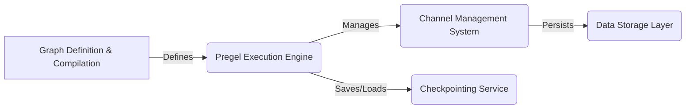

# LangGraph Data Flow Overview

LangGraph is a Python library designed to simplify the creation of robust and stateful conversational AI agents by representing them as graphs. It provides a framework for defining nodes, edges, and state, and then executing the graph using a Pregel-inspired algorithm. This allows for complex conversational flows with built-in checkpointing, channel management, and remote execution capabilities.

