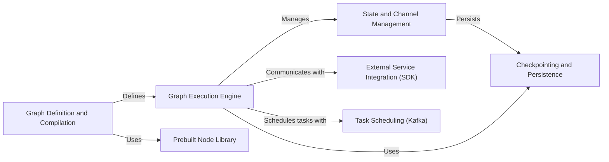

## Component Details

LangGraph is a framework for building robust and stateful conversational AI applications. It allows developers to define complex interaction flows as graphs, manage state across multiple turns, and integrate with external services. The core of LangGraph revolves around defining a graph structure, executing it with a dedicated engine, and managing the state throughout the execution. It provides tools for checkpointing, prebuilt nodes, and integration with external services.

### Graph Definition and Compilation
This component provides the tools and classes necessary to define the structure of the graph, including nodes, edges, and conditional transitions. It uses the StateGraph and Graph classes to represent the graph and provides methods for adding nodes, edges, and defining the flow of execution. The compilation step optimizes the graph for efficient execution.
- **Related Classes/Methods**: `langgraph.libs.langgraph.langgraph.graph.state.StateGraph`, `langgraph.libs.langgraph.langgraph.graph.graph.Graph`, `langgraph.libs.langgraph.langgraph.graph.state.CompiledStateGraph`, `langgraph.libs.langgraph.langgraph.graph.graph.CompiledGraph`

### Graph Execution Engine
The Graph Execution Engine is responsible for orchestrating the execution of the defined graph. It includes the PregelLoop and PregelRunner classes, which manage the execution loop, task scheduling, and state updates. This component handles retries, error handling, and ensures the correct flow of data and control through the graph.
- **Related Classes/Methods**: `langgraph.libs.langgraph.langgraph.pregel.loop.PregelLoop`, `langgraph.libs.langgraph.langgraph.pregel.runner.PregelRunner`, `langgraph.libs.langgraph.langgraph.pregel.algo`, `langgraph.libs.langgraph.langgraph.pregel.call`

### State and Channel Management
This component manages the state of the graph during execution. It includes classes for different types of channels (e.g., LastValue, NamedBarrierValue) that store and update the state. It provides mechanisms for managing the flow of information between nodes and maintaining the overall state of the graph, ensuring data consistency and availability throughout the execution.
- **Related Classes/Methods**: `langgraph.libs.langgraph.langgraph.channels.last_value.LastValue`, `langgraph.libs.langgraph.langgraph.channels.named_barrier_value.NamedBarrierValue`, `langgraph.libs.langgraph.langgraph.channels.ephemeral_value.EphemeralValue`, `langgraph.libs.langgraph.langgraph.channels.dynamic_barrier_value.DynamicBarrierValue`, `langgraph.libs.langgraph.langgraph.channels.untracked_value.UntrackedValue`, `langgraph.libs.langgraph.langgraph.channels.binop.BinaryOperatorAggregate`, `langgraph.libs.langgraph.langgraph.channels.any_value.AnyValue`, `langgraph.libs.langgraph.langgraph.channels.topic.Topic`

### Checkpointing and Persistence
The Checkpointing and Persistence component provides functionality for saving and restoring the state of the graph. It includes classes for different checkpoint savers (e.g., InMemorySaver, SqliteSaver, PostgresSaver) and serializers (e.g., JsonPlusSerializer, EncryptedSerializer). This ensures that the graph's state can be persisted and recovered, enabling long-running and fault-tolerant workflows.
- **Related Classes/Methods**: `langgraph.libs.checkpoint.langgraph.checkpoint.memory.InMemorySaver`, `langgraph.libs.checkpoint.langgraph.checkpoint.serde.jsonplus.JsonPlusSerializer`, `langgraph.libs.checkpoint.langgraph.checkpoint.serde.encrypted.EncryptedSerializer`, `langgraph.libs.checkpoint-sqlite.langgraph.checkpoint.sqlite.SqliteSaver`, `langgraph.libs.checkpoint-postgres.langgraph.checkpoint.postgres.PostgresSaver`, `langgraph.libs.checkpoint.langgraph.checkpoint.base.BaseCheckpointSaver`

### Prebuilt Node Library
This component offers pre-built nodes for common tasks, such as tool validation, interrupt handling, and tool execution. These nodes simplify graph construction by providing reusable components, allowing developers to quickly assemble complex workflows without having to implement common functionalities from scratch.
- **Related Classes/Methods**: `langgraph.libs.prebuilt.langgraph.prebuilt.tool_validator.ValidationNode`, `langgraph.libs.prebuilt.langgraph.prebuilt.interrupt.InterruptToolNode`, `langgraph.libs.prebuilt.langgraph.prebuilt.tool_node.ToolNode`, `langgraph.libs.prebuilt.langgraph.prebuilt.chat_agent_executor`

### External Service Integration (SDK)
The External Service Integration component provides a client for interacting with a LangGraph service. It includes classes for making HTTP requests and managing runs and stores. This enables communication with external LangGraph services for managing and monitoring graph executions, allowing for remote control and observation of graph workflows.
- **Related Classes/Methods**: `langgraph.libs.sdk-py.langgraph_sdk.client`, `langgraph.libs.sdk-py.langgraph_sdk.client.LangGraphClient`, `langgraph.libs.sdk-py.langgraph_sdk.client.HttpClient`, `langgraph.libs.sdk-py.langgraph_sdk.client.RunsClient`, `langgraph.libs.sdk-py.langgraph_sdk.client.StoreClient`

### Task Scheduling (Kafka)
This component provides integration with Kafka for scheduling and executing tasks. It includes classes for Kafka executors and orchestrators. This allows for distributed task scheduling and execution using Kafka, enabling scalable and reliable execution of graph workflows across multiple nodes.
- **Related Classes/Methods**: `langgraph.libs.scheduler-kafka.langgraph.scheduler.kafka.executor`, `langgraph.libs.scheduler-kafka.langgraph.scheduler.kafka.orchestrator`, `langgraph.libs.scheduler-kafka.langgraph.scheduler.kafka.default_sync`