```mermaid
graph LR
    Graph_Definition_Compilation["Graph Definition & Compilation"]
    Pregel_Execution_Engine["Pregel Execution Engine"]
    Channel_Management_System["Channel Management System"]
    State_Persistence_Checkpointing["State Persistence & Checkpointing"]
    Node_Execution_Tool_Integration["Node Execution & Tool Integration"]
    Prebuilt_Agent_Components["Prebuilt Agent Components"]
    LangGraph_SDK_Client["LangGraph SDK Client"]
    Graph_Definition_Compilation -- "defines workflow structure for" --> Pregel_Execution_Engine
    Pregel_Execution_Engine -- "reads/writes node data via" --> Channel_Management_System
    Pregel_Execution_Engine -- "loads/saves execution checkpoints with" --> State_Persistence_Checkpointing
    Channel_Management_System -- "persists/retrieves channel state via" --> State_Persistence_Checkpointing
    Pregel_Execution_Engine -- "delegates node execution to" --> Node_Execution_Tool_Integration
    Node_Execution_Tool_Integration -- "utilizes prebuilt agent logic from" --> Prebuilt_Agent_Components
    LangGraph_SDK_Client -- "remotely invokes/manages workflows in" --> Pregel_Execution_Engine
    LangGraph_SDK_Client -- "remotely accesses/manages checkpoints in" --> State_Persistence_Checkpointing
    click Graph_Definition_Compilation href "https://github.com/CodeBoarding/GeneratedOnBoardings/blob/main/langgraph/Graph_Definition_Compilation.md" "Details"
    click Pregel_Execution_Engine href "https://github.com/CodeBoarding/GeneratedOnBoardings/blob/main/langgraph/Pregel_Execution_Engine.md" "Details"
    click Channel_Management_System href "https://github.com/CodeBoarding/GeneratedOnBoardings/blob/main/langgraph/Channel_Management_System.md" "Details"
    click State_Persistence_Checkpointing href "https://github.com/CodeBoarding/GeneratedOnBoardings/blob/main/langgraph/State_Persistence_Checkpointing.md" "Details"
    click Node_Execution_Tool_Integration href "https://github.com/CodeBoarding/GeneratedOnBoardings/blob/main/langgraph/Node_Execution_Tool_Integration.md" "Details"
    click Prebuilt_Agent_Components href "https://github.com/CodeBoarding/GeneratedOnBoardings/blob/main/langgraph/Prebuilt_Agent_Components.md" "Details"
    click LangGraph_SDK_Client href "https://github.com/CodeBoarding/GeneratedOnBoardings/blob/main/langgraph/LangGraph_SDK_Client.md" "Details"
```

## Details

The LangGraph architecture is centered around the **Pregel Execution Engine**, which orchestrates the execution of agentic workflows defined by the **Graph Definition & Compilation** component. Data flow within the graph is managed by the **Channel Management System**, acting as a central bus for state propagation between nodes. For long-running and fault-tolerant workflows, the **State Persistence & Checkpointing** component provides mechanisms to save and restore the graph's state, supporting various storage backends. Individual steps or agents within the workflow are handled by the **Node Execution & Tool Integration** component, which can leverage pre-built functionalities from the **Prebuilt Agent Components**. External applications interact with and manage these workflows through the **LangGraph SDK Client**, enabling remote invocation and state management. This modular design facilitates clear separation of concerns, making the system extensible and maintainable, and is well-suited for visual representation as a data flow diagram.

### Graph Definition & Compilation [[Expand]](./Graph_Definition_Compilation.md)
Defines the structure of the agentic workflow, including nodes (agents/steps) and edges (transitions). It also handles the compilation of this definition into an executable graph.

**Related Classes/Methods**:

- <a href="https://github.com/langchain-ai/langgraph/blob/main/libs/langgraph/langgraph/graph/state.py#L897-L1216" target="_blank" rel="noopener noreferrer">`langgraph.graph.state.CompiledStateGraph`:897-1216</a>
- <a href="https://github.com/langchain-ai/langgraph/blob/main/libs/langgraph/langgraph/graph/state.py#L117-L894" target="_blank" rel="noopener noreferrer">`langgraph.graph.state.StateGraph`:117-894</a>

### Pregel Execution Engine [[Expand]](./Pregel_Execution_Engine.md)
The core runtime orchestrator, responsible for executing the defined graph in a Pregel-like iterative fashion. It manages the flow of control and data between nodes, handling state updates and checkpointing.

**Related Classes/Methods**:

- <a href="https://github.com/langchain-ai/langgraph/blob/main/libs/langgraph/langgraph/pregel/main.py" target="_blank" rel="noopener noreferrer">`langgraph.pregel.main.Pregel`</a>
- <a href="https://github.com/langchain-ai/langgraph/blob/main/libs/langgraph/langgraph/pregel/main.py" target="_blank" rel="noopener noreferrer">`langgraph.pregel.main._loop`</a>
- <a href="https://github.com/langchain-ai/langgraph/blob/main/libs/langgraph/langgraph/pregel/main.py" target="_blank" rel="noopener noreferrer">`langgraph.pregel.main._algo`</a>

### Channel Management System [[Expand]](./Channel_Management_System.md)
Acts as the central data bus for the graph, facilitating communication and state propagation between different nodes. It manages the read and write operations for various data channels.

**Related Classes/Methods**:

- <a href="https://github.com/langchain-ai/langgraph/blob/main/libs/langgraph/langgraph/channels/base.py#L19-L105" target="_blank" rel="noopener noreferrer">`langgraph.channels.base.BaseChannel`:19-105</a>
- <a href="https://github.com/langchain-ai/langgraph/blob/main/libs/langgraph/langgraph/pregel/main.py" target="_blank" rel="noopener noreferrer">`langgraph.pregel.main._read`</a>
- <a href="https://github.com/langchain-ai/langgraph/blob/main/libs/langgraph/langgraph/pregel/main.py" target="_blank" rel="noopener noreferrer">`langgraph.pregel.main._write`</a>

### State Persistence & Checkpointing [[Expand]](./State_Persistence_Checkpointing.md)
Provides mechanisms for saving and loading the entire graph's state (checkpoints), enabling long-running, fault-tolerant, and stateful workflows. Supports various storage backends.

**Related Classes/Methods**:

- <a href="https://github.com/langchain-ai/langgraph/blob/main/libs/checkpoint/langgraph/checkpoint/base/__init__.py" target="_blank" rel="noopener noreferrer">`langgraph.checkpoint.base.BaseCheckpointSaver`</a>
- <a href="https://github.com/langchain-ai/langgraph/blob/main/libs/checkpoint/langgraph/checkpoint/memory/__init__.py" target="_blank" rel="noopener noreferrer">`langgraph.checkpoint.memory.MemorySaver`</a>
- <a href="https://github.com/langchain-ai/langgraph/blob/main/libs/checkpoint-sqlite/langgraph/checkpoint/sqlite/__init__.py" target="_blank" rel="noopener noreferrer">`langgraph.checkpoint.sqlite.SqliteSaver`</a>
- <a href="https://github.com/langchain-ai/langgraph/blob/main/libs/checkpoint-postgres/langgraph/checkpoint/postgres/__init__.py" target="_blank" rel="noopener noreferrer">`langgraph.checkpoint.postgres.PostgresSaver`</a>

### Node Execution & Tool Integration [[Expand]](./Node_Execution_Tool_Integration.md)
Encapsulates the logic for executing individual nodes within the graph, including the invocation of external tools or APIs as part of an agent's action.

**Related Classes/Methods**:

- <a href="https://github.com/langchain-ai/langgraph/blob/main/libs/prebuilt/langgraph/prebuilt/tool_node.py#L239-L774" target="_blank" rel="noopener noreferrer">`langgraph.prebuilt.tool_node.ToolNode`:239-774</a>

### Prebuilt Agent Components [[Expand]](./Prebuilt_Agent_Components.md)
Offers high-level, reusable agent implementations that encapsulate common AI agent patterns (e.g., conversational agents), simplifying the creation of sophisticated agentic workflows.

**Related Classes/Methods**:

- <a href="https://github.com/langchain-ai/langgraph/blob/main/libs/prebuilt/langgraph/prebuilt/chat_agent_executor.py" target="_blank" rel="noopener noreferrer">`langgraph.prebuilt.chat_agent_executor.ChatAgentExecutor`</a>

### LangGraph SDK Client [[Expand]](./LangGraph_SDK_Client.md)
Provides a programmatic interface for external applications to interact with and manage deployed LangGraph workflows, supporting remote invocation, state management, and monitoring.

**Related Classes/Methods**:

- <a href="https://github.com/langchain-ai/langgraph/blob/main/libs/sdk-py/langgraph_sdk/client.py#L216-L233" target="_blank" rel="noopener noreferrer">`langgraph_sdk.client.LangGraphClient`:216-233</a>

### [FAQ](https://github.com/CodeBoarding/GeneratedOnBoardings/tree/main?tab=readme-ov-file#faq)