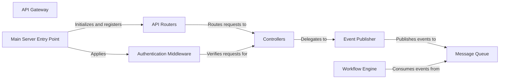

## Details

One paragraph explaining the functionality which is represented by this graph. What the main flow is and what is its purpose.

### API Gateway [[Expand]](./API_Gateway.md)
The primary public-facing service for the backend. It serves as the single entry point for all client requests (e.g., from the React UI), handling routing, request validation, and composition. It abstracts the underlying microservices from the client.

**Related Classes/Methods**:

- `packages/server/src/index.ts`

### Main Server Entry Point
The application's bootstrap script. It is responsible for initializing the web server (e.g., Express or Fastify), loading all necessary configurations, applying middleware, and starting the HTTP listener to accept incoming connections.

**Related Classes/Methods**:

- `packages/server/src/index.ts`

### API Routers
Defines the API endpoints (e.g., `/journeys`, `/segments`, `/users`) and maps them to the appropriate controller functions. This layer is responsible for the routing of HTTP requests based on their path and method.

**Related Classes/Methods**:

- `packages/server/src/routers/journeysRouter.ts`
- `packages/server/src/routers/segmentsRouter.ts`

### Controllers
Contain the logic for handling specific API requests. Responsibilities include parsing and validating request bodies, invoking authentication checks, and delegating the core business action to the `Event Publisher` by creating and passing a domain event.

**Related Classes/Methods**:

- `packages/server/src/controllers/journeysController.ts`
- `packages/server/src/controllers/usersController.ts`

### Authentication Middleware
An essential security component that intercepts all or a subset of incoming requests. It is responsible for verifying the identity and permissions of the caller (e.g., by validating a JWT) before passing the request to the designated controller.

**Related Classes/Methods**:

- `packages/server/src/middleware/auth.ts`

### Event Publisher
An infrastructure adapter that abstracts the message queue implementation (e.g., Kafka, RabbitMQ). Controllers use this component to publish events (like `JourneyStartRequested`) to the message queue, effectively decoupling the API Gateway from downstream services.

**Related Classes/Methods**:

- `packages/server/src/messaging/eventPublisher.ts`
- `packages/server/src/messaging/kafkaProducer.ts`

### Message Queue
The central communication backbone of the event-driven architecture. It receives events from the `Event Publisher` and guarantees their delivery to one or more subscribed downstream services, enabling asynchronous and resilient processing.

**Related Classes/Methods**:

- `packages/server/src/messaging/kafkaProducer.ts`
- `packages/worker/src/kafka/consumers.ts`

### Workflow Engine
A key downstream microservice that consumes events from the `Message Queue`. It contains the core business logic for processing long-running, multi-step tasks, such as executing a customer journey. It operates completely independently of the API Gateway.

**Related Classes/Methods**:

- `packages/worker/src/index.ts`
- `packages/worker/src/kafka/consumers.ts`

### [FAQ](https://github.com/CodeBoarding/GeneratedOnBoardings/tree/main?tab=readme-ov-file#faq)